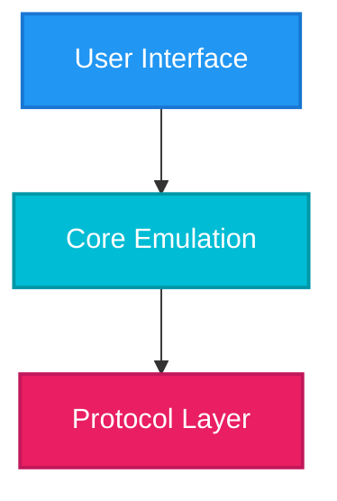
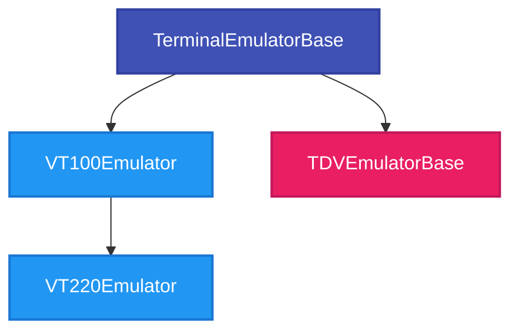
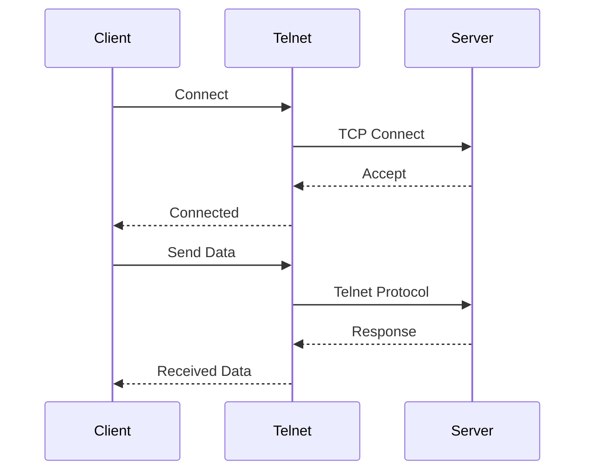
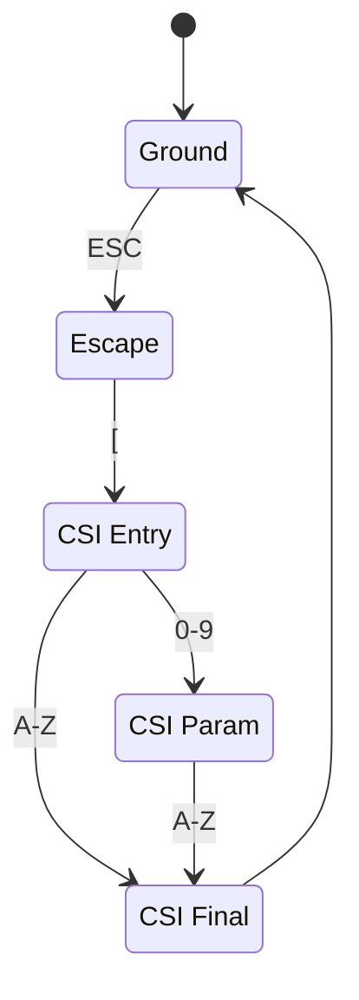
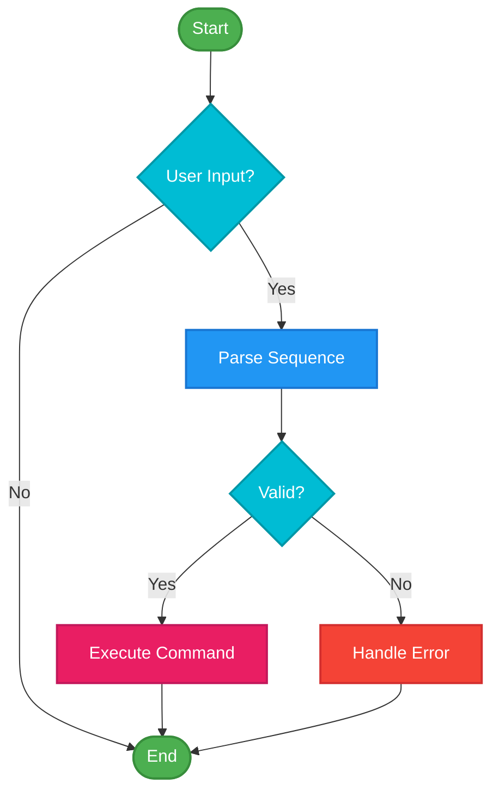

# RetroTerm - Documentation Guide

**Version**: 1.0.0  
**Last Updated**: 2025-10-17  
**Purpose**: Standards and guidelines for creating and maintaining RetroTerm documentation

---

## Table of Contents

1. [Documentation Philosophy](#1-documentation-philosophy)
2. [Documentation Structure](#2-documentation-structure)
3. [Writing Guidelines](#3-writing-guidelines)
4. [Mermaid Diagrams](#4-mermaid-diagrams)
5. [Code Examples](#5-code-examples)
6. [Screenshots and Images](#6-screenshots-and-images)
7. [Versioning and Updates](#7-versioning-and-updates)
8. [Review Process](#8-review-process)

---

## 1. Documentation Philosophy

### 1.1 Core Principles

**Clarity Over Brevity**
- Explain concepts thoroughly
- Use examples liberally
- Assume reader has basic C#/.NET knowledge but not terminal emulation expertise

**Visual First**
- Every complex concept should have a diagram
- Use Mermaid diagrams extensively
- Screenshots for UI features

**Maintainability**
- Keep documentation close to code (XML comments)
- Update documentation with every feature change
- Living documents that evolve with the codebase

**Accessibility**
- WCAG 2.1 AA compliant (color contrast, alt text)
- Clear heading hierarchy
- Descriptive link text

### 1.2 Target Audiences

| Audience | Documents | Focus |
|----------|-----------|-------|
| **End Users** | USER-MANUAL.md | How to use RetroTerm features |
| **Developers** | Architecture docs, API reference | How to extend RetroTerm |
| **Contributors** | CONTRIBUTING.md, TODO-PLAN.md | How to contribute code |
| **Testers** | TEST-PLAN.md | How to verify functionality |
| **System Admins** | Deployment guides | How to deploy and configure |

---

## 2. Documentation Structure

### 2.1 Core Documentation Files

| File | Purpose | Update Frequency |
|------|---------|------------------|
| **README.md** | Project overview, quick start | Every major release |
| **USER-MANUAL.md** | Complete user guide | With each feature implementation |
| **retroterm_emulator_plan.md** | Architecture and design | Major architectural changes |
| **TODO-PLAN.md** | Implementation roadmap | Weekly during development |
| **TEST-PLAN.md** | Testing strategy and procedures | With each phase |
| **OPEN-QUESTIONS.md** | Unresolved design decisions | As decisions are made |
| **CROSS-PLATFORM-GUIDE.md** | Platform-specific concerns | As needed |
| **RETRO-FAMILY-UI-DESIGN-SYSTEM.md** | Visual design standards (colors, typography, components) | Rarely |
| **DOCUMENTATION-GUIDE.md** | This file | As standards evolve |
| **MERMAID-COLOR-STANDARDS.md** | Diagram color standards | Rarely |

### 2.2 API Documentation

**XML Documentation Comments** (every public API):
```csharp
/// <summary>
/// Processes escape sequence data and updates the terminal buffer.
/// </summary>
/// <param name="data">Raw byte data containing escape sequences.</param>
/// <param name="offset">Starting offset in the data array.</param>
/// <param name="count">Number of bytes to process.</param>
/// <returns>Number of bytes actually processed.</returns>
/// <exception cref="ArgumentNullException">Thrown when data is null.</exception>
/// <remarks>
/// This method uses a hybrid parsing approach: common sequences are
/// handled via fast-path lookup, while complex sequences use a state machine.
/// <para>
/// Performance: Processes ~10MB/s of typical VT100 escape sequences.
/// </para>
/// </remarks>
/// <example>
/// <code>
/// var emulator = new VT100Emulator(80, 24);
/// byte[] data = Encoding.UTF8.GetBytes("\x1b[2J"); // Clear screen
/// emulator.ProcessData(data, 0, data.Length);
/// </code>
/// </example>
public int ProcessData(byte[] data, int offset, int count)
```

### 2.3 Inline Documentation

**When to use inline comments**:
- Complex algorithms that aren't self-explanatory
- Non-obvious performance optimizations
- Platform-specific workarounds
- Temporary hacks (with TODO)

**When NOT to use inline comments**:
- Obvious code (don't comment `i++; // Increment i`)
- Outdated comments (remove or update immediately)
- Commented-out code (use version control instead)

---

## 3. Writing Guidelines

### 3.1 Writing Style

**Voice and Tone**:
- **Technical but friendly**: Professional yet approachable
- **Active voice**: "The parser processes sequences" not "Sequences are processed by the parser"
- **Present tense**: "The emulator handles" not "The emulator will handle"
- **Direct and concise**: Get to the point quickly

**Formatting**:
- **Headings**: Use ATX-style `#` headings (not underline-style)
- **Lists**: Use `-` for unordered, `1.` for ordered
- **Emphasis**: `**bold**` for important terms, `*italic*` for emphasis, `` `code` `` for technical terms
- **Line length**: No hard limit, but break at natural points (~120 characters)

### 3.2 Technical Terms

**Consistency**:
- Use the same term throughout (don't alternate between "terminal", "emulator", "terminal emulator")
- Define abbreviations on first use: "CSI (Control Sequence Introducer)"
- Maintain a glossary in USER-MANUAL.md

**Capitalization**:
- Product names: RetroTerm (capital R, capital T)
- Terminal types: VT100, TDV1200, IBM 3270 (all caps/numbers)
- Protocols: Telnet, SSH, SFTP (capital first letter)
- Technical terms: escape sequence, control code, CSI (lowercase unless abbreviation)

### 3.3 Code References

**Inline code**:
- File paths: `` `src/RetroTerm.Core/TerminalBuffer.cs` ``
- Class names: `` `TerminalEmulatorBase` ``
- Method names: `` `ProcessData()` ``
- Variables: `` `scrollbackSize` ``
- Keyboard shortcuts: `` `Ctrl+C` ``

**Code blocks**:
````markdown
```csharp
public void Example()
{
    // Code here
}
```
````

---

## 4. Mermaid Diagrams

### 4.1 When to Use Mermaid Diagrams

**Always use diagrams for**:
- ✅ Architecture overviews
- ✅ Class hierarchies
- ✅ Sequence flows (protocol handshakes, escape sequence parsing)
- ✅ State machines (LAPB, parser states)
- ✅ Data flows (input processing pipeline)
- ✅ Decision trees (which emulator to use)
- ✅ Module dependencies

**Consider diagrams for**:
- Complex algorithms (if flowchart clarifies)
- Multi-step processes (connection setup)
- Branching logic (mode handling)

### 4.2 Color Standards

**CRITICAL**: All Mermaid diagrams MUST follow the color standards defined in `MERMAID-COLOR-STANDARDS.md`.

**Quick Reference**:

| Purpose | Color | Hex Code |
|---------|-------|----------|
| **Frontend/Parsing** | Sky Blue | `#2196F3` |
| **Backend/Code Gen** | Magenta | `#E91E63` |
| **Data Structures** | Indigo | `#3F51B5` |
| **Success/Complete** | Green | `#4CAF50` |
| **Error/Failure** | Red | `#F44336` |
| **Warning/Caution** | Amber | `#FFA726` |
| **Processing/Active** | Cyan | `#00BCD4` |
| **Storage/Memory** | Purple | `#9C27B0` |
| **Resources** | Teal | `#009688` |

**Standard Class Definitions** (copy-paste into your diagrams):

```mermaid
classDef frontend fill:#2196F3,stroke:#1976D2,stroke-width:2px,color:#fff
classDef backend fill:#E91E63,stroke:#C2185B,stroke-width:2px,color:#fff
classDef dataStructure fill:#3F51B5,stroke:#303F9F,stroke-width:2px,color:#fff
classDef success fill:#4CAF50,stroke:#388E3C,stroke-width:2px,color:#fff
classDef error fill:#F44336,stroke:#D32F2F,stroke-width:2px,color:#fff
classDef warning fill:#FFA726,stroke:#F57C00,stroke-width:2px,color:#fff
classDef processing fill:#00BCD4,stroke:#0097A7,stroke-width:2px,color:#fff
classDef storage fill:#9C27B0,stroke:#7B1FA2,stroke-width:2px,color:#fff
classDef resources fill:#009688,stroke:#00796B,stroke-width:2px,color:#fff
```

### 4.3 Diagram Types

#### Architecture Diagrams (Graph)



#### Class Hierarchies (Graph)



#### Sequence Diagrams



#### State Machines



#### Flowcharts



### 4.4 Diagram Guidelines

**Size and Complexity**:
- Keep diagrams focused (max 10-15 nodes)
- Split complex diagrams into multiple smaller ones
- Use subgraphs for logical grouping

**Labels**:
- Use clear, concise labels (2-4 words)
- Avoid abbreviations unless well-known
- Include legends if using custom symbols

**Accessibility**:
- ALWAYS use colors from MERMAID-COLOR-STANDARDS.md
- Don't rely solely on color (use shapes/labels too)
- Test with colorblind simulation tools

---

## 5. Code Examples

### 5.1 Example Guidelines

**Complete and Runnable**:
```csharp
// ✅ GOOD - Complete, runnable example
var emulator = new VT100Emulator(80, 24);
byte[] data = Encoding.UTF8.GetBytes("\x1b[2J"); // Clear screen
emulator.ProcessData(data, 0, data.Length);

// ❌ BAD - Incomplete, won't compile
emulator.ProcessData(data);
```

**Realistic Use Cases**:
```csharp
// ✅ GOOD - Realistic scenario
var connection = new SSHClient();
await connection.ConnectAsync("example.com", 22);
await connection.AuthenticateAsync("user", privateKeyPath);

var terminal = new VT100Emulator(80, 24);
connection.DataReceived += data => terminal.ProcessData(data);

// ❌ BAD - Unrealistic
var x = new Thing();
x.DoStuff();
```

**Error Handling**:
```csharp
// ✅ GOOD - Shows error handling
try
{
    await connection.ConnectAsync(host, port);
}
catch (SocketException ex)
{
    Console.WriteLine($"Connection failed: {ex.Message}");
}

// ❌ BAD - No error handling
await connection.ConnectAsync(host, port);
```

### 5.2 Code Example Templates

**Basic Usage**:
````markdown
### Basic Usage

```csharp
using RetroTerm.Core;

var emulator = new VT100Emulator(80, 24);
emulator.ProcessData(data);
```
````

**Advanced Example**:
````markdown
### Advanced Example

This example shows how to connect via SSH with key authentication:

```csharp
using RetroTerm.Core.Protocols.Net;
using System.IO;

// Load SSH private key
var keyPath = Path.Combine(Environment.GetFolderPath(
    Environment.SpecialFolder.UserProfile), ".ssh", "id_rsa");

// Create and configure SSH connection
var ssh = new SSHClient();
await ssh.ConnectAsync("example.com", 22);
await ssh.AuthenticateAsync("username", keyPath);

// Integrate with terminal emulator
var terminal = new VT100Emulator(80, 24);
ssh.DataReceived += data => 
{
    terminal.ProcessData(data);
    // Update UI here
};

// Send terminal input to SSH
terminal.UserInput += data => 
{
    ssh.SendAsync(data).Wait();
};
```

**Key Points**:
- SSH key must be in OpenSSH format
- Connection is asynchronous - use `await`
- Wire up bidirectional data flow
````

---

## 6. Screenshots and Images

### 6.1 When to Include Screenshots

**Required for**:
- ✅ UI features (connection dialog, settings window)
- ✅ Visual keyboard layouts
- ✅ Terminal rendering examples (colors, fonts)
- ✅ Error messages and dialogs

**Optional for**:
- File transfer UI
- Menu structures
- Keyboard shortcuts (can use tables instead)

### 6.2 Screenshot Guidelines

**Format**: PNG (lossless)
**Resolution**: High-DPI (2x) for Retina displays
**Size**: Optimize with tools like TinyPNG
**Location**: `docs/images/` directory

**Naming Convention**:
```
feature-description-platform.png

Examples:
connection-dialog-windows.png
terminal-vt100-colors.png
settings-font-macos.png
```

**Alt Text**:
```markdown

```

### 6.3 Annotations

**Use annotations for**:
- Highlighting specific UI elements
- Showing click sequences (1, 2, 3)
- Indicating keyboard shortcuts

**Tool Recommendations**:
- Windows: Snipping Tool, Greenshot
- macOS: Screenshot utility (Cmd+Shift+4), Skitch
- Linux: GNOME Screenshot, Flameshot

---

## 7. Versioning and Updates

### 7.1 Documentation Versions

**Semantic Versioning** (matches code version):
- **Major version** (v1.0.0 → v2.0.0): Breaking changes, major new features
- **Minor version** (v1.0.0 → v1.1.0): New features, no breaking changes
- **Patch version** (v1.0.0 → v1.0.1): Bug fixes, clarifications

**Version Header**:
```markdown
# Document Title

**Version**: 1.0.0  
**Last Updated**: 2025-10-17  
**Status**: Current / Draft / Obsolete
```

### 7.2 Update Frequency

| Document | Update Trigger |
|----------|----------------|
| **USER-MANUAL.md** | Every feature implementation |
| **TODO-PLAN.md** | Daily during active development |
| **TEST-PLAN.md** | Every phase completion |
| **retroterm_emulator_plan.md** | Architectural changes only |
| **README.md** | Major releases |

### 7.3 Changelog

**Maintain a changelog** in each major document:

```markdown
## Change Log

### Version 1.1.0 (2025-11-01)
- Added section on SINTRAN file transfer protocol
- Updated Mermaid diagrams with new color standards
- Fixed typos in keyboard shortcut table

### Version 1.0.0 (2025-10-17)
- Initial release
```

---

## 8. Review Process

### 8.1 Documentation Review Checklist

Before committing documentation changes:

**Content**:
- [ ] Technically accurate
- [ ] Complete (no placeholders without TODOs)
- [ ] Code examples compile and run
- [ ] Screenshots current and annotated

**Style**:
- [ ] Follows writing guidelines
- [ ] Consistent terminology
- [ ] Proper heading hierarchy
- [ ] Mermaid diagrams use standard colors

**Formatting**:
- [ ] Markdown syntax correct
- [ ] Links work (relative paths for internal, absolute for external)
- [ ] Tables formatted correctly
- [ ] Code blocks have language specifiers

**Accessibility**:
- [ ] Color contrast meets WCAG AA (diagrams)
- [ ] Alt text for all images
- [ ] Clear heading structure
- [ ] No color-only information

### 8.2 Pull Request Documentation Requirements

**Every PR that changes functionality MUST**:
1. Update affected sections of USER-MANUAL.md
2. Update API documentation (XML comments)
3. Add/update relevant Mermaid diagrams
4. Include before/after screenshots (for UI changes)

**PR Description Template**:
```markdown
## Changes
- Brief description of changes

## Documentation Updates
- [ ] USER-MANUAL.md section X.Y updated
- [ ] API documentation added for new classes/methods
- [ ] Mermaid diagram added/updated
- [ ] Screenshots included (if UI change)

## Breaking Changes
- None / List breaking changes
```

### 8.3 Documentation Debt

**Track documentation TODOs**:
```markdown
<!-- TODO(v1.1): Add detailed examples for SINTRAN file transfer -->
<!-- TODO: Add performance benchmarks once optimization complete -->
```

**Regular Documentation Audits**:
- Monthly: Review open TODOs
- Quarterly: Check for outdated screenshots
- Annually: Review entire documentation set

---

## 9. Quick Reference

### 9.1 Documentation Checklist for New Features

When implementing a new feature:

1. **Before Coding**:
   - [ ] Create/update architecture diagrams
   - [ ] Document design decisions in plan
   - [ ] Add test cases to TEST-PLAN.md

2. **During Coding**:
   - [ ] Write XML documentation comments
   - [ ] Add inline comments for complex logic
   - [ ] Create code examples

3. **After Coding**:
   - [ ] Update USER-MANUAL.md
   - [ ] Add Mermaid diagrams (with standard colors!)
   - [ ] Take screenshots (if UI)
   - [ ] Update README.md (if major feature)

4. **Before PR**:
   - [ ] Run documentation review checklist
   - [ ] Verify all links work
   - [ ] Test code examples
   - [ ] Spell check

### 9.2 Common Markdown Patterns

**Admonitions** (GitHub Flavored Markdown):
```markdown
> **Note**
> This is a note block.

> **Warning**
> This is a warning block.

> **Important**
> This is an important notice.
```

**Tables with alignment**:
```markdown
| Left Aligned | Center Aligned | Right Aligned |
|:-------------|:--------------:|--------------:|
| Text         | Text           | 123           |
```

**Task Lists**:
```markdown
- [x] Completed task
- [ ] Pending task
```

**Collapsible Sections**:
```markdown
<details>
<summary>Click to expand</summary>

Content here (leave blank lines around Markdown content)

</details>
```

---

## Summary

### Key Documentation Principles

1. **Visual First**: Use Mermaid diagrams extensively (with standard colors!)
2. **Complete Examples**: All code examples must be runnable
3. **Keep Current**: Update documentation with every code change
4. **Accessible**: WCAG AA compliant colors and structure
5. **User-Focused**: Write for your audience's knowledge level

### Essential References

- **Color Standards**: [MERMAID-COLOR-STANDARDS.md](MERMAID-COLOR-STANDARDS.md)
- **Project Structure**: [README.md](README.md)
- **Architecture**: [retroterm_emulator_plan.md](retroterm_emulator_plan.md)
- **Testing**: [TEST-PLAN.md](TEST-PLAN.md)

### Documentation Contacts

- **Technical Lead**: Responsible for architecture documentation
- **QA Lead**: Responsible for test plan and procedures
- **UI/UX Lead**: Responsible for user manual and screenshots

---

**End of Documentation Guide**

For detailed color standards, see [MERMAID-COLOR-STANDARDS.md](MERMAID-COLOR-STANDARDS.md)  
For contribution guidelines, see [CONTRIBUTING.md](docs/contributing.md) (TBD)

