# TDV-2200 Series Keyboard Specification

Comprehensive reference for the ND-246 and ND-322 keyboards used with TDV-2200 series terminals.

**Sources:**
- ROM Layout 965313-0 (TDV-2200/9S Norwegian) — the Tandberg scan archive, kept outside this repository: `TDV-2200S Keyboard 4580\`
- ROM Layout 961292-2 (TDV-2215 ASCII) — the Tandberg scan archive, kept outside this repository: `TDV-2200 Keyboard 4024\`
- ROM Layout 961299-3 (TDV-2215 Variant) — the Tandberg scan archive, kept outside this repository: `TDV-2200 Keyboard 4076\`
- Keyboards Technical Info — the Tandberg scan archive, kept outside this repository: `Keyboards Technical Info.txt`
- TDV-2200/9 User's Guide (OCR) — `spec\TDV2200\OCR\TDV-2200_9-User-s_Guide-ND_combined.md`
- Keyboard photos — `spec\Keyboards\ND246-Keyboard.jpg`, `ND322-Keyboard.jpg`
- Siemens variant photos — the Tandberg scan archive, kept outside this repository: `TDV-2200 Keyboard Unk1\IMG_9250r.jpg` etc.

---

## 1. Overview

### 1.1 Keyboard Product Variants

| Product Code | Item Type | Description | ROM Layout | Notes |
|---|---|---|---|---|
| 961267 | 4212 | TDV-2200 keyboard (ND-246) | 965313-0 (TDV-2200/9S) | Full-featured, Norwegian labeled keys |
| 965133 | 4513 | TDV-2200/S keyboard | 965313 variant? | /S variant |
| 967003 | 8720 | TDV-1200 keyboard | Unknown | Different keycap colors, Norwegian layout |
| (4024) | — | TDV-2215 keyboard | 961292-2 | ASCII, many keys covered/unused |
| (4076) | — | TDV-2215 keyboard variant | 961299-3 | Extended Ctrl support, blank keycaps on unused keys |
| (Unk1) | — | Siemens-branded TDV-2200 | Unknown (`xxxVT100S.u8`) | English PF1-PF20 labels, older design |

### 1.2 Physical Models

**ND-246:**
- Beige housing
- Orange flat keycaps for function/editing keys (top row G, and right-side action keys)
- Cream/white keys for main typing area
- Brown/dark keys for some function keys (TAB+, JUST, etc.)
- 9 LEDs in top strip: EXP, APP, BUSY, MSG (application) + LINE, CAR, WAIT, ERROR, ON
- "CONTROL MODE:" label printed above the top-right key block
- "ND 246" printed on the right side of the LED strip

**ND-322:**
- Different housing style/color
- Gold round keycaps for function area (top row, editing keys)
- Cream rectangular keys for main typing area
- Same functional layout as ND-246
- Same LED bar layout (EXP/APP/BUSY/MSG + LINE/CAR/WAIT/ERROR/ON)
- Same CONTROL MODE label area
- "ND 322" printed on the right side of the LED strip
- Norwegian key labels visible in photo

### 1.3 Hardware Architecture

**Schematic:** Part no. 391170, Drawing 20007, Rev D

| Component | Part | Function |
|---|---|---|
| U1 | 8035 (8048 family) | Microcontroller, 6.0 MHz crystal |
| U8 | 2716 EPROM (2KB) | Key layout ROM |
| U4 | 74LS154 | 4-to-16 decoder (key matrix row scanning) |
| U5, U7 | 74LS373 | Latches (column read-back) |
| U9 | 26LS32 | RS-422 differential receiver |
| U10 | 26LS31 | RS-422 differential transmitter |
| J1 | Connector | Expansion card (READY, CARD PRESENT, CARD DATA, CARD CLOCK) |

**Communication:**
- UART over RS-422
- 8 bits per byte, no parity
- 2400 baud TX (keyboard → terminal), 600 baud RX (terminal → keyboard)

---

## 2. Physical Layout

Grid position naming from `Keyboards Technical Info.txt`. Rows A (bottom) through G (top), columns numbered.

**Three column groups separated by physical gaps:**
- **Cols 0–14** (+ 99): Main keyboard area (letters, numbers, function row, modifiers)
- **Cols 47–49**: Middle block (editing keys, navigation, arrows)
- **Col 50**: Physical gap — empty space in the keyboard housing, no key present
- **Cols 51–54**: Right block (F-keys / system keys on rows F–G, numeric keypad on rows A–D)

```
+------------------------------------------------------------------------------------------------------+
|                                                                                                      |
|  PUSH-key labels (shift P9-P16 top row, P1-P8 bottom row)                                            |
|  [EXP] [APP] [BUSY] [MSG]              [LINE] [CAR] [WAIT] [ERROR] [ON]    CONTROL MODE: labels      |
|                                                                                                      |
|  G0  G1  G2  G3  G4  G5  G6  G7  G8  G9  G10 G11 G12 G13 G14      G47 G48 G49 |   | G51 G52 G53 G54 |
|                                                                   F47 F48 F49 |   | F51 F52 F53 F54 |
|    E0  E1  E2  E3  E4  E5  E6  E7  E8  E9  E10 E11 E12 E13 E14    E47 E48 E49 |   | E51 E52 E53 E54 |
|  D99 D0  D1  D2  D3  D4  D5  D6  D7  D8  D9  D10 D11 D12 D13      D47 D48 D49 |   | D51 D52 D53 D54 |
|  C99  C0  C1  C2  C3  C4  C5  C6  C7  C8  C9  C10 C11 C12 C13     C47 C48 C49 |   | C51 C52 C53 C54 |
|    B99   B0  B1  B2  B3  B4  B5  B6  B7  B8  B9  B10 B11          B47 B48 B49 |   | B51 B52 B53 B54 |
|                                A5                                  A47 A48 A49 |   | A51     A53     |
|                                                                                                      |
| <------------- Main Area (0-14,99) ------------> <-- Middle (47-49) --> | | <-- Right (51-54) -->    |
+------------------------------------------------------------------------------------------------------+
```

### ND-246 Key Labels (Norwegian, Layout 5313)

```
Row G:  ESC  P1  P2  P3  P4  P5  P6  P7  P8  MERK FELT AVSN SETN ORD  LOKAL     STRYK KOPI FLYTT | | FUNK SKRIV HJELP SLUTT
Row F:                                                                            TAB+  (...) /aaa | | F1   F2    F3    F4
Row E:  CAPS 1!  2"  3#  4$  5%  6&  7/  8(  9)  0=  +?  @`  ¶    Del  <<   JUST  <>  | | F5   F6    F7    F8
Row D:  INNS CTRL Q   W   E   R   T   Y   U   I   O   P   Å   ^~  LF   RollUp ANGRE RollDn | | 7np  8np   9np   SPnp
Row C:  MM   LOCK A   S   D   F   G   H   J   K   L   Ø   Æ   '*  CR   FldL  Up   FldR  | | 4np  5np   6np   -np
Row B:       SHFT <>  Z   X   C   V   B   N   M   ,;  .:  -_  SHFT    Left Home Right | | 1np  2np   3np   ENTnp
Row A:                              Space                               TabL Down TabR | | 0np       .np
```

Notes:
- `¶` = NewParagraph key (E13)
- `MM` = Mode key (C99, shown as squiggle symbol)
- `| |` = Column 50 is a physical gap in the keyboard (not a key). It separates the middle block (cols 47–49) from the right block (cols 51–54)
- `np` = numeric pad

---

## 3. ROM Layout Flag System

### 3.1 Flag Byte Bit Definitions

The flag byte for each key position controls how the key behaves with modifiers:

#### Layout 5313 (TDV-2200/9S)

```
Flags: xxxxxxxx
         ||||||
         |||||+--  Bit 0: 0=Don't use key with Normal, 1=Use key with Normal
         |||++---  Bits 1-2: 00=Don't use key with Shift/Caps/Lock
         |||                 x1=Use key with Shift/Caps/Lock
         |||                 10=Use key with Shift, but not Caps/Lock
         |++-----  Bits 3-4: x0=Don't use key with Ctrl
         |                   01=Use key with Ctrl
         |                   11=Prefix Ctrl-key code with 0xFF
         +-------  Bit 5: 0=Enable key-repeat (Normal/Shift), 1=Disable key-repeat
```

#### Layouts 1292 and 1299 (TDV-2215)

```
Flags: xxxxxxxx
         ||||||
         |||||+--  Bit 0: 0=Don't use key with Normal, 1=Use key with Normal
         |||++---  Bits 1-2: 00=Don't use key with Shift/Caps/Lock
         |||                 x1=Use key with Shift/Caps/Lock
         |||                 10=Use key with Shift, but not Caps/Lock
         ||+-----  Bit 3: 0=Don't use key with Ctrl, 1=Use key with Ctrl
         |+------  Bit 4: 0=Treat Caps as Shift, 1=Treat Caps as Normal
         +-------  Bit 5: 0=Enable key-repeat (Normal/Shift), 1=Disable key-repeat
```

### 3.2 Common Flag Values

| Flags | Hex | Meaning |
|---|---|---|
| `00001111` | 0x0F | Standard alpha key: Normal + Shift/Caps/Lock + Ctrl |
| `00010111` | 0x17 | Number/punctuation: Normal + Shift (not Caps) + no Ctrl, Caps=Normal |
| `00011111` | 0x1F | Like 0x17 but with Ctrl (and FF-prefix for 5313) |
| `00000101` | 0x05 | Function key: Normal + Ctrl only, no repeat |
| `00000111` | 0x07 | Normal-only, no repeat |
| `00001101` | 0x0D | Normal + Ctrl, with repeat |
| `00100111` | 0x27 | Like 0x07 but no repeat (5313: LOKAL) |
| `00110100` | 0x34 | Shift only, no repeat (MODE key) |
| `00110101` | 0x35 | ... |
| `00110111` | 0x37 | Normal-only, no repeat (many function keys in 1292/1299) |
| `00111100` | 0x3C | Shift + Ctrl, no repeat (PRINT key) |
| `00111101` | 0x3D | Normal + Shift + Ctrl, no repeat (BREAK key) |
| `00111111` | 0x3F | All modifiers, no repeat (1299: extended Ctrl) |

### 3.3 ROM Layout Structure (EPROM)

Key datatables within each layout definition (512 bytes total):

| Offset Range | Content |
|---|---|
| `0x000–0x07F` | Key flags (128 entries) |
| `0x080–0x0FF` | Normal key values |
| `0x100–0x17F` | Shift-held key values |
| `0x180–0x1FF` | Ctrl-held key values |

Layout locations in the 2KB EPROM:
- Layout 5313: offset `0x600`
- Layout 1292: offset `0x400`
- Layout 1299: offset `0x600`

### 3.4 Grid Position to Datatable Offset Mapping

From `Keyboards Technical Info.txt`:

```
Offset:
00-0F    x    x    x   A50  A49  A48  A47  C49  D48  E48  B49  G50   x    x   E50  C50
10-1F   C54  B53  C53  B52  B51  B50  C51  D54  D51  E52  C52  E53  E54  D52  E51  D53
20-2F   F50  F49  F53  F52  F51  F54  G54  G53  D49  F48  G52  G48  F47  E49  G49  G51
30-3F    B0   B1   B2   B3   B4   B5   B6   B7   B8   B9  B10  A51   A5  B48  B47  C13
40-4F    C1   C2   C3   C4   C5   C6   C7   C8   C9  C10  C11  B54  C48  C47  C99  C12
50-5F    D1   D2   D3   D4   D5   D6   D7   D8   D9  D10  D11  D50  D47  D99  D13  D12
60-6F    E1   E2   E3   E4   E5   E6   E7   E8   E9  E10  E11  A53  E47  E14  E13  E12
70-7F    G0   G1   G2   G3   G4   G5   G6   G7   G8   G9  G10  G47  G14  G13  G12  G11
```

---

## 4. Complete Key Tables

### 4.1 Layout 965313-0 (TDV-2200/9S Norwegian)

Full-featured layout used with ND-246/ND-322 keyboards. All editing, system, and function keys active.

#### Alphabetic Keys

| Grid Pos | Key Label | Flags | Normal | Shift | Ctrl |
|---|---|---|---|---|---|
| C1 | A | 0x0F | 0x61 `a` | 0x41 `A` | 0x01 SOH |
| B5 | B | 0x0F | 0x62 `b` | 0x42 `B` | 0x02 STX |
| B3 | C | 0x0F | 0x63 `c` | 0x43 `C` | 0x03 ETX |
| C3 | D | 0x0F | 0x64 `d` | 0x44 `D` | 0x04 EOT |
| D3 | E | 0x0F | 0x65 `e` | 0x45 `E` | 0x05 ENQ |
| C4 | F | 0x0F | 0x66 `f` | 0x46 `F` | 0x06 ACK |
| C5 | G | 0x0F | 0x67 `g` | 0x47 `G` | 0x07 BEL |
| C6 | H | 0x0F | 0x68 `h` | 0x48 `H` | 0x08 BS |
| D8 | I | 0x0F | 0x69 `i` | 0x49 `I` | 0x09 HT |
| C7 | J | 0x0F | 0x6A `j` | 0x4A `J` | 0x0A LF |
| C8 | K | 0x0F | 0x6B `k` | 0x4B `K` | 0x0B VT |
| C9 | L | 0x0F | 0x6C `l` | 0x4C `L` | 0x0C FF |
| B7 | M | 0x0F | 0x6D `m` | 0x4D `M` | 0x0D CR |
| B6 | N | 0x0F | 0x6E `n` | 0x4E `N` | 0x0E SO |
| D9 | O | 0x0F | 0x6F `o` | 0x4F `O` | 0x0F SI |
| D10 | P | 0x0F | 0x70 `p` | 0x50 `P` | 0x10 DLE |
| D1 | Q | 0x0F | 0x71 `q` | 0x51 `Q` | 0x11 DC1 |
| D4 | R | 0x0F | 0x72 `r` | 0x52 `R` | 0x12 DC2 |
| C2 | S | 0x0F | 0x73 `s` | 0x53 `S` | 0x13 DC3 |
| D5 | T | 0x0F | 0x74 `t` | 0x54 `T` | 0x14 DC4 |
| D7 | U | 0x0F | 0x75 `u` | 0x55 `U` | 0x15 NAK |
| B4 | V | 0x0F | 0x76 `v` | 0x56 `V` | 0x16 SYN |
| D2 | W | 0x0F | 0x77 `w` | 0x57 `W` | 0x17 ETB |
| B2 | X | 0x0F | 0x78 `x` | 0x58 `X` | 0x18 CAN |
| D6 | Y | 0x0F | 0x79 `y` | 0x59 `Y` | 0x19 EM |
| B1 | Z | 0x0F | 0x7A `z` | 0x5A `Z` | 0x1A SUB |

#### Number Row

| Grid Pos | Key Label | Flags | Normal | Shift | Ctrl |
|---|---|---|---|---|---|
| E1 | 1 ! | 0x1F | 0x31 `1` | 0x21 `!` | FF 86 |
| E2 | 2 " | 0x1F | 0x32 `2` | 0x22 `"` | FF 87 |
| E3 | 3 # | 0x1F | 0x33 `3` | 0x23 `#` | FF 88 |
| E4 | 4 $ | 0x1F | 0x34 `4` | 0x24 `$` | FF 89 |
| E5 | 5 % | 0x1F | 0x35 `5` | 0x25 `%` | FF 8A |
| E6 | 6 & | 0x1F | 0x36 `6` | 0x26 `&` | FF 8B |
| E7 | 7 / | 0x1F | 0x37 `7` | 0x27 `/` | FF 8C |
| E8 | 8 ( | 0x1F | 0x38 `8` | 0x28 `(` | FF 8D |
| E9 | 9 ) | 0x1F | 0x39 `9` | 0x29 `)` | FF 8E |
| E10 | 0 = | 0x0F | 0x30 `0` | 0x5F `_` | 0x1F US |

Note: Ctrl+number keys use 0xFF prefix followed by the Ctrl code.

#### Punctuation and Special Characters

| Grid Pos | Key Label | Flags | Normal | Shift | Ctrl |
|---|---|---|---|---|---|
| B0 | < > | 0x0F | 0x5C `\` | 0x7C `\|` | 0x1C FS |
| B8 | , ; | 0x1F | 0x2C `,` | 0x3C `<` | FF 80 |
| B9 | . : | 0x1F | 0x2E `.` | 0x3E `>` | FF 81 |
| B10 | - _ | 0x1F | 0x2F `/` | 0x3F `?` | FF 82 |
| C10 | (national) | 0x1F | 0x3B `;` | 0x2B `+` | FF 83 |
| C11 | (national) | 0x1F | 0x3A `:` | 0x2A `*` | FF 84 |
| C12 | ' * | 0x0F | 0x7D `}` | 0x5D `]` | 0x1D GS |
| D11 | (national) | 0x1F | 0x60 `` ` `` | 0x40 `@` | FF 85 |
| D12 | ^ ~ | 0x0F | 0x7B `{` | 0x5B `[` | 0x1B ESC |
| E11 | + ? | 0x1F | 0x2D `-` | 0x3D `=` | FF 8F |
| E12 | @ ` | 0x0F | 0x5E `^` | 0x7E `~` | 0x1E RS |

Note: The "Normal" column shows the byte value sent. For Norwegian layout, positions C10/C11/D11 correspond to national variant characters (Ø, Æ, Å in display).

#### Control and Whitespace Keys

| Grid Pos | Key Label | Flags | Normal | Shift | Ctrl |
|---|---|---|---|---|---|
| A5 | Space | 0x0F | 0x20 SP | 0x20 SP | — |
| E14 | Del | 0x0F | 0x7F DEL | — | 0x7F DEL |
| D13 | LineFeed | 0x0F | 0x9A | — | 0x9A |
| C13 | Carriage Return | 0x0F | 0xCD | — | 0xCD |
| E13 | NewParagraph | 0x05 | 0xEE | 0xFE | — |
| G0 | ESC | 0x07 | 0xDB | — | — |

#### Editing Keys (Left Block)

| Grid Pos | Key Label (Norw.) | Flags | Normal | Shift | Ctrl |
|---|---|---|---|---|---|
| G9 | MERK (Mark) | 0x05 | 0xBD | 0x80 | — |
| G10 | FELT (Field) | 0x05 | 0xBC | 0x81 | — |
| G11 | AVSN (Paragraph) | 0x05 | 0xC0 | 0x82 | — |
| G12 | SETN (Sentence) | 0x05 | 0xB0 | 0x83 | — |
| G13 | ORD (Word) | 0x05 | 0xF4 | 0x84 | — |

#### Action Keys (Middle Block, Row G) and LOKAL (Left Block)

| Grid Pos | Key Label (Norw.) | Flags | Normal | Shift | Ctrl |
|---|---|---|---|---|---|
| G47 | STRYK (Delete) | 0x05 | 0xF1 | 0xD0 | — |
| G48 | KOPI (Copy) | 0x05 | 0xF2 | 0xD1 | — |
| G49 | FLYTT (Move) | 0x05 | 0xF0 | 0xD2 | — |
| G14 | LOKAL (Local) | 0x27 | 0xFA | — | — |

#### System Keys

| Grid Pos | Key Label (Norw.) | Flags | Normal | Shift | Ctrl |
|---|---|---|---|---|---|
| G51 | FUNK (Function) | 0x0D | 0xC1 | 0xB5 | 0xFD (STOP PRINT) |
| G52 | SKRIV (Print) | 0x0D | 0xC2 | 0xB6 | 0xFC (START PRINT) |
| G53 | HJELP (Help) | 0x0D | 0xCB | 0xB7 | 0xF8 (MODE) |
| G54 | SLUTT (Exit) | 0x0D | 0xCC | 0xB9 | 0xF9 (BREAK) |

#### Function Keys F1–F8

| Grid Pos | Key Label | Flags | Normal | Shift | Ctrl |
|---|---|---|---|---|---|
| F51 | F1 | 0x05 | 0x9D | 0xBA | — |
| F52 | F2 [SI] | 0x0D | 0x9C | 0xBB | 0xCF (S1/SI) |
| F53 | F3 [SO] | 0x0D | 0x9E | 0xBE | 0xCE (S0/SO) |
| F54 | F4 [CLEAR] | 0x0D | 0x9B | 0xBF | 0xFB (CLEAR) |
| E51 | F5 | 0x05 | 0x8B | 0x92 | — |
| E52 | F6 | 0x05 | 0x8C | 0x95 | — |
| E53 | F7 | 0x05 | 0x8D | 0x98 | — |
| E54 | F8 | 0x05 | 0x8E | 0x9F | — |

Note: F50 is a physical gap (no key) — see "Column 50" section.

#### Navigation and Cursor Keys

| Grid Pos | Key Label | Flags | Normal | Shift | Ctrl |
|---|---|---|---|---|---|
| C48 | Up | 0x0F | 0xB1 | — | 0xB1 |
| A48 | Down | 0x0F | 0xB2 | — | 0xB2 |
| B49 | Right | 0x0F | 0xB3 | — | 0xB3 |
| B47 | Left | 0x0F | 0xB4 | — | 0xB4 |
| B48 | Home | 0x0F | 0xB8 | — | 0xB8 |
| C47 | FieldLeft | 0x05 | 0xC3 | 0xD9 | — |
| C49 | FieldRight | 0x05 | 0xC4 | 0xDA | — |
| D47 | RollUp / RollLeft | 0x05 | 0xC5 | 0xC8 | — |
| D49 | RollDown / RollRight | 0x05 | 0xC6 | 0xC7 | — |
| A47 | TABLeft | 0x05 | 0xCA | 0x85 | — |
| A49 | TABRight | 0x05 | 0x99 | 0x86 | — |

#### Editing Keys (Middle Block Rows F–E, and Left Block D99/C99)

| Grid Pos | Key Label | Flags | Normal | Shift | Ctrl |
|---|---|---|---|---|---|
| F47 | TAB+ / TAB- | 0x05 | 0x87 | 0xD3 | — |
| F48 | (... ...) | 0x05 | 0x89 | 0xD4 | — |
| F49 | /aaa aaa | 0x05 | 0x8A | 0xD5 | — |
| E47 | << >> | 0x05 | 0x96 | 0xD6 | — |
| E48 | JUST | 0x05 | 0x88 | 0xD7 | — |
| E49 | <> >< | 0x05 | 0x97 | 0xD8 | — |
| D48 | ANGRE (Cancel) | 0x05 | 0x8F | 0xC9 | — |
| D99 | EKSP / INNS | 0x05 | 0x90 | 0x93 | — |
| C99 | Squiggle (≈) | 0x05 | 0x91 | 0x94 | — |

#### PUSH Keys P1–P8

| Grid Pos | Key Label | Flags | Normal | Shift |
|---|---|---|---|---|
| G1 | P1 | 0x05 | 0xA0 | 0xA8 |
| G2 | P2 | 0x05 | 0xA1 | 0xA9 |
| G3 | P3 | 0x05 | 0xA2 | 0xAA |
| G4 | P4 | 0x05 | 0xA3 | 0xAB |
| G5 | P5 | 0x05 | 0xA4 | 0xAC |
| G6 | P6 | 0x05 | 0xA5 | 0xAD |
| G7 | P7 | 0x05 | 0xA6 | 0xAE |
| G8 | P8 | 0x05 | 0xA7 | 0xAF |

Normal = P1–P8, Shift = P9–P16.

#### Numeric Keypad

| Grid Pos | Key Label | Flags | Normal |
|---|---|---|---|
| A51 | 0 | 0x07 | 0xE0 |
| B51 | 1 | 0x07 | 0xE1 |
| B52 | 2 | 0x07 | 0xE2 |
| B53 | 3 | 0x07 | 0xE3 |
| C51 | 4 | 0x07 | 0xE4 |
| C52 | 5 | 0x07 | 0xE5 |
| C53 | 6 | 0x07 | 0xE6 |
| D51 | 7 | 0x07 | 0xE7 |
| D52 | 8 | 0x07 | 0xE8 |
| D53 | 9 | 0x07 | 0xE9 |
| C54 | - | 0x07 | 0xEA |
| A53 | . | 0x07 | 0xEB |
| D54 | SP | 0x07 | 0xEC |
| B54 | ENTER | 0x07 | 0xED |

All numeric keypad keys: Normal-only, no repeat (flags 0x07). No Shift or Ctrl values.

#### Column 50 — Physical Gap (No Key Present)

Column 50 on every row is a **physical gap** in the keyboard housing — there is no key in this position. It is the space that separates the middle block (cols 47–49) from the right block (cols 51–54).

The ROM datatable still has entries at these scan matrix positions. They are set to Normal-only with no repeat (flags 0x07 or 0x06), and their codes overlap with Shift codes of other keys. Since no physical key exists, these codes are never generated during normal use.

| Grid Pos | Flags | Code in ROM | Overlaps With |
|---|---|---|---|
| G50 | 0x07 | 0x80 | Shift+MERK (G9) |
| F50 | — | 0x81 | Shift+FELT (G10) |
| E50 | 0x07 | 0x82 | Shift+AVSN (G11) |
| D50 | 0x07 | 0x83 | Shift+SETN (G12) |
| C50 | 0x07 | 0x84 | Shift+ORD (G13) |
| B50 | 0x07 | 0x85 | Shift+TABLeft (A47) |
| A50 | 0x06 | 0x86 (Shift only) | Shift+TABRight (A49) |

#### Modifier Keys (No Codes Sent)

| Grid Pos | Key Label |
|---|---|
| B99 | Shift (left) |
| B11 | Shift (right) |
| C0 | LOCK |
| D0 | CTRL |
| E0 | CAPS |

---

### 4.2 Layout 961292-2 (TDV-2215 ASCII)

General purpose ASCII keyboard. Many keys covered/unused. No support for keyboard expansion.

This table only shows entries that **differ** from Layout 5313. Keys with identical values are not repeated.

#### Key Differences from 5313

**Number row — no Ctrl codes:**

| Grid Pos | Key Label | Flags | Normal | Shift | Ctrl |
|---|---|---|---|---|---|
| E1 | 1 ! | 0x17 | 0x31 | 0x21 | — |
| E2 | 2 " | 0x17 | 0x32 | 0x22 | — |
| E3 | 3 # | 0x17 | 0x33 | 0x23 | — |
| E4 | 4 $ | 0x17 | 0x34 | 0x24 | — |
| E5 | 5 % | 0x17 | 0x35 | 0x25 | — |
| E6 | 6 & | 0x17 | 0x36 | 0x26 | — |
| E7 | 7 ' | 0x17 | 0x37 | 0x27 | — |
| E8 | 8 ( | 0x17 | 0x38 | 0x28 | — |
| E9 | 9 ) | 0x17 | 0x39 | 0x29 | — |
| E10 | 0 [] | 0x1F | 0x30 | 0x5F | 0x1F |

Note: E7 Shift produces `'` (0x27) instead of `/` as in 5313.

**Punctuation — different assignments:**

| Grid Pos | Key Label | Flags | Normal | Shift | Ctrl |
|---|---|---|---|---|---|
| B0 | (unused) | 0x00 | — | — | — |
| B8 | , < | 0x17 | 0x2C | 0x3C | — |
| B9 | . > | 0x17 | 0x2E | 0x3E | — |
| B10 | / ? | 0x17 | 0x2F | 0x3F | — |
| C10 | (national) | 0x0F | 0x7C | 0x5C | 0x1C |
| C11 | (national) | 0x0F | 0x7B | 0x5B | 0x1B |
| C12 | : * | 0x17 | 0x3A | 0x2A | — |
| D11 | (national) | 0x0F | 0x7D | 0x5D | 0x1D |
| D12 | ; + | 0x17 | 0x3B | 0x2B | — |
| E11 | - = | 0x17 | 0x2D | 0x3D | — |
| E12 | ^ | | 0x1F | 0x5E | 0x7E | 0x1E |
| E13 | @ ` | 0x1F | 0x40 | 0x60 | 0x00 NUL |

**Control keys:**

| Grid Pos | Key Label | Flags | Normal | Shift | Ctrl |
|---|---|---|---|---|---|
| A5 | Space | 0x1F | 0x20 | — | 0x00 NUL |
| G0 | DEL | 0x37 | 0x7F | — | — |
| D13 | LF | 0x17 | 0x9A | — | — |
| C13 | CR | 0x37 | 0xCD | — | — |
| A49 | TABRight | 0x37 | 0x99 | — | — |

**Editing keys — different names/codes (many covered/unused):**

| Grid Pos | Key Label (2215) | 5313 Label | Flags | Normal | Shift |
|---|---|---|---|---|---|
| G9 | DELLINE | MERK | 0x37 | 0xBD | — |
| G10 | INSLINE | FELT | 0x37 | 0xBC | — |
| G11 | DELCHAR | AVSN | 0x37 | 0xC0 | — |
| G12 | INSCHAR | SETN | 0x37 | 0xB0 | — |
| G47 | ERLINE | STRYK | 0x37 | 0xF1 | — |
| G48 | (unused) | KOPI | 0x37 | 0xF2 | — |
| G49 | ERPAGE | FLYTT | 0x37 | 0xF0 | — |
| G13 | CLEAR | ORD | 0x37 | 0xFB | — |
| G14 | LINE | LOKAL | 0x37 | 0xFA | — |

**Navigation — different assignments:**

| Grid Pos | Key Label (2215) | 5313 Label | Flags | Normal | Ctrl |
|---|---|---|---|---|---|
| C47 | RollUp | FieldLeft | 0x17 | 0xC3 | — |
| C49 | RollDown | FieldRight | 0x17 | 0xC4 | — |
| D47 | (unused) | RollUp | 0x37 | 0xC5 | — |
| D49 | (unused) | RollDown | 0x37 | 0xC6 | — |

**System keys:**

| Grid Pos | Key Label (2215) | Flags | Normal | Shift | Ctrl |
|---|---|---|---|---|---|
| G53 | MODE | 0x34 | — | 0x93 / 0xF8 | — |
| G54 | BREAK | 0x3D | 0xFE | 0xF9 | 0xF4 |
| G52 | PRINT | 0x3C | — | 0xFC | 0xFD |

Note: G53 appears twice in the layout data — once with Shift=0x93, once with Shift=0xF8. The MODE key sends 0xF8.

**F-keys:**

| Grid Pos | Key Label | Flags | Normal | Shift |
|---|---|---|---|---|
| F51 | (unused) | 0x37 | 0x9D | — |
| F52 | (unused) | 0x37 | 0x9C | — |
| F53 | ESC | 0x37 | 0xDB | — |
| F54 | CSI | 0x37 | 0x9B | — |

**PUSH keys:** Same codes as 5313 (0xA0–0xAF) but flags changed to 0x37 (Normal-only, no repeat).

**Other covered/unused keys:** E48 sends 0x88/0xD7 but is flagged 0x37. D48 sends CE/CF (SO/SI). Most Row-E/F editing positions are flagged 0x37 (disabled for Shift/Ctrl).

---

### 4.3 Layout 961299-3 (TDV-2215 Variant)

Extended Ctrl support variant. Blank keycaps on unused keys.

This layout differs significantly from both 5313 and 1292. Many keys have Ctrl codes remapped to send different function codes.

#### Key Differences from 1292

**Extended Ctrl support for function keys:**

In 1299, most function/editing keys have flags 0x3F (all modifiers enabled) instead of 0x37 (Normal only). The Ctrl column maps to the corresponding function code, providing an alternate way to send these codes:

| Grid Pos | Key Label | Flags | Normal (Ctrl char) | Ctrl (function code) |
|---|---|---|---|---|
| G0 | (ESC area) | 0x3F | 0x0F | 0x80 |
| G9 | (DELLINE) | 0x3F | 0x0E | 0xBD |
| G10 | (INSLINE) | 0x3F | 0x02 | 0xBC |
| G11 | DEL CHAR | 0x3F | 0x01 | 0xC0 |
| G12 | (INSCHAR) | 0x3F | 0x03 | 0xB0 |
| G47 | ER LINE | 0x3F | 0x04 | 0x89 |
| G48 | | 0x3F | 0x10 | 0x8A |
| G49 | ER PAGE | 0x3F | 0x19 | 0x8B |
| G51 | | 0x3F | 0x16 | 0x8C |
| E13 | Backspace | 0x17 | 0x08 | — |

Note: In 1299, Normal sends low ASCII control codes (0x01-0x1A), while Ctrl sends the function codes (0x80+). This is the inverse of the 5313 design.

**Punctuation differences:**

| Grid Pos | Key Label | Flags | Normal | Shift |
|---|---|---|---|---|
| E7 | 7 / | 0x17 | 0x37 | 0x2F |
| E10 | 0 = | 0x17 | 0x30 | 0x3D |
| B8 | , ; | 0x17 | 0x2C | 0x3B |
| B0 | < > | 0x17 | 0x3C | 0x3E |
| C12 | ' * | 0x17 | 0x27 | 0x2A |

**Additional keypad keys:**

| Grid Pos | Key Label | Flags | Normal |
|---|---|---|---|
| E54 | + (np) | 0x37 | 0x2B |
| E53 | = (np) | 0x37 | 0x3D |

**PUSH keys with Ctrl:**

| Grid Pos | Flags | Normal | Shift | Ctrl |
|---|---|---|---|---|
| G1 P1 | 0x3F | 0xA0 | 0xA8 | 0x81 |
| G2 P2 | 0x3F | 0xA1 | 0xA9 | 0x82 |
| G3 P3 | 0x3F | 0xA2 | 0xAA | 0x83 |
| G4 P4 | 0x3F | 0xA3 | 0xAB | 0x84 |
| G5 P5 | 0x3F | 0xA4 | 0xAC | 0x85 |
| G6 P6 | 0x3F | 0xA5 | 0xAD | 0x86 |
| G7 P7 | 0x3F | 0xA6 | 0xAE | 0x87 |
| G8 P8 | 0x3F | 0xA7 | 0xAF | 0x88 |

**Other system keys:**

| Grid Pos | Key Label | Flags | Normal | Shift | Ctrl |
|---|---|---|---|---|---|
| F54 | CSI | 0x3F | 0x9B | — | 0x93 |
| G53 | MODE | 0x34 | 0x00 | 0xF8 | — |
| G54 | BREAK | 0x3D | 0xFE | 0xF9 | 0xF4 |
| G52 | PRINT | 0x3C | 0x00 | 0xFC | 0xFD |
| A47 | TABLeft | 0x3F | 0xCA | — | 0xCA |
| A49 | TABRight | 0x3F | 0x09 | — | 0x99 |
| D48 | SI SO | 0x3F | 0x15 | — | 0xD7 |

---

## 5. National Keyboard Variations

The TDV-2200/9S can be configured for 12 national variants. The following tables document which keys change labels and/or codes per nationality.

### 5.1 Function Key Labels

| Key | Norwegian | Danish | Swedish | SDS | USASCII | French | German | English | FAO | Swiss | Finnish | Icelandic |
|---|---|---|---|---|---|---|---|---|---|---|---|---|
| G9 | MERK | MRK | MERK | MARK | MARQ | — | MARKE | MARK | MARK | MARQ | — | — |
| G10 | FELT | FELT | FÄLT | FELT | FIELD | CHAMP | FELD | FIELD | FIELD | CHAMP | — | — |
| G11 | AVSN | AVSN | AVSN | AVSN | PARA | CAV | ABSTD | PARA | PARA | PARA | — | — |
| G12 | SETN | SETN | MEN | SETN | PHRASE | — | SATZ | SENT | SENT | PHRASE | — | — |
| G13 | ORD | ORD | ORD | ORD | WORD | MOT | WORT | WORD | WORD | MOT | — | — |
| G14 | LOKAL | LOKAL | LOKAL | LOKAL | LOCAL | LOCAL | LOKAL | LOCAL | LOCAL | LOCAL | — | — |
| G47 | STRYK | SLET | STRYK | STRYK | DELETE | EFF | LÖSCH | DELETE | DELETE | EFF | — | — |
| G48 | KOPI | KOPI | KOPI | KOPI | COPY | COPIE | KOPIE | COPY | COPY | COPIE | — | — |
| G49 | FLYTT | FLYT | FLYTT | FLYTT | MOVE | DEPL | VERSCH | MOVE | MOVE | DEPL | — | — |
| G51 | FUNK | FUNK | FUNK | FUNK | FUNC | FONC | FUNK | FUNC | FUNC | FONC | — | — |
| G52 | SKRIV | SKRIV | SKRIV | SKRIV | PRINT | IMPR | DRUCK | PRINT | PRINT | IMPR | — | — |
| G53 | HJELP | HJLP | HJÄLP | HJELP | HELP | AIDE | HILFE | HELP | HELP | AIDE | — | — |
| G54 | SLUTT | SLUT | SLUTT | SLUTT | EXIT | FIN | ENDE | EXIT | EXIT | FIN | — | — |
| D48 | ANGRE | OPHÆV | ÅNGRA | ANGRE | CANCEL | ANNUL | AUFH | CANCEL | CANCEL | ANNUL | — | — |
| D99 | EKSP/INNS | EXP/INS | EXP/INS | EKSP | EXPND | ANNUL | EINS | APPND | APPND | IN.L | — | — |

Note: Finnish and Icelandic columns are blank in the source — labels were not documented in the User's Guide OCR.

### 5.2 Character Key Label Variations (Shift Row)

These are the Shift labels for number/punctuation keys:

| Key | Norw. | Danish | Swedish | SDS | USASCII | French | German | English | FAO | Swiss |
|---|---|---|---|---|---|---|---|---|---|---|
| E1 | ! | ! | ! | ! | ! | ! | ! | ! | ! | ! |
| E2 | " | " | " | " | " | " | " | " | " | " |
| E3 | # | # | # | # | ) | # | # | # | # | # |
| E4 | ¤ | $ | ¤ | $ | $ | * | $ | $ | $ | $ |
| E5 | % | % | % | % | % | % | % | % | % | % |
| E6 | & | & | & | & | & | & | & | & | & | & |
| E7 | / | / | / | / | / | / | ' | ' | ' | ' |
| E8 | ( | ( | ( | ( | ( | ( | ( | ( | ( | ( |
| E9 | ) | ) | ) | ) | ) | ) | ) | ) | ) | ) |
| E10 | = | = | = | = | = | = | * | * | * | * |
| E11 | ? | ? | ? | ? | ? | ? | + | + | + | + |

### 5.3 National Character Positions

The following key positions use national variant characters. The byte value stays the same; the display character changes per nationality setting:

| Key | Position | Norwegian | Danish | Swedish | German | English | USASCII |
|---|---|---|---|---|---|---|---|
| C10 | (0x3B/0x2B) | (national) | (national) | (national) | Ä | Ä | — |
| C11 | (0x3A/0x2A) | (national) | (national) | (national) | Å | Å | — |
| C12 | (0x7D/0x5D) | (national) | (national) | (national) | Ö | Ö | — |
| D11 | (0x60/0x40) | (national) | (national) | (national) | — | — | — |
| B0 | (0x5C/0x7C) | > | < | < | < | < | < |

### 5.4 ISO 646 Character Set Variations

The terminal display maps 13 code positions to different glyphs depending on the configured nationality. These correspond to the positions in the 7-bit ASCII character set that ISO 646 designates as "national use":

| Octal | Hex | USASCII | Norwegian | Danish | Swedish | German | English | French |
|---|---|---|---|---|---|---|---|---|
| 043 | 0x23 | # | # | # | # | # | £ | £ |
| 044 | 0x24 | $ | $ | $ | $ | $ | $ | $ |
| 133 | 0x5B | [ | Æ | Æ | Ä | Ä | [ | ° |
| 134 | 0x5C | \ | Ø | Ø | Ö | Ö | \ | ç |
| 135 | 0x5D | ] | Å | Å | Å | Ü | ] | § |
| 136 | 0x5E | ^ | ^ | ^ | ^ | ^ | ^ | ^ |
| 137 | 0x5F | _ | _ | _ | _ | _ | _ | _ |
| 140 | 0x60 | ` | ` | ` | ` | ` | ` | ` |
| 173 | 0x7B | { | æ | æ | ä | ä | { | é |
| 174 | 0x7C | \| | ø | ø | ö | ö | \| | ù |
| 175 | 0x7D | } | å | å | å | ü | } | è |
| 176 | 0x7E | ~ | ~ | ~ | ~ | ß | ~ | ¨ |

**NOTE:** This table is reconstructed from the User's Guide OCR (section 4.6) which has significant character corruption. The Norwegian, Danish, Swedish, and German values follow the well-known ISO 646 national variant standards. Values for SDS, FAO, Swiss, Finnish, and Icelandic could not be reliably determined from the OCR.

---

## 6. Escape Sequence Mappings

The keyboard sends single-byte codes (0x80–0xFF range) to the terminal controller. The terminal then translates these internal codes into escape sequences before sending to the host. The mapping depends on the terminal's operating mode (VT100, VT220, TDV-2115 compatibility).

### 6.1 Function Keys → Escape Sequences

| Key | Internal Code | VT220/TDV Sequence |
|---|---|---|
| F1 (F51) | 0x9D | `ESC [ 11 ~` |
| F2 (F52) | 0x9C | `ESC [ 12 ~` |
| F3 (F53) | 0x9E | `ESC [ 13 ~` |
| F4 (F54) | 0x9B | `ESC [ 14 ~` |
| F5 (E51) | 0x8B | `ESC [ 15 ~` |
| F6 (E52) | 0x8C | `ESC [ 17 ~` |
| F7 (E53) | 0x8D | `ESC [ 18 ~` |
| F8 (E54) | 0x8E | `ESC [ 19 ~` |
| Shift+F1 | 0xBA | `ESC [ 20 ~` (F9) |
| Shift+F2 | 0xBB | `ESC [ 21 ~` (F10) |
| Shift+F3 | 0xBE | `ESC [ 23 ~` (F11) |
| Shift+F4 | 0xBF | `ESC [ 24 ~` (F12) |
| Shift+F5 | 0x92 | `ESC [ 25 ~` (F13) |
| Shift+F6 | 0x95 | `ESC [ 26 ~` (F14) |
| Shift+F7 | 0x98 | `ESC [ 28 ~` (F15) |
| Shift+F8 | 0x9F | `ESC [ 29 ~` (F16) |

Note: F6–F10 numbering skips from 15 to 17 in the VT220 standard (no `ESC [ 16 ~`). Similarly F11–F12 skip from 21 to 23 (no `ESC [ 22 ~`).

### 6.2 Editing Keys → Escape Sequences

| Function | Internal Code | VT220/TDV Sequence |
|---|---|---|
| MERK/MARK (Find) | 0xBD | `ESC [ 1 ~` |
| FELT/FIELD (Insert Here) | 0xBC | `ESC [ 2 ~` |
| AVSN/PARA (Remove) | 0xC0 | `ESC [ 3 ~` |
| SETN/SENT (Select) | 0xB0 | `ESC [ 4 ~` |
| STRYK/DELETE | 0xF1 | — (application-specific) |
| KOPI/COPY | 0xF2 | — (application-specific) |
| FLYTT/MOVE | 0xF0 | — (application-specific) |

### 6.3 Navigation Keys → Escape Sequences

| Key | Internal Code | Normal Mode | Application Cursor Mode |
|---|---|---|---|
| Up | 0xB1 | `ESC [ A` | `ESC O A` |
| Down | 0xB2 | `ESC [ B` | `ESC O B` |
| Right | 0xB3 | `ESC [ C` | `ESC O C` |
| Left | 0xB4 | `ESC [ D` | `ESC O D` |
| Home | 0xB8 | `ESC [ H` | — |
| RollUp | 0xC5 | `ESC [ 5 ~` (Page Up) | — |
| RollDown | 0xC6 | `ESC [ 6 ~` (Page Down) | — |

Application Cursor Mode is activated by `CSI ? 1 h` and deactivated by `CSI ? 1 l`.

### 6.4 System Keys → Escape Sequences

| Key | Internal Code | VT220/TDV Sequence | Notes |
|---|---|---|---|
| HJELP/HELP | 0xCB | `ESC [ 28 ~` | Help request |
| SLUTT/EXIT (DO) | 0xCC | `ESC [ 29 ~` | Execute/do action |
| FUNK/FUNC | 0xC1 | — | Application-specific |
| SKRIV/PRINT | 0xC2 | — | Application-specific |

### 6.5 Modifier-Extended Sequences (VT220 Mode)

When the terminal is in VT220 mode, modifier keys add a parameter to the escape sequence:

| Modifier | Parameter | Example (Arrow Up) |
|---|---|---|
| None | — | `ESC [ A` |
| Shift | `;2` | `ESC [ 1 ; 2 A` |
| Alt | `;3` | `ESC [ 1 ; 3 A` |
| Ctrl | `;5` | `ESC [ 1 ; 5 A` |
| Shift+Ctrl | `;6` | `ESC [ 1 ; 6 A` |

For function keys with `~` terminator:

| Modifier | Example (F5) |
|---|---|
| None | `ESC [ 15 ~` |
| Shift | `ESC [ 15 ; 2 ~` |
| Ctrl | `ESC [ 15 ; 5 ~` |

### 6.6 Numeric Keypad → Escape Sequences

| Key | Internal Code | Numeric Mode | Application Mode |
|---|---|---|---|
| 0 | 0xE0 | `0` | `ESC O p` |
| 1 | 0xE1 | `1` | `ESC O q` |
| 2 | 0xE2 | `2` | `ESC O r` |
| 3 | 0xE3 | `3` | `ESC O s` |
| 4 | 0xE4 | `4` | `ESC O t` |
| 5 | 0xE5 | `5` | `ESC O u` |
| 6 | 0xE6 | `6` | `ESC O v` |
| 7 | 0xE7 | `7` | `ESC O w` |
| 8 | 0xE8 | `8` | `ESC O x` |
| 9 | 0xE9 | `9` | `ESC O y` |
| - | 0xEA | `-` | `ESC O m` |
| . | 0xEB | `.` | `ESC O n` |
| ENTER | 0xED | `CR` | `ESC O M` |

Application Keypad Mode is activated by `CSI ? 66 h` (or `ESC =`) and deactivated by `CSI ? 66 l` (or `ESC >`).

### 6.7 TDV-2115 Compatibility Mode

Activated by `CSI ? 40 h`, deactivated by `CSI ? 40 l`.

In 2115 mode, the keyboard sends shorter or different sequences. Function keys and some editing keys use the TDV-2115 format instead of VT220.

### 6.8 Complete Host Transmission Reference

Source: TDV-2200/9 User's Guide (ND-30.003.04 EN), Sections 7, 8, and 9.

The keyboard sends internal codes (documented in section 4.1) to the terminal controller. The terminal controller translates these codes into bytes or escape sequences sent to the host computer. The translation depends on the **Extended Control Mode** switch:

- **Extended Control Mode ON** (normal for NOTIS/ND applications): Function/editing/system keys send unique 5-byte CSI sequences: `ESC [ nn _` (hex: `1B 5B <h1> <h2> 5F`). 88 unique codes available. Documented in User's Guide section 9.1.
- **Extended Control Mode OFF** (TDV-2115 compatible): Function/editing/system keys send single C0 control codes (0x00–0x1F), shared with Ctrl+letter combinations. Documented in User's Guide section 7.2.

Sections 6.1–6.6 document VT220 emulation mode sequences (`ESC [ nn ~`), which apply when the terminal operates in VT220-compatible mode.

**IMPORTANT — OCR correction (verified 2026-02):** The original OCR of the User's Guide (publication 5599, part 408356) systematically misread `5B` as `58` in all hex byte sequences in section 9.1, turning `ESC [` (CSI, 1B 5B) into `ESC X` (1B 58). A fresh OCR confirmed ALL sequences use CSI format (`1B 5B ... 5F`), not `ESC X`. Multiple digit values in the F-row and several single-byte key values were also OCR'd incorrectly. The tables below reflect the corrected values.

#### 6.8.1 Typewriter Area Keys — Direct ASCII Transmission

All typewriter area keys transmit standard ASCII directly to the host in ALL modes. The values from the ROM layout (section 4.1) pass through unchanged:

- **Letters A–Z**: Normal = lowercase (0x61–0x7A), Shift = uppercase (0x41–0x5A), Ctrl = C0 code (0x01–0x1A)
- **Numbers 0–9**: Normal = digit (0x30–0x39), Shift = symbol (per layout nationality)
- **Punctuation**: Normal/Shift per layout, some have Ctrl codes (see section 4.1)
- **Space** (A5): 0x20

Ctrl+number keys (E1–E9) in layout 5313 send a 0xFF prefix byte followed by a code (0x80–0x8F). This is a keyboard-internal mechanism — the terminal controller's handling of these 0xFF-prefixed codes is not documented in the User's Guide.

#### 6.8.2 Extended Control Mode ON — Function Key CSI Sequences

When Extended Control Mode is ON, function/editing/system keys generate 5-byte CSI sequences sent to the host.

**Format:** `CSI nn _` = `ESC [ nn _` (hex: `1B 5B <h1> <h2> 5F`)

Where `nn` is a two-digit decimal identifier (00–87), encoded as ASCII digit characters.
Example: `CSI 00 _` = hex bytes `1B 5B 30 30 5F`

Note: These use `_` (0x5F) as the final byte, distinguishing them from standard VT220 function key sequences which use `~` (0x7E).

**Row G — Top Row**

| Grid Pos | Key Label | Normal | Shift | Ctrl |
|---|---|---|---|---|
| G0 | ESC | `1B` (ESC) | `1B` (ESC) | — |
| G1–G8 | P1–P8 | (PUSH — user-programmable) | (PUSH — user-programmable) | — |
| G9 | MERK | `CSI 00 _` | `CSI 01 _` | — |
| G10 | FELT | `CSI 02 _` | `CSI 03 _` | — |
| G11 | AVSN | `CSI 04 _` | `CSI 05 _` | — |
| G12 | SETN | `CSI 06 _` | `CSI 07 _` | — |
| G13 | ORD | `CSI 08 _` | `CSI 09 _` | — |
| G14 | LOKAL | Local function — not sent to host | — | — |
| G47 | STRYK | `CSI 10 _` | `CSI 11 _` | — |
| G48 | KOPI | `CSI 12 _` | `CSI 13 _` | — |
| G49 | FLYTT | `CSI 14 _` | `CSI 15 _` | — |
| G51 | FUNK | `CSI 42 _` | `CSI 43 _` | STOP PRINT (local) |
| G52 | SKRIV | `CSI 44 _` | `CSI 45 _` | START PRINT (local) |
| G53 | HJELP | `CSI 46 _` | `CSI 47 _` | MODE (config menu) |
| G54 | SLUTT | `CSI 48 _` | `CSI 49 _` | BREAK (serial break) |

**Row F**

| Grid Pos | Key Label | Normal | Shift | Ctrl |
|---|---|---|---|---|
| F47 | TAB+ / TAB- | `CSI 16 _` | `CSI 17 _` | — |
| F48 | (... ...) | `CSI 18 _` | `CSI 19 _` | — |
| F49 | /aaa aaa | `CSI 20 _` | `CSI 21 _` | — |
| F51 | F1 | `CSI 50 _` | `CSI 51 _` | — |
| F52 | F2 [SI] | `CSI 52 _` | `CSI 53 _` | `CSI 54 _` |
| F53 | F3 [SO] | `CSI 55 _` | `CSI 56 _` | `CSI 57 _` |
| F54 | F4 [CLEAR] | `CSI 58 _` | `CSI 59 _` | CLEAR (local) |

**Row E**

| Grid Pos | Key Label | Normal | Shift |
|---|---|---|---|
| E13 | NewParagraph | `CSI 86 _` | `CSI 87 _` |
| E14 | DEL | `7F` (DEL) | `7F` (DEL) |
| E47 | << >> | `CSI 22 _` | `CSI 23 _` |
| E48 | JUST | `CSI 24 _` | `CSI 25 _` |
| E49 | <> >< | `CSI 26 _` | `CSI 27 _` |
| E51 | F5 | `CSI 60 _` | `CSI 61 _` |
| E52 | F6 | `CSI 62 _` | `CSI 63 _` |
| E53 | F7 | `CSI 64 _` | `CSI 65 _` |
| E54 | F8 | `CSI 66 _` | `CSI 67 _` |

**Row D**

| Grid Pos | Key Label | Normal | Shift |
|---|---|---|---|
| D99 | EKSP / INNS | `CSI 82 _` | `CSI 83 _` |
| D13 | LineFeed | `0A` (LF) | `0A` (LF) |
| D47 | RollUp / RollLeft | `CSI 28 _` | `CSI 29 _` |
| D48 | ANGRE | `CSI 30 _` | `CSI 31 _` |
| D49 | RollDown / RollRight | `CSI 32 _` | `CSI 33 _` |

**Row C**

| Grid Pos | Key Label | Normal | Shift |
|---|---|---|---|
| C99 | Squiggle (≈) | `CSI 84 _` | `CSI 85 _` |
| C13 | CR | `0D` (CR) | `0D` (CR) |
| C47 | FieldLeft | `CSI 34 _` | `CSI 35 _` |
| C48 | Up | `1C` (FS) | `1C` (FS) |
| C49 | FieldRight | `CSI 36 _` | `CSI 37 _` |

**Row B — Fixed C0 codes (same in all modes)**

| Grid Pos | Key Label | Normal | Shift |
|---|---|---|---|
| B47 | Left | `08` (BS) | `08` (BS) |
| B48 | Home | `1D` (GS) | `1D` (GS) |
| B49 | Right | `18` (CAN) | `18` (CAN) |

**Row A**

| Grid Pos | Key Label | Normal | Shift |
|---|---|---|---|
| A47 | TABLeft | `CSI 38 _` | `CSI 39 _` |
| A48 | Down | `0B` (VT) | `0B` (VT) |
| A49 | TABRight | `CSI 40 _` | `CSI 41 _` |

**Notes:**
- E13 (NewParagraph) Shift (`CSI 87 _`) shares the same code as F47 (TAB+) Shift (`CSI 17 _` — DIFFERENT, no collision).
- Ctrl+F52 sends `CSI 54 _` and Ctrl+F53 sends `CSI 57 _` — distinct from their Shift codes.
- Ctrl+G51–G54 trigger local terminal functions (STOP PRINT, START PRINT, MODE, BREAK) and do not send sequences to the host.
- LOKAL (G14) toggles online/offline mode locally. No code is sent to host.
- PUSH keys (G1–G8) are user-programmable and send whatever sequence the user has stored.
- Keys marked "is always" in the User's Guide (B47, B48, B49, C48, A48, G0, E14, D13, C13) send the same code regardless of Extended Control Mode and Shift state.

#### 6.8.3 Extended Control Mode OFF — C0 Control Codes

When Extended Control Mode is OFF, function keys send single C0 control codes (0x00–0x1F). This is the TDV-2115 compatible mode. Shift is disabled for most function keys. Many codes are shared with Ctrl+letter combinations, making keys ambiguous to the host.

Source: User's Guide section 7.2.

| Grid Pos | Key Label | Code | C0 Name | Also sent by |
|---|---|---|---|---|
| G10 | FELT | `02` | STX | Ctrl+B |
| G11 | AVSN | `01` | SOH | Ctrl+A |
| G12 | SETN | `03` | ETX | Ctrl+C |
| G47 | STRYK | `04` | EOT | Ctrl+D |
| G48 | KOPI | `10` | DLE | Ctrl+P, Home (B48) |
| G49 | FLYTT | `19` | EM | Ctrl+Y |
| G51 | FUNK | `16` | SYN | Ctrl+V |
| F47 | TAB+ | `09` | HT | Ctrl+I, TABRight (A49) |
| F48 | (... ...) | `11` | DC1 | Ctrl+Q |
| F49 | /aaa aaa | `14` | DC4 | Ctrl+T |
| F51 | F1 | `1E` | RS | Ctrl+^ |
| F52 | F2 | `1F` | US | Ctrl+_ |
| F53 | F3 | `18` | CAN | Ctrl+X, Right (B49) |
| E13 | NewParagraph | `08` | BS | Ctrl+H, Left (B47) |
| E47 | << >> | `1A` | SUB | Ctrl+Z |
| E48 | JUST | `12` | DC2 | Ctrl+R |
| E49 | <> >< | `13` | DC3 | Ctrl+S |
| E51 | F5 | `30 30 30` | "000" | (3 bytes, not C0) |
| E52 | F6 | `30 30` | "00" | (2 bytes, not C0) |
| E53 | F7 | `30` | "0" | (1 byte, not C0) |
| E54 | F8 | `2B` | "+" | (1 byte, not C0) |
| D99 | EKSP | `07` | BEL | Ctrl+G |
| D47 | RollUp | `06` | ACK | Ctrl+F |
| D48 | ANGRE | `15` | NAK | Ctrl+U, TABLeft (A47) |
| D49 | RollDown | `05` | ENQ | Ctrl+E, Squiggle (C99) |
| C99 | Squiggle | `05` | ENQ | Ctrl+E, RollDown (D49) |
| C47 | FieldLeft | `0C` | FF | Ctrl+L |
| C49 | FieldRight | `17` | ETB | Ctrl+W |
| B47 | Left | `08` | BS | Ctrl+H |
| B48 | Home | `1D` | GS | — |
| B49 | Right | `18` | CAN | Ctrl+X, F3 (F53) |
| A47 | TABLeft | `15` | NAK | Ctrl+U, ANGRE (D48) |
| A49 | TABRight | `09` | HT | Ctrl+I, TAB+ (F47) |

**Fixed keys (same code in both Extended Control Mode ON and OFF):**

| Grid Pos | Key Label | Code | C0 Name |
|---|---|---|---|
| G0 | ESC | `1B` | ESC |
| E14 | DEL | `7F` | DEL |
| D13 | LineFeed | `0A` | LF |
| C13 | CR | `0D` | CR |
| C48 | Up | `1C` | FS |
| A48 | Down | `0B` | VT |
| B47 | Left | `08` | BS |
| B48 | Home | `1D` | GS |
| B49 | Right | `18` | CAN |
| B54 | ENTER (np) | `0D` | CR |

**Keys with no code in Extended Control Mode OFF:**

G9 (MERK), G13 (ORD), G14 (LOKAL), G52 (SKRIV), G53 (HJELP), G54 (SLUTT), F54 (F4).

**Note:** Section 7.2 in the original OCR may also contain errors. The values above for B47, B48, B49 have been corrected based on the fresh OCR of section 9.1 which marks these as "always" keys. The section 7.2 OCR listed B48 as `10` (DLE) which conflicts with the section 9.1 value of `1D` (GS) — the section 9.1 fresh OCR is considered authoritative.

#### 6.8.4 Numeric Keypad — Function Mode Sequences

When both Extended Control Mode is ON and the Numeric Pad switch is set to "Function", the numeric keypad sends CSI sequences instead of ASCII digits.

Source: User's Guide section 9.2.

**Format:** `CSI nn _` = `ESC [ nn _` (hex: `1B 5B <h1> <h2> 5F`)

Same format as the function key sequences in section 6.8.2 — CSI with `_` as final byte.

| Grid Pos | Key Label | Sequence | Hex |
|---|---|---|---|
| D51 | 7 | `CSI 75 _` | `1B 5B 37 35 5F` |
| D52 | 8 | `CSI 76 _` | `1B 5B 37 36 5F` |
| D53 | 9 | `CSI 77 _` | `1B 5B 37 37 5F` |
| D54 | SP | `CSI 80 _` | `1B 5B 38 30 5F` |
| C51 | 4 | `CSI 72 _` | `1B 5B 37 32 5F` |
| C52 | 5 | `CSI 73 _` | `1B 5B 37 33 5F` |
| C53 | 6 | `CSI 74 _` | `1B 5B 37 34 5F` |
| C54 | - | `CSI 79 _` | `1B 5B 37 39 5F` |
| B51 | 1 | `CSI 69 _` | `1B 5B 36 39 5F` |
| B52 | 2 | `CSI 70 _` | `1B 5B 37 30 5F` |
| B53 | 3 | `CSI 71 _` | `1B 5B 37 31 5F` |
| B54 | ENTER | `CSI 81 _` | `1B 5B 38 31 5F` |
| A51 | 0 | `CSI 68 _` | `1B 5B 36 38 5F` |
| A53 | . | `CSI 78 _` | `1B 5B 37 38 5F` |

When Numeric Pad is NOT in Function mode, these keys send ASCII directly: digits `0`–`9`, `-`, `.`, and `CR` (ENTER).

**OCR correction (verified 2026-02):** The original OCR misread D51–D53 terminator as `3F` (`?`) instead of `5F` (`_`). A fresh OCR confirmed ALL numpad keys use `_` (0x5F) as the terminator, same as the function keys.

#### 6.8.5 Ctrl+System Key Functions (Local Terminal Actions)

Source: User's Guide section 8 (Control Mode Cues).

These Ctrl+key combinations trigger local terminal functions. They do NOT send sequences to the host.

| Keys | Label on Keyboard | Function |
|---|---|---|
| Ctrl+G51 | STOP PRINT | Stops local printer output |
| Ctrl+G52 | START PRINT | Sends screen contents to local printer |
| Ctrl+G53 | MODE | Enters Configuration Menu |
| Ctrl+G54 | BREAK | Sends BREAK signal to host (serial line break, not a character) |
| Ctrl+F52 | SI | Allows arrows/SI/SO/ESC to be assigned to PUSH keys |
| Ctrl+F53 | SO | Lead-in for hex code programming of PUSH keys |
| Ctrl+F54 | CLEAR | Turns off application LEDs (L1–L4) and error LEDs (WAIT/CAR/ERROR). Also restores video if screen was blanked by timeout. |

#### 6.8.6 Summary of CSI nn _ Sequence ID Allocation (Extended Control Mode ON)

The 88 CSI sequences are allocated across this range:

| ID Range | Assignment |
|---|---|
| 00–09 | Editing keys: MERK, FELT, AVSN, SETN, ORD (Normal/Shift) |
| 10–15 | Action keys: STRYK, KOPI, FLYTT (Normal/Shift) |
| 16–21 | F47 TAB+/TAB-, F48, F49 (Normal/Shift) |
| 22–27 | Middle block E-row: <<>>, JUST, <>>< (Normal/Shift) |
| 28–33 | D-row nav: RollUp, ANGRE, RollDown (Normal/Shift) |
| 34–37 | C-row nav: FieldLeft, FieldRight (Normal/Shift) |
| 38–41 | A-row: TABLeft, TABRight (Normal/Shift) |
| 42–49 | System keys: FUNK, SKRIV, HJELP, SLUTT (Normal/Shift) |
| 50–59 | F1–F4 (Normal/Shift/Ctrl) |
| 60–67 | F5–F8 (Normal/Shift) |
| 68–81 | Numpad function mode (0–9, ., -, SP, ENTER) |
| 82–85 | Left block D/C: EKSP, Squiggle (Normal/Shift) |
| 86–87 | E13 NewParagraph (Normal/Shift) |

The allocation is clean with no collisions. IDs 50–59 cover F1–F4 with Normal (even), Shift (odd), and Ctrl codes for F2/F3 filling the gaps (54, 57).

---

## 7. LED Indicators

### 7.1 Physical LED Layout

The ND-246 and ND-322 have a row of LEDs in the top strip:

```
[EXP] [APP] [BUSY] [MSG]    [LINE] [CAR] [WAIT] [ERROR] [ON]
  L1    L2    L3     L4        L5     L6    L7     L8     ---
```

- L1–L4: Application-controlled LEDs
- L5 (LINE): Terminal is online to host
- L6 (CAR): Carrier Detect from modem
- L7 (WAIT): Terminal trying to go online, modem not responding
- L8 (ERROR): Communication error (overrun, parity, format)
- ON: Power-on indicator (not software-controllable)

### 7.2 LED Control Commands

Commands sent from terminal to keyboard (600 baud RX channel):

| Command | Hex | Description |
|---|---|---|
| 0x00 | 00 | Do nothing |
| 0x01–0x08 | 01–08 | Turn LED 1–8 ON |
| 0x09–0x10 | 09–10 | Turn LED 1–8 OFF |
| 0x11–0x18 | 11–18 | Turn LED 1–8 ON in RAM bitmap only (no physical change) |
| 0x19–0x1F | 19–1F | Do nothing |

### 7.3 Keyboard Operations

Commands sent as "Execute operation" (0x20–0x2F → operation 1–16):

| Operation | Command | Description |
|---|---|---|
| 1 | 0x20 | Do nothing |
| 2 | 0x21 | Enable Click |
| 3 | 0x22 | Disable Click |
| 4 | 0x23 | Turn on CAPS |
| 5 | 0x24 | Trigger Beeper |
| 6 | 0x25 | Turn off LED 1 to 8 (all off) |
| 7 | 0x26 | Turn off LED 1 to 4 (application LEDs only) |
| 8 | 0x27 | Check Keyboard Expansion busy state (returns 0xEF if 0, 0xF5 if 1) |
| 9 | 0x28 | Enable Key-Repeat |
| 10 | 0x29 | Disable Key-Repeat |
| 11 | 0x2A | Read Locks |
| 12 | 0x2B | Disable READY to expansion |
| 13 | 0x2C | Enable READY to expansion |
| 14 | 0x2D | ROM Check (returns 0xAA = ok, else fail) |
| 15 | 0x2E | RAM Check (returns 0xAA = ok, 0xEE = fail) |
| 16 | 0x2F | Read Selected Layout ID number (6 chars) |

Additional command:
| 0x30 | Set bit 2 of P2 (2200S models only) |

---

## 8. CONTROL MODE Labels

The ND-246 (and ND-322) have a "CONTROL MODE:" label printed on the keyboard above the top-right key block. This documents what Ctrl+key produces for the system keys and F-keys:

```
                                              CONTROL MODE:
FUNK   SKRIV   HJELP   SLUTT      STOP    START
                                   PRINT   PRINT    MODE    BREAK
F1     F2      F3      F4                  S1       S0      CLEAR
```

| Physical Key | Grid Pos | Normal | Shift | Ctrl (labeled) |
|---|---|---|---|---|
| FUNK | G51 | 0xC1 | 0xB5 | STOP PRINT (0xFD) |
| SKRIV | G52 | 0xC2 | 0xB6 | START PRINT (0xFC) |
| HJELP | G53 | 0xCB | 0xB7 | MODE (0xF8) |
| SLUTT | G54 | 0xCC | 0xB9 | BREAK (0xF9) |
| F1 | F51 | 0x9D | 0xBA | (none) |
| F2 | F52 | 0x9C | 0xBB | S1/SI (0xCF) |
| F3 | F53 | 0x9E | 0xBE | S0/SO (0xCE) |
| F4 | F54 | 0x9B | 0xBF | CLEAR (0xFB) |

- S1 = Shift In (SI, 0x0F) — select character set G1
- S0 = Shift Out (SO, 0x0E) — select character set G0
- STOP PRINT / START PRINT: Enable/disable print logging
- MODE: Enter configuration menu
- BREAK: Send break signal to host
- CLEAR: Clear screen

---

## 9. Modifier Key Behavior

### 9.1 Physical Modifier Keys

| Key | Grid Pos | Behavior |
|---|---|---|
| SHIFT (left) | B99 | Selects Shift column from ROM table |
| SHIFT (right) | B11 | Same as left Shift |
| CTRL | D0 | Selects Ctrl column from ROM table |
| CAPS | E0 | Locks alphabetic keys to uppercase; depends on Caps flag bit |
| LOCK | C0 | Shift Lock — locks shift in "grey area" of keyboard |

### 9.2 Modifier Interaction Rules

1. **Normal mode:** Sends the Normal column value
2. **Shift held:** Sends the Shift column value (if Shift bit enabled in flags)
3. **Ctrl held:** Sends the Ctrl column value (if Ctrl bit enabled in flags)
4. **CAPS active:**
   - If flag bit "Treat Caps as Shift" (layouts 1292/1299): sends Shift value
   - If flag bit "Treat Caps as Normal" (layouts 1292/1299): sends Normal value
   - In layout 5313: Caps/Lock treated same as Shift for bits 1-2
5. **LOCK active:** Like Shift for the "grey area" (function keys). Ignored for arrows, DEL, ESC, LF, CR.
6. **FF-prefix (layout 5313):** When flag bits 3-4 = `11`, Ctrl sends `0xFF` followed by the Ctrl value

### 9.3 Key Repeat Rules

- **Bit 5 = 0:** Key-repeat enabled for Normal and Shift
- **Bit 5 = 1:** Key-repeat disabled
- CTRL as lead-in disables repeat for all keys
- SHIFT as lead-in disables repeat only for function keys that have different Shift codes

---

## 10. PUSH Key Programming

### 10.1 Overview

PUSH (Programmable Utility for String Handling) keys allow the user to store character sequences that can be recalled with a single keypress.

### 10.2 Key Allocation

| PUSH Key | Access | Max Keystrokes |
|---|---|---|
| P1–P8 | Normal (unshifted) | 12 |
| P9–P12 | Shift + P1–P4 | 32 |
| P13–P16 | Shift + P5–P8 | 48 |

### 10.3 Internal Codes

| Key | Normal Code | Shift Code |
|---|---|---|
| P1 | 0xA0 | 0xA8 (P9) |
| P2 | 0xA1 | 0xA9 (P10) |
| P3 | 0xA2 | 0xAA (P11) |
| P4 | 0xA3 | 0xAB (P12) |
| P5 | 0xA4 | 0xAC (P13) |
| P6 | 0xA5 | 0xAD (P14) |
| P7 | 0xA6 | 0xAE (P15) |
| P8 | 0xA7 | 0xAF (P16) |

### 10.4 Programming Procedure

1. Enter Configuration Menu: Press CTRL+HJELP twice
2. Navigate to PUSH-key sub-menu
3. Programming may be prohibited by Function Switch setting (shows "Prohibited" blinking)
4. Non-alphanumeric keystrokes display as a block character
5. Special keys (arrows, SI, SO, ESC) must be led-in with SI (CTRL+F52) before each one
6. Overwrite with SPACE to erase assigned characters
7. Press ESC to leave the PUSH-key menu

### 10.5 PUSH Key Label Strip

The keyboard has a physical label strip above the LED bar with two rows:
- Top row: SHIFT P9, P10, P11, P12, P13, P14, P15, P16
- Bottom row: UN SHIFT P1, P2, P3, P4, P5, P6, P7, P8

---

## 11. Other Codes

### 11.1 Autolinefeed Codes (Layout 5313)

| Code | Description |
|---|---|
| 0xDC | AL1 on, AL2 on |
| 0xDD | AL1 off, AL2 on |
| 0xDE | AL1 on, AL2 off |
| 0xDF | AL1 off, AL2 off |

### 11.2 Keyboard Expansion Codes (Layout 5313)

| Code | Description |
|---|---|
| 0xEF | Keyboard expansion busy/READY disabled (DATA reset) |
| 0xF3 | Keyboard expansion not present |
| 0xF5 | Keyboard expansion not busy (DATA set) |
| 0xF6 | Keyboard expansion data start |
| 0xF7 | Keyboard expansion data end |

Sequence `F6 E0 F7` means: Could not disable expansion (DATA reset while called).

### 11.3 BREAK Key Behavior (Layouts 1292/1299)

| Code | Event |
|---|---|
| 0xFE | BREAK pressed (key down) |
| 0xF9 | BREAK value (Shift) |
| 0xF4 | BREAK Ctrl value |

In layouts 1292/1299, BREAK Normal=0xFE (press), and the "Other codes" section lists:
- `0xF9`: BREAK pressed
- `0xFE`: BREAK released

This means the BREAK key in 2215 mode sends make/break codes rather than a simple keycode.

---

## 12. ND-322 Specific Details

### 12.1 Physical Differences from ND-246

Based on the keyboard photo (`spec\Keyboards\ND322-Keyboard.jpg`):

- **Housing:** Different style, appears darker/more industrial
- **Function area (top row):** Gold/bronze round keycaps instead of ND-246's flat orange rectangles
- **Main typing area:** Cream rectangular keys (similar to ND-246 but round profile)
- **Editing/action keys:** Gold round keycaps (matching function row)
- **"ND 322"** printed on the right side of the LED strip

### 12.2 Functional Identity

The ND-322 is **functionally identical** to the ND-246:
- Same key positions and grid layout
- Same LED bar (EXP/APP/BUSY/MSG + LINE/CAR/WAIT/ERROR/ON)
- Same CONTROL MODE label layout (STOP PRINT/START PRINT/MODE/BREAK + S1/S0/CLEAR)
- Same PUSH key label strip layout
- Norwegian key labels visible in photo (MERK, FELT, AVSN, SETN, ORD, STRYK, KOPI, FLYTT, etc.)
- Uses the same ROM layouts

The only differences are cosmetic (keycap shape, color scheme, housing design).

---

## 13. Siemens/TDV-2200 Keyboard Variant (Unk1)

### 13.1 Overview

Found in the Tandberg scan archive, kept outside this repository: `TDV-2200 Keyboard Unk1\`. This is an older or OEM variant of the TDV-2200 keyboard.

**Identification from photos:**
- PCB reads: "TANDBERG DATA A/S TDV 2200 KEYBOARD"
- Branded "SIEMENS" on the front panel (top-right)
- ROM dump available: `xxxVT100S.u8` (2KB, undecoded)

### 13.2 Physical Description

**Assembled view (IMG_9252r.jpg):**
- Similar overall layout to ND-246 but with different styling
- Round keycaps in the function/editing area (gold/orange)
- Cream rectangular keys for main typing area
- Top strip has PUSH-key labels and LEDs (L1–L8 visible)
- Branded "SIEMENS" in top-right

**PCB view (IMG_9251r.jpg):**
- Same 8035 + 2716 EPROM architecture
- Visible ICs: P8035AHL (Intel '82), 74LS154N, MC1401JBCP, and other support chips
- PCB text: "TANDBERG DATA A/S TDV 2200 KEYBOARD"

### 13.3 Key Layout (From Photos)

The Unk1 keyboard uses English labels with PF-numbering instead of P-numbering.

#### Top Row (Row G equivalent)

From left to right (PCB view, IMG_9250r.jpg + assembled view, IMG_9252r.jpg):

```
PUSH  PF13  PF14  PF15  PF16  PF17  PF18  PF19  PF20  DEL   INS
KEY                                                     LINE  LINE
```

Then continuing:

```
INS   DEL   CLEAR  LINE    G1  G2  G3    ST  PRINT  MODE  BREAK
CHAR  CHAR                  G4  G5  G6    AO
                            G7  G8  G9    ESC ESC    ST    ST
                                          ST  ST     ST    F1
```

#### Main Typing Area

Standard QWERTY layout with labels:
```
Row F:  CAPS  1  2  3  4  5  6  7  8  9  0           DISCON
Row E:  ST  CTRL  Q  W  E  R  T  Y  U  I  O  P  @  LF
Row D:  C1  LOCK  A  S  D  F  G  H  J  K  L  +  '  :  ENTER
Row C:  SHIFT  :  Z  X  C  V  B  N  M  <  >  ?  SHIFT
Row B:                    [Space Bar]
```

#### Right Side Blocks

Numeric keypad (standard layout):
```
7  8  9  -
4  5  6
1  2  3
   0      ENTER
```

Function block between main area and keypad:
```
G1  G2  G3        ST   PRINT  MODE   BREAK
G4  G5  G6        AO
G7  G8  G9        ESC  ESC    ST     ST
SD  SD            ST   ST     ST     F1
ST  ST
```

### 13.4 Key Differences from ND-246

| Feature | ND-246 | Siemens Unk1 |
|---|---|---|
| PUSH keys | P1–P8 | PF13–PF20 (top row) |
| Additional PF keys | — | PF1–PF12 visible on right side |
| Editing (top row) | MERK/FELT/AVSN/SETN/ORD | DEL LINE/INS LINE/INS CHAR/DEL CHAR/CLEAR/LINE |
| Action keys | STRYK/KOPI/FLYTT | Not present as separate group |
| System keys | FUNK/SKRIV/HJELP/SLUTT | ST/PRINT/MODE/BREAK |
| Right function block | F1–F8, FUNK/SKRIV/HJELP/SLUTT | G1–G9, ST, PRINT, MODE, BREAK, ESC, F1 |
| Language | Norwegian (MERK, FELT, etc.) | English (DEL LINE, INS LINE, etc.) |
| Branding | ND 246 | SIEMENS |

### 13.5 ROM Dump

File: `xxxVT100S.u8` (2048 bytes = 2716 EPROM)

The filename suggests a VT100S-compatible layout. The ROM has not been decoded/analyzed. It follows the same 512-byte layout structure (flags + normal + shift + ctrl) but the specific key assignments are unknown.

---

## Appendix A: Complete Code Map (Layout 5313)

Quick reference mapping every byte value 0x80–0xFF to its key function:

| Code | Function | Key Position |
|---|---|---|
| 0x80 | Shift+MERK (also in ROM at G50 — gap, no key) | G9 |
| 0x81 | Shift+FELT (also in ROM at F50 — gap, no key) | G10 |
| 0x82 | Shift+AVSN (also in ROM at E50 — gap, no key) | G11 |
| 0x83 | Shift+SETN (also in ROM at D50 — gap, no key) | G12 |
| 0x84 | Shift+ORD (also in ROM at C50 — gap, no key) | G13 |
| 0x85 | Shift+TABLeft (also in ROM at B50 — gap, no key) | A47 |
| 0x86 | Shift+TABRight (also in ROM at A50 — gap, no key) | A49 |
| 0x87 | TAB+ (Normal) | F47 |
| 0x88 | JUST (Normal) | E48 |
| 0x89 | (...) (Normal) | F48 |
| 0x8A | /aaa (Normal) | F49 |
| 0x8B | F5 (Normal) | E51 |
| 0x8C | F6 (Normal) | E52 |
| 0x8D | F7 (Normal) | E53 |
| 0x8E | F8 (Normal) | E54 |
| 0x8F | ANGRE (Normal) | D48 |
| 0x90 | EKSP/INNS (Normal) | D99 |
| 0x91 | Squiggle (Normal) | C99 |
| 0x92 | Shift+F5 | E51 |
| 0x93 | Shift+EKSP/INNS | D99 |
| 0x94 | Shift+Squiggle | C99 |
| 0x95 | Shift+F6 | E52 |
| 0x96 | << (Normal) | E47 |
| 0x97 | <> (Normal) | E49 |
| 0x98 | Shift+F7 | E53 |
| 0x99 | TABRight (Normal) | A49 |
| 0x9A | LineFeed | D13 |
| 0x9B | F4 (Normal) | F54 |
| 0x9C | F2 (Normal) | F52 |
| 0x9D | F1 (Normal) | F50/F51 |
| 0x9E | F3 (Normal) | F53 |
| 0x9F | Shift+F8 | E54 |
| 0xA0–0xA7 | P1–P8 (Normal) | G1–G8 |
| 0xA8–0xAF | P9–P16 (Shift+P1–P8) | G1–G8 |
| 0xB0 | SETN (Normal) | G12 |
| 0xB1 | Up arrow | C48 |
| 0xB2 | Down arrow | A48 |
| 0xB3 | Right arrow | B49 |
| 0xB4 | Left arrow | B47 |
| 0xB5 | Shift+FUNK | G51 |
| 0xB6 | Shift+SKRIV | G52 |
| 0xB7 | Shift+HJELP | G53 |
| 0xB8 | Home | B48 |
| 0xB9 | Shift+SLUTT | G54 |
| 0xBA | Shift+F1 | F51 |
| 0xBB | Shift+F2 | F52 |
| 0xBC | FELT (Normal) | G10 |
| 0xBD | MERK (Normal) | G9 |
| 0xBE | Shift+F3 | F53 |
| 0xBF | Shift+F4 | F54 |
| 0xC0 | AVSN (Normal) | G11 |
| 0xC1 | FUNK (Normal) | G51 |
| 0xC2 | SKRIV (Normal) | G52 |
| 0xC3 | FieldLeft (Normal) | C47 |
| 0xC4 | FieldRight (Normal) | C49 |
| 0xC5 | RollUp (Normal) | D47 |
| 0xC6 | RollDown (Normal) | D49 |
| 0xC7 | Shift+RollDown (RollRight) | D49 |
| 0xC8 | Shift+RollUp (RollLeft) | D47 |
| 0xC9 | Shift+ANGRE | D48 |
| 0xCA | TABLeft (Normal) | A47 |
| 0xCB | HJELP (Normal) | G53 |
| 0xCC | SLUTT (Normal) | G54 |
| 0xCD | Carriage Return | C13 |
| 0xCE | Ctrl+F3 = S0/SO | F53 |
| 0xCF | Ctrl+F2 = S1/SI | F52 |
| 0xD0 | Shift+STRYK | G47 |
| 0xD1 | Shift+KOPI | G48 |
| 0xD2 | Shift+FLYTT | G49 |
| 0xD3 | Shift+TAB+ (TAB-) | F47 |
| 0xD4 | Shift+(...) | F48 |
| 0xD5 | Shift+/aaa | F49 |
| 0xD6 | Shift+<< (>>) | E47 |
| 0xD7 | Shift+JUST | E48 |
| 0xD8 | Shift+<> (><) | E49 |
| 0xD9 | Shift+FieldLeft | C47 |
| 0xDA | Shift+FieldRight | C49 |
| 0xDB | ESC | G0 |
| 0xDC | AL1 on, AL2 on | (internal) |
| 0xDD | AL1 off, AL2 on | (internal) |
| 0xDE | AL1 on, AL2 off | (internal) |
| 0xDF | AL1 off, AL2 off | (internal) |
| 0xE0–0xE9 | Numpad 0–9 | A51, B51–B53, C51–C53, D51–D53 |
| 0xEA | Numpad - | C54 |
| 0xEB | Numpad . | A53 |
| 0xEC | Numpad SP | D54 |
| 0xED | Numpad ENTER | B54 |
| 0xEE | NewParagraph (Normal) | E13 |
| 0xEF | Keyboard expansion busy | (internal) |
| 0xF0 | FLYTT (Normal) | G49 |
| 0xF1 | STRYK (Normal) | G47 |
| 0xF2 | KOPI (Normal) | G48 |
| 0xF3 | Keyboard expansion not present | (internal) |
| 0xF4 | ORD (Normal) | G13 |
| 0xF5 | Keyboard expansion not busy | (internal) |
| 0xF6 | Keyboard expansion data start | (internal) |
| 0xF7 | Keyboard expansion data end | (internal) |
| 0xF8 | Ctrl+HJELP = MODE | G53 |
| 0xF9 | Ctrl+SLUTT = BREAK | G54 |
| 0xFA | LOKAL (Normal) | G14 |
| 0xFB | Ctrl+F4 = CLEAR | F54 |
| 0xFC | Ctrl+SKRIV = START PRINT | G52 |
| 0xFD | Ctrl+FUNK = STOP PRINT | G51 |
| 0xFE | NewParagraph (Shift) | E13 |
| 0xFF | Ctrl prefix for number keys | (prefix byte) |

---

*Document created from original Tandberg ROM layout definitions, Keyboards Technical Info, TDV-2200/9 User's Guide, and keyboard photographs.*

---

## Appendix B: Grid Position → Key Label Map (All Rows)

Complete map of every grid position, organized by row from top (G) to bottom (A).
Labels from Layout 5313 (TDV-2200/9S Norwegian). Normal and Shift labels shown in separate columns.
Where 1292 (TDV-2215 ASCII) differs, shown in its own columns. Blank Shift = same function or no Shift variant.

**Keycap Symbol** column shows the actual symbol/text printed on the physical ND-246 keycap (Norwegian version), using Unicode approximations where the keycap has a graphical symbol rather than text. Where available, a cropped photo of the physical keycap is shown (from `keys/` directory).

### Row G (Top Row)

| Grid Pos | Keycap Symbol | Normal (5313) | Shift (5313) | Normal (1292) | Shift (1292) | Description |
|---|---|---|---|---|---|---|
| G0 | `ESC` 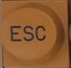 | ESC | | DEL | | Escape / start escape sequence |
| G1 | `P1` 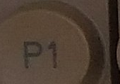 | P1 | P9 | P1 | P9 | Programmable PUSH key |
| G2 | `P2` 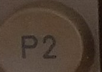 | P2 | P10 | P2 | P10 | Programmable PUSH key |
| G3 | `P3` 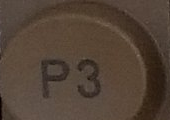 | P3 | P11 | P3 | P11 | Programmable PUSH key |
| G4 | `P4` 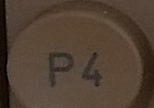 | P4 | P12 | P4 | P12 | Programmable PUSH key |
| G5 | `P5` 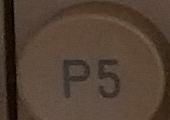 | P5 | P13 | P5 | P13 | Programmable PUSH key |
| G6 | `P6(P8)` 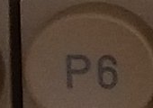 | P6(P8) | P14 | P6(P8) | P14 | Programmable PUSH key (note: P5 and P8 printed on same key in photo — likely P6) |
| G7 | `P7` 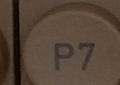 | P7 | P15 | P7 | P15 | Programmable PUSH key |
| G8 | `P8` 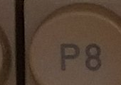 | P8 | P16 | P8 | P16 | Programmable PUSH key |
| G9 | `MERK` 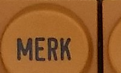 | MERK | (shift) | DELLINE | | Mark/select text (NOTIS); Delete line (2215) |
| G10 | `FELT` 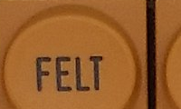 | FELT | (shift) | INSLINE | | Field select (NOTIS); Insert line (2215) |
| G11 | `AVSN` 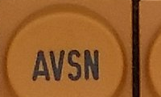 | AVSN | (shift) | DELCHAR | | Paragraph (NOTIS); Delete character (2215) |
| G12 | `SETN` 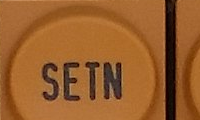 | SETN | (shift) | INSCHAR | | Sentence (NOTIS); Insert character (2215) |
| G13 | `ORD` 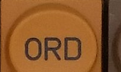 | ORD | (shift) | CLEAR | | Word (NOTIS); Clear screen (2215) |
| G14 | `LOKAL` 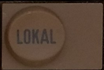 | LOKAL | | LINE | | Toggle online/offline; LINE lamp lights when online |
| | | | | | | |
| G47 | `STRYK` 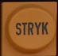 | STRYK | (shift) | ERLINE | | Delete text (NOTIS); Erase line (2215) |
| G48 | `KOPI`  | KOPI | (shift) | (unused) | | Copy text (NOTIS) |
| G49 | `FLYTT`  | FLYTT | (shift) | ERPAGE | | Move text (NOTIS); Erase page (2215) |
| | **G50 — GAP** | | | **no key** | | **physical gap** |
| G51 | `FUNK`  | FUNK | (shift) | (unused) | | Function key; Ctrl=STOP PRINT |
| G52 | `SKRIV`  | SKRIV | (shift) | PRINT | | Print; Ctrl=START PRINT (print screen to local printer) |
| G53 | `HJELP`  | HJELP | (shift) | MODE | | Help; Ctrl=MODE (enter config menu). Ctrl+Ctrl=config entry |
| G54 | `SLUTT`  | SLUTT | (shift) | BREAK | | Exit; Ctrl=BREAK (send break signal to host) |

### Row F

Row F only has keys in cols 47–49 and 51–54 (no keys in cols 0–14).

| Grid Pos | Keycap Symbol | Normal (5313) | Shift (5313) | Normal (1292) | Shift (1292) | Description |
|---|---|---|---|---|---|---|
| F47 | `TAB+` / `TAB-`  | TAB+ | TAB- | (unused) | | Set/clear tab stop |
| F48 | `(...)` / `(...)`  | (...) | (shift) | (unused) | | Centering (NOTIS) |
| F49 | `/aaa` / `aaa` 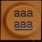 | /aaa | aaa | (unused) | | Hyphenation (NOTIS) |
| | **F50 — GAP** | | | **no key** | | **physical gap** |
| F51 | `F1` 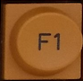 | F1 | (shift) | (unused) | | Function key 1 |
| F52 | `F2` 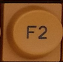 | F2 | (shift) | (unused) | | Function key 2; Ctrl=SI (shift in, select G1 char set) |
| F53 | `F3` 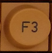 | F3 | (shift) | ESC | | Function key 3; Ctrl=SO (shift out, select G0 char set) |
| F54 | `F4` 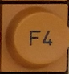 | F4 | (shift) | CSI | | Function key 4; Ctrl=CLEAR (turn off app+error LEDs) |

### Row E

| Grid Pos | Keycap Symbol | Normal (5313) | Shift (5313) | Normal (1292) | Shift (1292) | Description |
|---|---|---|---|---|---|---|
| E0 | `CAPS` (with LED) 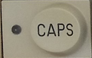 | CAPS | | CAPS | | Caps lock (alpha keys only); LED in key |
| E1 | `1` / `!` 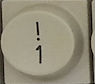 | 1 | ! | 1 | ! | |
| E2 | `2` / `"` 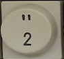 | 2 | " | 2 | " | |
| E3 | `3` / `#` 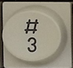 | 3 | # | 3 | # | |
| E4 | `4` / `$` 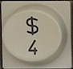 | 4 | $ | 4 | $ | |
| E5 | `5` / `%` 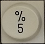 | 5 | % | 5 | % | |
| E6 | `6` / `&` 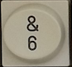 | 6 | & | 6 | & | |
| E7 | `7` / `/` 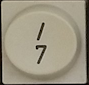 | 7 | / | 7 | ' | |
| E8 | `8` / `(` 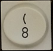 | 8 | ( | 8 | ( | |
| E9 | `9` / `)` 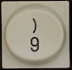 | 9 | ) | 9 | ) | |
| E10 | `0` / `=` 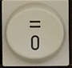 | 0 | = | 0 | _ | |
| E11 | `+` / `?`  | + | ? | - | = | |
| E12 | `@` / `` ` ``  | @ | ` | ^ | \| | |
| E13 | `pilcrow` (¶) 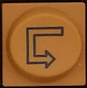 | NewParagraph | (shift) | @ | ` | New paragraph (NOTIS) |
| E14 | Del 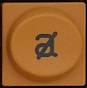 | Del | | (unused) | | Erase char at cursor or backspace+erase |
| |  | | |  | | **physical gap** |
| E47 | `<<` / `>>`  | << | >> | (unused) | | Indent left / Indent right (NOTIS) |
| E48 | `JUST` / `<< >>`  | JUST | (shift) | (unused) | | Justify text (NOTIS) |
| E49 | `<>` / `><`  | <> | >< | (unused) | | Expand / compress spacing (NOTIS) |
| | **E50 — GAP** | | | **no key** | | **physical gap** |
| E51 | `F5` 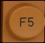 | F5 | (shift) | (unused) | | Function key 5 |
| E52 | `F6` 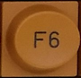 | F6 | (shift) | (unused) | | Function key 6 |
| E53 | `F7` 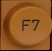 | F7 | (shift) | (unused) | | Function key 7 |
| E54 | `F8` 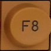 | F8 | (shift) | (unused) | | Function key 8 |

### Row D

| Grid Pos | Keycap Symbol | Normal (5313) | Shift (5313) | Normal (1292) | Shift (1292) | Description |
|---|---|---|---|---|---|---|
| D99 | `INNS` / `EKSP` 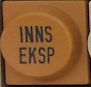 | EKSP | INNS | (unused) | | Expand / Insert (NOTIS) |
| D0 | `CTRL`  | CTRL | | CTRL | | Control modifier; held with another key |
| D1 | `Q` | q | Q | q | Q | |
| D2 | `W` | w | W | w | W | |
| D3 | `E` | e | E | e | E | |
| D4 | `R` | r | R | r | R | |
| D5 | `T` | t | T | t | T | |
| D6 | `Y` | y | Y | y | Y | |
| D7 | `U` | u | U | u | U | |
| D8 | `I` | i | I | i | I | |
| D9 | `O` | o | O | o | O | |
| D10 | `P` | p | P | p | P | |
| D11 | `Å` 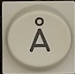 | (nat: å) | (nat: Å) | (national) | (national) | National variant character |
| D12 | `^` / `~` 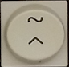 | ^ | ~ | ; | + | |
| D13 | `LF` (vertical ↓ symbol) 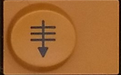 | LineFeed | | LF | | Line feed; application dependent |
| |  | | |  | | **physical gap** |
| D47 | `⇑` / `⇐` 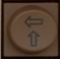 | RollUp | RollLeft | (unused) | | Scroll up / Scroll left (NOTIS) |
| D48 | `ANGRE`  | ANGRE | (shift) | SO | SI | Cancel/undo (NOTIS); SO/SI char set select (2215) |
| D49 | `⇓` / `⇒` 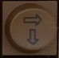 | RollDown | RollRight | (unused) | | Scroll down / Scroll right (NOTIS) |
| | **D50 — GAP** | | | **no key** | | **physical gap** |
| D51 | `7` 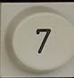 | 7 (numpad) | | 7 (numpad) | | |
| D52 | `8` 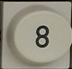 | 8 (numpad) | | 8 (numpad) | | |
| D53 | `9` 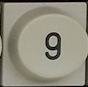 | 9 (numpad) | | 9 (numpad) | | |
| D54 | `⎵` (space symbol) 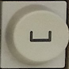 | SP (numpad) | | SP (numpad) | | Numpad space |

### Row C

| Grid Pos | Keycap Symbol | Normal (5313) | Shift (5313) | Normal (1292) | Shift (1292) | Description |
|---|---|---|---|---|---|---|
| C99 | `≈` (squiggle) 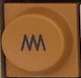 | Squiggle | (shift) | (unused) | | Application dependent (NOTIS) - i think it means M-mode|
| C0 | `LOCK` (with LED) 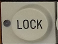 | LOCK | | LOCK | | Shift lock; LED in key; locks "grey area" to shift |
| C1 | `A` | a | A | a | A | |
| C2 | `S` | s | S | s | S | |
| C3 | `D` | d | D | d | D | |
| C4 | `F` | f | F | f | F | |
| C5 | `G` | g | G | g | G | |
| C6 | `H` | h | H | h | H | |
| C7 | `J` | j | J | j | J | |
| C8 | `K` | k | K | k | K | |
| C9 | `L` | l | L | l | L | |
| C10 | `Ø`  | (nat: ø) | (nat: Ø) | (national) | (national) | National variant character |
| C11 | `Æ`  | (nat: æ) | (nat: Æ) | (national) | (national) | National variant character |
| C12 | `'` / `*`  | ' | * | : | * | |
| C13 | `↵` (return symbol)  | CR | | CR | | Carriage return; cursor to col 1 (host usually adds LF) |
| |  | | |  | | **physical gap** |
| C47 | `⇐` (fat arrow left)  | FieldLeft | (shift) | RollUp | | Jump to prev field (NOTIS); Scroll up (2215) |
| C48 | `↑`  | Up | | Up | | Cursor up one line |
| C49 | `⇒` (fat arrow right)  | FieldRight | (shift) | RollDown | | Jump to next field (NOTIS); Scroll down (2215) |
| | **C50 — GAP** | | | **no key** | | **physical gap** |
| C51 | `4`  | 4 (numpad) | | 4 (numpad) | | |
| C52 | `5`  | 5 (numpad) | | 5 (numpad) | | |
| C53 | `6`  | 6 (numpad) | | 6 (numpad) | | |
| C54 | `-`  | - (numpad) | | - (numpad) | | |

### Row B

| Grid Pos | Keycap Symbol | Normal (5313) | Shift (5313) | Normal (1292) | Shift (1292) | Description |
|---|---|---|---|---|---|---|
| B99 | (wide key, left) | SHIFT (left) | | SHIFT (left) | | Shift modifier (left side) |
| B0 | `<` / `>` (or `≤` / `≥`)  | < | > | (unused) | | |
| B1 | `Z` | z | Z | z | Z | |
| B2 | `X` | x | X | x | X | |
| B3 | `C` | c | C | c | C | |
| B4 | `V` | v | V | v | V | |
| B5 | `B` | b | B | b | B | |
| B6 | `N` | n | N | n | N | |
| B7 | `M` | m | M | m | M | |
| B8 | `,` / `;`  | , | ; | , | < | |
| B9 | `.` / `:`  | . | : | . | > | |
| B10 | `-` / `=`  | - | _ | / | ? | |
| B11 | (wide key, right)  | SHIFT (right) | | SHIFT (right) | | Shift modifier (right side) |
| |  | | |  | | **physical gap** |
| B47 | `←`  | Left | | Left | | Cursor left one column |
| B48 | `⌂` (home symbol, arrow to the left and up)  | Home | | Home | | Cursor home; application dependent |
| B49 | `→`  | Right | | Right | | Cursor right one column |
| | **B50 — GAP** | | | **no key** | | **physical gap** |
| B51 | `1`  | 1 (numpad) | | 1 (numpad) | | |
| B52 | `2`  | 2 (numpad) | | 2 (numpad) | | |
| B53 | `3`  | 3 (numpad) | | 3 (numpad) | | |
| B54 | `ENTER` (vertical text)  | ENTER (numpad) | | ENTER (numpad) | | Numpad enter |

### Row A (Bottom Row)

| Grid Pos | Keycap Symbol | Normal (5313) | Shift (5313) | Normal (1292) | Shift (1292) | Description |
|---|---|---|---|---|---|---|
| A5 | (wide space bar) | Space | | Space | | Space bar |
| |  | | |  | | **physical gap** |
| A47 | `\|←` (Arrow left to bar)  | TABLeft | (shift) | TABLeft | | Tab cursor left to previous tab stop |
| A48 | `↓`  | Down | | Down | | Cursor down one line |
| A49 | `→\|` (Arow right to bar)  | TABRight | (shift) | TABRight | | Tab cursor right to next tab stop |
| | **A50 — GAP** | | | **no key** | | **physical gap** |
| A51 | `0` (double-wide)  | 0 (numpad) | | 0 (numpad) | | |
| A53 | `.`  | . (numpad) | | . (numpad) | | Numpad decimal point |
| A54 |     |            | |            | | **The "Enter" key from B54 fills this spot** |