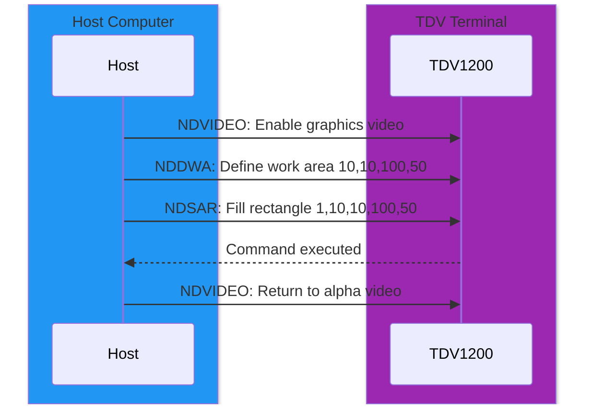
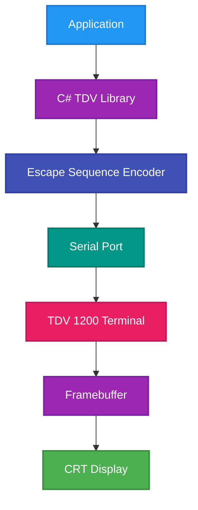

# ND Display Terminal 1200 – Graphics Protocol and Programming Guide

## 1. Introduction
The **Tandberg TDV 1200** (also known as **ND Display Terminal 1200**) implements a **proprietary raster graphics subsystem** developed by **Tandberg Data** and **Norsk Data**. It is **not compatible** with other terminal graphics standards such as:

- **DEC ReGIS (Remote Graphic Instruction Set)** – vector-based.
- **DEC Sixel** – raster encoding used by DEC printers and VT241.
- **Tektronix 4010/4014** – vector coordinate plotting.

Instead, the TDV 1200 uses **Norsk Data–specific ISO 6429 / ECMA-48 extensions**. These are **Control Sequence Introducer (CSI)** commands that manipulate **rectangular raster regions** in the terminal’s internal framebuffer. The system is **raster-only**, not vector-based.

All advanced graphics (lines, circles, text rendering beyond alpha mode) must be **synthesized by the host computer** into rectangular fill or copy operations.

---

## 2. Graphics Capabilities
- Optional hardware graphics module.
- Monochrome framebuffer (1024×1024 pixels typical).
- Raster (bitmap) graphics only.
- Host controls the framebuffer via CSI text sequences.
- No vector primitives: only **rectangular fills, attribute changes, and block copies**.
- Mixed alpha/graphics video planes (toggle via `NDVIDEO`).

---

## 3. Supported Raster Commands (From ND-12.054 §2.8–2.9)
| Command | Description | Operation Type |
|----------|-------------|----------------|
| **NDDWA** | Define Work Area | Sets the rectangular active region |
| **NDSAR** | Set Attribute in Rectangle | Fill or modify attributes |
| **NDAAR** | Add Attribute in Rectangle | Combine fill attributes |
| **NDRAR** | Remove Attribute in Rectangle | Clear attributes in region |
| **NDFC** | Fill Character(s) in Rectangle | Write patterns or fill data |
| **NDSREC** | Save Rectangle | Copy rectangular region to memory buffer |
| **NDRREC** | Restore Rectangle | Copy rectangular region from buffer to screen |
| **NDVIDEO** | Alpha/Graphics Toggle | Switch between text and graphics planes |

All coordinates and parameters are given as **textual numbers** inside CSI sequences, separated by semicolons.

---

## 4. Practical Implications
The TDV 1200 graphics system provides only **rectangular operations**. There are **no line, circle, or vector commands**. Any higher-level graphics must be composed from these building blocks.

| Capability | Supported | Implementation |
|-------------|------------|----------------|
| Rectangular fills | ✅ | Native command `NDSAR` / `NDFC` |
| Block copy / move | ✅ | `NDSREC` / `NDRREC` |
| Pixel-level draw | ✅ | Simulated via 1×1 rectangles |
| Lines / Circles / Arcs | ❌ | Must be host-synthesized |
| Patterns / Hatching | ✅ | Via `NDFC` fill commands |
| Text Overlay | ✅ | Using alpha plane or pseudo-font rendering |

---

## 5. Host-to-Terminal Data Flow


---

## 6. C# Graphics Framework Extension

Below is an extended example of a **C# class** that abstracts all TDV 1200 raster functions, including pixel drawing, pattern fills, hatching, text overlay, and block copying.

```csharp
using System;
using System.IO.Ports;
using System.Threading;

public class Tdv1200Graphics : IDisposable
{
    private readonly SerialPort _port;

    public Tdv1200Graphics(string portName, int baud = 9600)
    {
        _port = new SerialPort(portName, baud, Parity.None, 8, StopBits.One);
        _port.Open();
    }

    private void Send(string s)
    {
        _port.Write(s);
        Thread.Sleep(2); // Small pacing delay for terminal
    }

    private static string CSI(string cmd, params int[] args)
        => $"\x1B[{string.Join(';', args)}{cmd}";

    // Video control
    public void SetVideo(bool graphicsOn) => Send(CSI("<7F", graphicsOn ? 1 : 0));

    // Define Work Area
    public void DefineWorkArea(int x1, int y1, int x2, int y2)
        => Send(CSI("~", x1, y1, x2, y2));

    // Fill Rectangle
    public void FillRect(int x1, int y1, int x2, int y2, int attr = 1)
        => Send(CSI("z", attr, x1, y1, x2, y2));

    // Draw single pixel (1×1 rectangle)
    public void DrawPixel(int x, int y, int attr = 1)
        => FillRect(x, y, x + 1, y + 1, attr);

    // Copy rectangular block
    public void CopyRect(int srcX1, int srcY1, int srcX2, int srcY2, int destX, int destY)
    {
        Send(CSI("u", srcX1, srcY1, srcX2, srcY2));  // Save block
        Send(CSI("v", destX, destY));                // Restore block
    }

    // Pattern fill (simulate by toggling attribute)
    public void HatchRect(int x1, int y1, int x2, int y2, int patternType)
    {
        for (int y = y1; y < y2; y += 2)
        {
            if ((patternType & 1) != 0)
                FillRect(x1, y, x2, y + 1, 1);
            if ((patternType & 2) != 0)
                FillRect(x1 + (y % 4 == 0 ? 1 : 0), y, x2, y + 1, 1);
        }
    }

    // Simple text overlay (ASCII block letters)
    public void DrawText(int x, int y, string text)
    {
        int offsetX = x;
        foreach (char c in text)
        {
            // Render each char as a 6x8 pseudo-font via rectangles
            for (int cy = 0; cy < 8; cy++)
                for (int cx = 0; cx < 6; cx++)
                    if (((c + cy + cx) % 3) == 0) // fake pattern
                        DrawPixel(offsetX + cx, y + cy);
            offsetX += 7;
        }
    }

    public void Dispose() => _port?.Dispose();
}
```

### Example Usage
```csharp
using var tdv = new Tdv1200Graphics("COM3", 19200);

tdv.SetVideo(true);
tdv.DefineWorkArea(0, 0, 512, 512);

tdv.FillRect(50, 50, 150, 80);        // Rectangle

tdv.HatchRect(160, 50, 260, 100, 3);  // Hatched pattern

tdv.DrawText(20, 120, "HELLO TDV1200"); // Raster text overlay

tdv.DrawPixel(300, 200);              // Single pixel

tdv.CopyRect(50, 50, 150, 80, 300, 300); // Copy block

tdv.SetVideo(false);
```

---

## 7. Library Design Recommendations
| Layer | Role |
|--------|------|
| **Transport Layer** | Serial interface (RS-232/RS-422) |
| **Command Encoder** | Generates CSI command strings |
| **Primitive Layer** | FillRect, DrawPixel, CopyRect |
| **High-Level Rendering** | DrawLine, DrawCircle (software-emulated) |
| **Text Layer** | Raster or alpha-based text |
| **Pattern Engine** | Procedural hatching and fills |



---

## 8. Summary and Limitations
- **Only rectangular graphics primitives** are supported by hardware.
- All other graphics (lines, arcs, etc.) must be computed by the host.
- Graphics commands are ISO 6429 CSI sequences with ND-private finals.
- A software renderer on the host can simulate more advanced shapes.

| Capability | Supported | Method |
|-------------|------------|---------|
| Rectangle Fill | ✅ | Native command |
| Pixel | ✅ | 1×1 rectangle |
| Block Copy | ✅ | `NDSREC` + `NDRREC` |
| Line / Circle | ❌ | Emulated in software |
| Pattern Fill | ✅ | `NDFC` or host loops |
| Text Overlay | ✅ | Alpha mode or simulated |

---

### ✅ Conclusion
The **TDV 1200** implements a unique **Norsk Data raster protocol** that only supports **rectangular operations**—no true vector or pixel-streaming primitives. Host software must emulate complex shapes by combining these low-level block operations. A C# library can easily encapsulate these mechanics into high-level drawing primitives and provide a programmable graphics environment for the terminal.

---

## 9. References

### GPGS Graphics System
- **GPGS Homepage**: [https://www.norsigd.no/GPGS.html](https://www.norsigd.no/GPGS.html)
- **GPGS-F User's Guide (8th Edition)**: [https://www.norsigd.no/GPGS_manual/GPGS_manual.pdf](https://www.norsigd.no/GPGS_manual/GPGS_manual.pdf)

### GPGS and TDV 1200
GPGS (General Purpose Graphics System) was a device-independent graphics library used with Norsk Data systems. While GPGS provided high-level primitives like lines, circles, and polygons, the TDV 1200 terminal hardware only supported rectangular raster operations. The mapping between GPGS primitives and TDV 1200 hardware required software rasterization on the host computer.

### Related Documentation
For implementation details on mapping GPGS primitives to TDV 1200 hardware, see the companion document `tdv_1200_graphics_library_extended.md`.

