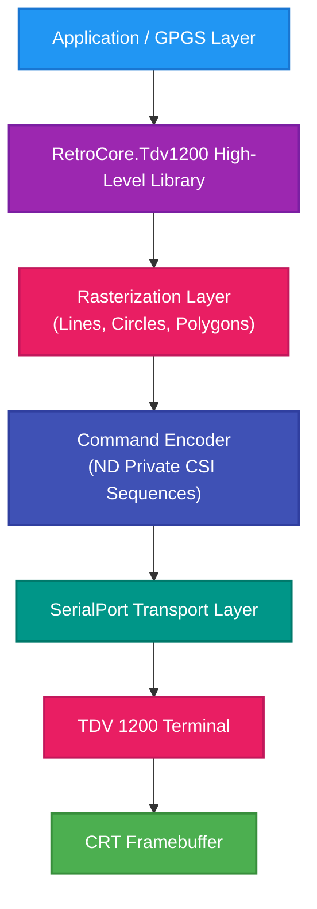

# Extended ND Display Terminal 1200 Graphics Programming Guide

## 1. Overview
This extended guide merges insights from the **GPGS manual** and the **TDV 1200 hardware protocol**, providing a complete high-level specification for implementing a full C# graphics subsystem for the Tandberg TDV 1200 terminal. It includes both theoretical alignment with GPGS primitives and practical implementation details based on the terminal’s raster-only capabilities.

---

## 2. GPGS Primitives vs. TDV 1200 Hardware Capabilities

| GPGS Primitive | Description | TDV 1200 Implementation |
|----------------|--------------|--------------------------|
| **LINE** | Vector between two points | Rasterized via Bresenham into multiple FillRect() calls |
| **POLYLINE** | Connected sequence of lines | Loop of rasterized lines |
| **CIRCLE / ARC / ELLIPSE** | Curved shapes | Midpoint circle/ellipse algorithm rendered as pixels |
| **POLYGON** | Closed shape | Scanline fill algorithm using FillRect() |
| **TEXT** | Character string in arbitrary orientation | Native alpha plane for normal text, or host rasterization for rotated/sheared text |
| **HATCH / FILL / PATTERN** | Area fill with texture or pattern | Procedural patterns using FillRect() and loops |
| **BITMAP / PIXEL ARRAY** | Raw raster data block | Simulated using repeated rectangle writes |
| **COPY / SEGMENT** | Picture segment or region copy | Directly maps to NDSREC / NDRREC |

In essence, the **TDV 1200 protocol** acts as a low-level raster target similar to a framebuffer, while **GPGS** serves as an abstract device-independent API. The driver bridges the gap by decomposing complex primitives into rectangle-based operations.

---

## 3. Architecture of the C# Library

The extended C# library will follow a layered design to emulate a full GPGS environment:

### Layered Model


| Layer | Function |
|--------|-----------|
| **Application Layer** | Uses the graphics API like a normal canvas |
| **High-Level Library** | Provides DrawLine, DrawPolygon, DrawCircle, etc. |
| **Rasterization Layer** | Converts high-level primitives into pixels/rectangles |
| **Command Encoder** | Generates ND-private CSI sequences |
| **Transport Layer** | Sends encoded data via RS-232 or RS-422 |

---

## 4. Extended Command Set Abstraction

### 4.1. Native TDV Commands
| Command | Function | Notes |
|----------|-----------|-------|
| `ESC [x1;y1;x2;y2~` | Define Work Area | Limits subsequent drawing |
| `ESC [a;x1;y1;x2;y2z` | Set Attribute Rectangle | Fills rectangular region |
| `ESC [x1;y1;x2;y2u` | Save Rectangle | Copy to memory |
| `ESC [x;yv` | Restore Rectangle | Copy from memory |
| `ESC [?1<7F` | Graphics Video ON | Switches display mode |
| `ESC [?0<7F` | Graphics Video OFF | Return to alpha |

### 4.2. Library-Generated High-Level Calls
| Method | Operation | Implementation |
|---------|------------|----------------|
| `DrawLine()` | Draws line using Bresenham | Multiple `FillRect()` calls |
| `DrawCircle()` | Draws circle via midpoint algorithm | Pixel approximations |
| `DrawPolygon()` | Filled polygon using scanline algorithm | Series of rectangle spans |
| `FillPattern()` | Area fill using procedural pattern | Alternating fills |
| `CopyRect()` | Block move | Native TDV command |
| `DrawText()` | ASCII text | Either alpha plane or raster font |

---

## 5. Example: Mapping GPGS Primitives to TDV 1200

### 5.1. Draw Line
```csharp
public void DrawLine(int x1, int y1, int x2, int y2, int attr = 1)
{
    int dx = Math.Abs(x2 - x1), sx = x1 < x2 ? 1 : -1;
    int dy = -Math.Abs(y2 - y1), sy = y1 < y2 ? 1 : -1;
    int err = dx + dy, e2;

    while (true)
    {
        DrawPixel(x1, y1, attr);
        if (x1 == x2 && y1 == y2) break;
        e2 = 2 * err;
        if (e2 >= dy) { err += dy; x1 += sx; }
        if (e2 <= dx) { err += dx; y1 += sy; }
    }
}
```

### 5.2. Filled Polygon
```csharp
public void FillPolygon(List<(int X, int Y)> vertices, int attr = 1)
{
    if (vertices.Count < 3) return;
    int minY = int.MaxValue, maxY = int.MinValue;
    foreach (var v in vertices) { minY = Math.Min(minY, v.Y); maxY = Math.Max(maxY, v.Y); }

    for (int y = minY; y <= maxY; y++)
    {
        var nodes = new List<int>();
        for (int i = 0, j = vertices.Count - 1; i < vertices.Count; j = i++)
        {
            var vi = vertices[i]; var vj = vertices[j];
            if ((vi.Y < y && vj.Y >= y) || (vj.Y < y && vi.Y >= y))
            {
                int x = vi.X + (y - vi.Y) * (vj.X - vi.X) / (vj.Y - vi.Y);
                nodes.Add(x);
            }
        }
        nodes.Sort();
        for (int i = 0; i < nodes.Count; i += 2)
        {
            if (i + 1 >= nodes.Count) break;
            FillRect(nodes[i], y, nodes[i + 1], y + 1, attr);
        }
    }
}
```

---

## 6. Pattern and Hatch Fill Examples

### 6.1. Horizontal Hatch
```csharp
for (int y = y1; y < y2; y += 2)
    FillRect(x1, y, x2, y + 1, attr);
```

### 6.2. Diagonal Hatch (Software Rasterized)
```csharp
for (int i = 0; i < width + height; i += 4)
{
    int xStart = Math.Max(x1, i - height);
    int yStart = Math.Max(y1, height - i);
    int xEnd = Math.Min(x2, i);
    int yEnd = yStart + 1;
    FillRect(xStart, yStart, xEnd, yEnd, attr);
}
```

### 6.3. Checkerboard Fill
```csharp
for (int y = y1; y < y2; y++)
    for (int x = x1; x < x2; x++)
        if (((x / 4) + (y / 4)) % 2 == 0)
            DrawPixel(x, y, attr);
```

---

## 7. Text Rendering Options

| Mode | Description | Performance |
|-------|--------------|--------------|
| **Alpha Video Mode** | Use NDVIDEO to toggle to text plane | Fast, native |
| **Rasterized Font Mode** | Draw characters as pixel grids | Slower, supports rotation |
| **Vector Emulation Mode** | Software draw lines per character stroke | Very slow but scalable |

---

## 8. Block Copy Optimization
The TDV 1200 supports **hardware rectangle copy** (`NDSREC` / `NDRREC`), which can be leveraged for efficient animation, double buffering, or scrolling effects.

Example:
```csharp
CopyRect(0, 0, 100, 100, 200, 200); // Move block
```

Applications can pre-render UI components off-screen and use this feature to quickly restore them without re-sending full pixel data.

---

## 9. Performance Considerations
- **Command Overhead**: Each CSI sequence is textual; batching reduces serial load.
- **Rasterization Cost**: Host must compute all shapes.
- **Bandwidth Limits**: 9600–19200 baud typical; minimize pixel-by-pixel operations.
- **Partial Updates**: Use CopyRect for motion, avoid full redraws.

---

## 10. Future Extension Ideas
- Develop an offline rasterization buffer in C# (`byte[,] framebuffer`) to compute graphics off-screen and flush changes via rectangle diffs.
- Implement delta compression to minimize serial traffic.
- Build a GPGS-to-TDV translator library that accepts GPGS command streams and emits TDV-compatible escape sequences.
- Add optional PNG export for debugging host-side rasterization output.

---

## 11. Conclusion
The **TDV 1200** provides only **rectangular raster operations**, but with appropriate software rasterization and optimization, it can emulate a full GPGS graphics stack including lines, polygons, fills, patterns, and text. The C# library architecture described here bridges the historical TDV hardware protocol with a modern high-level drawing API, enabling both retro emulation and real-device rendering.

---

## 12. References

### GPGS Graphics System
- **GPGS Homepage**: [https://www.norsigd.no/GPGS.html](https://www.norsigd.no/GPGS.html)
- **GPGS-F User's Guide (8th Edition)**: [https://www.norsigd.no/GPGS_manual/GPGS_manual.pdf](https://www.norsigd.no/GPGS_manual/GPGS_manual.pdf)

### GPGS Overview
GPGS (General Purpose Graphics System) is a device-independent graphics library developed by SINTEF DELAB and NORSIGD (Norwegian Association for Computer Graphics). It provides high-level graphics primitives including:

- **Basic Primitives**: Lines, polylines, circles, arcs, ellipses, markers
- **Raster Graphics**: Polygons with various fill styles, patterns, and textures
- **Text Rendering**: Multiple fonts, arbitrary orientation, and transformations
- **Coordinate Systems**: Window-viewport mapping, transformations, clipping
- **Picture Segments**: Retained graphics objects with attributes
- **Interaction**: Sample and event mode input handling

The TDV 1200 terminal's graphics capabilities can be mapped to GPGS primitives through software rasterization, allowing applications written for GPGS to target the TDV 1200 hardware.

