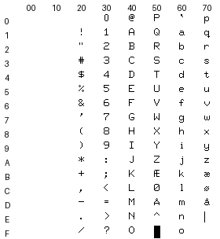
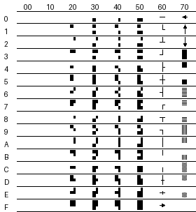
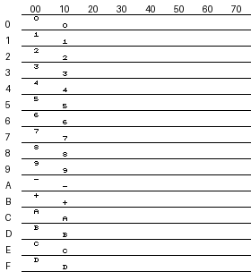
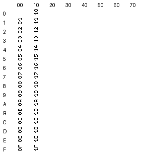

# TDV 2215

## Functional Specifications

Firmware Revision Level 11

---

TANDBERG DATA A/S  
P.O. Box 9 Korsvoll  
OSLO 8, NORWAY  
Phone (47-2) 23 20 80  
Telex 17002 tdata n  
© 1983 Tandberg Data A/S

Part no. 385604  
Publ. no. 5176  
February 1983  
Revision no. 4
---

# 0. PREFACE

This document contains the specifications of the TDV 2215 as they are defined at the time of release (firmware revision level 11).

TANDBERG DATA is grateful for any comments to this document regarding:

- deviations between specification and product
- consistency of definition
- vague points in the definitions
- compatibility with TDV 2115

# 1. TERMINOLOGY

This section gives a summary of some important terms used in this specification.

### Active line
The text line where the cursor is presently located.

### Active position
The character position where the cursor is presently located.

### Attribute
An attribute specifies the graphic rendition to be used in the display area starting with the first position after the attribute and ending with the last position before the next attribute or, if there are no more attributes, ending with the last position on the bottom line.
An attribute occupies one position on the display, this position is displayed as a blank.

### Away position
The rightmost bottom position of the display, i.e. the last character position on the last line.

### Character generator
The part of the terminal which defines how the different characters are going to be displayed. The TDV 2215 defines the characters within a 9 by 14 dot cell (a so-called 7 by 9 matrix).

### Character position
A character position is the position or positions occupied by one character, i.e. on a single-width line a character occupies one display position, whereas on a double-width line a character occupies two display positions. In the latter case a character in e.g. character position no. 14 occupies display positions no. 28 and 29.

### C0 - control character set
Control codes from <00> to <1F> of the code set (section 8.4)
Note: Angle brackets <> denote code values in hexadecimal form.

### C1 - Control character set
These are represented as an ESC <1B> followed by a code in the range <40>-<5F> (section 8.5 and 8.6).

### CSI sequence
A CSI sequence is started by ESC [, followed by parameters, and terminated by a character in the range <40>-<6F>. The parameters are represented by ASCII coded numbers and separated by ";" <3B>. Parameters may in certain cases be omitted in which case a default value will be used (section 8.7).

### Cursor
The cursor is a visible marker shown on the screen to indicate where the next character will be written. This position is also referred to as the active position.

### Display
Information presented on the screen.

### Double-width line
A line in which all characters occupy two display positions.

### Graphic Rendition
The graphic rendition is the way in which a character is presented on the screen. Examples of different graphic renditions are inverse video, low intensity, underline and normal.

### Home position
The leftmost character of the first line of the display.

### Numeric parameter
A parameter in a CSI sequence which represents a number.

### Non-volatile memory
A memory that does not lose its contents when power is turned off. The non-volatile memory is used for Soft-switches, tabulation rack and PUSH-keys.

### Option
A feature which is not part of the standard terminal, but which can be ordered from TANDBERG DATA, usually at an extra cost. In general, options may not be included through Field Upgrade of the terminal, but must be factory installed when the terminal is produced.

### Permanent switch
See Soft-switch.

### PUSH-key
The TDV 2215 has 8 keys that allow the user to link a string of text or control characters to a single key.  This enables the user to transmit frequently used texts or control strings by pressing a single key.  The PUSH-keys work in both SHIFTED and NONSHIFTED mode to enable 16 strings to be generated.

### Screen
The area of the Cathode-Ray-Tube used for displaying characters.

### Selective parameter
A parameter in a CSI sequence which represents a numbered alternative.

### Soft-switch
Firmware-implemented, alterable switches within the terminal which control various aspects of terminal operation.  These switches replace corresponding physical back-panel and internal switches used on the TDV 2115 terminal and permit being set by software, by the host computer or from the keyboard.  They are implemented as values stored in the non-volatile memory representing switch settings.  These are copied into ordinary RAM when power is turned on.

The switches residing in the non-volatile memory are referred to as Permanent switches, whereas the copies residing in the RAM are referred to as Temporary switches.

The terminal operates only on the Temporary switches.  They can be altered by the operator through use of the menus for Soft-switch setup (section 5).  If it is desired to make an alteration permanent, the Temporary switches may be copied back into the Permanent switches using the same setup menu program.

Most of the Temporary switches may be altered by the host computer (SM and RM commands, section 8.7).  Such alterations can not be made permanent, however, since the host has accesss neither to the setup menu program nor the non-volatile memory.

### Temporary Switch
See Soft-switch.

## 2. GENERAL INFORMATION


The TDV 2215 is designed to be a successor of the TDV 2115.  It
can be plugged into any installation using the TDV 2115 without
modifications to the program in the host computer.

The new features that are introduced in the TDV 2215 and which
require host support, can be disabled, thus putting the terminal
into a true TDV 2115 compatible mode.  This ensures that control
codes that are not used by the TDV 2115 will be ignored by the TDV 2215.

The new features of the TDV 2215 allow users to upgrade the performance
and extend the functions of their system without having to put excessive
amounts of effort into upgrading their software.  Some of the most
outstanding new features - printer output and PUSH-keys - can be used
without host support.

New features of TDV 2215:

    - PUSH-keys

    - Soft switches for easy installation and user convenience.

    - Transparent mode

    - Printer output

    - Insert and delete functions

    - Erase functions

    - Semigraphic character set (line drawing, histogram subscript, superscript and plot)

    - Graphic rendition control on a character-by-character basis

    - New graphic rendition alternatives

    - Double-width characters

    - Status report (read current cursor position)

    - Smooth scroll

Note: In this document character code values in hexadecimal form are denoted by angle bracket enclosure, e.g. (12) = <0C>.


## 3. BASIC TERMINAL CONCEPT


As already mentioned, the TDV 2215 is code compatible with the TDV 2115.
Since the TDV 2115 utilizes the C0-control character set in an
unstandard manner, this has to be maintained for compatibility.
New features are defined according to ECMA-6, ECMA-35 and ECMA-48.

A number of internal switches are installed in the TDV 2215 to
control its operation. These switches reside in non-volatile memory
ensuring that they will not be lost even if the terminal is left
without power.
ALL switches can be changed by the operator in the setup mode, and most
of the switches can also be set from the host computer. The switches
that influence the communication formats are excepted from host computer
control.

The TDV 2215 works in the simultaneous send/receive mode, i.e data
entered from the keyboard is transmitted to the host computer
and data from the host computer is either displayed on the screen
or activates local functions in the terminal. Normally data from the
keyboard is echoed back by the host computer; it is, however,
possible to use an internal echo 

### 3.1 TDV 2115 Compatible Operation


Whether the TDV 2215 should be limited to the TDV 2115 compatible mode, or take advantage of its full capability, is controlled by a Soft-switch called the Extended Control switch (4.2.12). When this switch is set to OFF, the terminal works like a TDV 2115 from the host computer's point of view. Certain new features are, however, available to the operator:

- Copies of the screen contents can be printed
- The PUSH-keys can be used
- The Soft-switch menus are available
- Transparent mode

Only control codes from the C0-set will be accepted. If control sequences are received, the ESC code will be ignored, while the rest of the sequence will be displayed. This is identical to the behaviour of the TDV 2115. The only exception from this rule is ESC Q which turns the Extended Control switch (EC) on and enables extended operation.

The accepted codes are listed below, refer to section 8.4 for details on their effect.

```
ACK - Light 2 on keyboard comes on
BEL - Bell
BS  - Backspace
CAN - Cursor right
CR  - Cursor return
DLE - Cursor load
EM  - Erase page
ENQ - Light 1 on keyboard comes on
EOT - Erase line
ETB - Roll down
ETX - Video on
FF  - Roll up
FS  - Cursor up
GS  - Cursor home
LF  - Line feed
NAK - Light 3 on keyboard comes on
SI  - Normal
SO  - Underline
STX - Video off
SYN - Keyboard lights are turned off
VT  - Cursor down
```

Table 3.1: C0-set in TDV 2115 compatible mode.

Keys that would otherwise generate control sequences are disabled in this case (see section 6 for details).

### 3.2 Extended Operation


To fully utilize the capabilities of the TDV 2215, the EC switch (4.2.12) must be turned on. By doing this, a number of new features become available:

- Remote printer control
- Tabulation
- Graphic rendition control on a character-by-character basis
- Insert, delete and erase character with numeric parameter
- Insert and delete line with numeric parameter
- Erase line with selective parameter
- Erase page with selective parameter
- Expanded character set for line drawing, histograms, simple graphics and subscript/superscript for numerics
- Double-width characters on a line-by-line basis
- Remote Soft-switch control
- Remote PUSH-key loading

The additional codes that have effect are:

#### CO - control codes

ESC - Lead in for additional controls
HT  - Horizontal tab

Table 3.2: CO-set extentions.

#### C1 - control codes

These are represented by an ESC plus one code in the range <40>-<5F>. See section 8.5 for details.

CSI - Control sequence introducer
PM  - Privacy message
SS2 - Single shift 2
SS3 - Single shift 3
DCS - Device control string (PUSH-key loading)
ST  - String terminator
HTS - Horizontal tab set

Table 3.3: C1-set

#### Three-character ESC sequences

These are represented by an ESC followed by a character in the range <20>-<2F> and a character in the range <30>-<3F>. See section 8.6 for details.

DWL - Double-width line
SWL - Single-width line

Table 3.4: Three-character ESC sequences.

#### CSI sequences

These are control sequences that can contain one or more parameters. See section 8.7 for details.

CBT - Cursor backward tabulation
DCH - Delete character
DL  - Delete line
ECH - Erase character
ED  - Erase in display
EL  - Erase line
ICH - Insert character
IL  - Insert line
MC  - Media copy
RM  - Reset mode
SGR - Select graphic rendition
SM  - Set mode
TBC - Tabulation clear
DSR - Device status report

Table 3.5: CSI sequences.

#### 3.3 Transparent Mode

The transparent mode is included as an aid to the system programmer for debugging purposes. In this mode received characters are not decoded as control codes, but displayed directly on the screen. Received characters are displayed in the normal graphic rendition.

Characters transmitted from the terminal are displayed on the screen in inverse video/low intensity to be able to distinguish them from received characters.

See section 4.3.1 for additional details.

#### 3.4 Power-up Test

When the power is turned on, the terminal runs through a self-test sequence. If a malfunction is found, an error-code is displayed on the screen, and the ERROR indicator on the keyboard will be blinking. The significance of the error-code is listed in section 10. If an error is found, the terminal is blocked from further operation, and a service engineer should be called.

#### 3.5 Firmware Options

A 2000 character print buffer can be installed as an option. This enables printing to be done as a background activity while the screen and the keyboard are used independently. Notice that the printing represents a load on the terminal's internal processor and that the ability to handle characters from the line will be reduced during printing from the print buffer. The use of XON/XOFF handshake will ensure that no characters are lost.

See the "TDV 2215 Specifications and Installation Guide", publication no. 5174, for details on hardware options.

---

### 4. SOFT-SWITCHES

The operation of the TDV 2215 is controlled by a number of switches. The switches can be altered by local firmware in the terminal, or they can be temporarily set from host computer. The firmware will present switch menus to ease the setup task. (Refer to section 5).

Upon delivery all switches are set to their default settings.

The Soft-switches are divided into three groups, and each group has its own menu:

- CONVENIENCE SWITCHES
  are included for operator convenience, and they have no bearing on the function of the terminal.

- FUNCTION SWITCHES
  define the functional characteristics of the terminal.

- COMMUNICATION SWITCHES
  control the operation of the line and printer interfaces.

#### 4.1.4 Auto Repeat Switch (AR)

The auto repeat switch controls whether or not the normal repeat function in the keyboard should operate.

It has two settings: ON and OFF

The repeat function is enabled in the ON state.
Note that this function is operative only for keys in the regular typewriter area of the keyboard, the numeric pad keys and the cursor movement keys (except home).

The default setting is ON.

#### 4.1.5 Key Rollover Switch (ROV)

This switch has two settings: ENABLED and DISABLED.

In the ENABLED state, the rollover function will be enabled, which means that if two or more keys are depressed simultaneously on the keyboard, all keys will be registrated and sent to the terminal.

In the DISABLED state, the rollover function will be disabled, which means that if two or more keys are depressed simultaneously on the keyboard, only the key detected by the keyboard as the first depressed will be sent to the terminal, and the others ignored.

The default setting is ENABLED

#### 4.1.6 Keyboard CAPS on Power Up switch (CAP)

This switch has two settings: OFF and ON

In the ON state, the keyboard CAPS will automatically be set after power up, and thus place the keyboard in CAPS mode.

The default setting is OFF.

### 4.2 Function Switches


#### 4.2.1 Time-out Switch (TIM)

This switch controls whether or not the video should be turned off after a period of no activity on the terminal.

It has two settings: ON and OFF

In the OFF state, the time-out function is disabled, and the video will stay on for as long as the power is on.

In the ON state the picture will be turned off approximately 10 minutes after the last activity occurred on the terminal. The video will turn on again as soon as a character is received from the line or any key on the keyboard is depressed. Note that whatever activity that turns the video on, will be processed as normal.

The default setting is ON.

#### 4.2.2 Bell Switch (BEL)

The Bell switch controls whether or not the terminal can give an audible alarm during normal operation.

It has two settings: ON and OFF

In the ON state a bell-like sound will be activated when the BEL code <07> is received. The margin bell will work as specified in section 4.1.3.

In the OFF state the BEL code will be ignored, and the margin bell will be disabled regardless of the Margin Bell Switch setting.

The default setting is ON.

This switch does not affect audible alarms due to error conditions in the terminal.

#### 4.2.3 Graphic Rendition Mode Switch (GRM)

This switch controls the way in which the graphic rendition of characters on the screen can be selected.

The switch has the following settings: ATTR., UNDERLINE and SGR.

When the switch is in the UNDERLINE state the terminal acts like the TDV 2115 in the underline mode. The characters can be individually underlined, and this is controlled by the SO <0E> and SI <0F> codes. Switching from normal to underline is done by SO, and back to normal is done by SI. The graphic rendition used in this state can be selected by the Underline Representation switch (4.2.4). The effect of erase, insert and delete functions is controlled by the CGR switch (4.2.4). Refer to section 7.6.1 for details.

When the switch is in the ATTR. state, the terminal acts like the TDV 2115 in the attribute mode. Each change in graphic rendition is initiated by a so-called attribute which occupies one character position on the screen and is invisible. The graphic rendition specified by the attribute is valid up to the next attribute or to the end of the screen if no more attributes are present. Note that the erasure or overwriting of an attribute will change the graphic rendition of the characters following the removed attribute to that of the character preceding the attribute. Attributes are set by the code character sequence SO Y SI, where Y is selected according to the following scheme:

| bit 6 | bit 5 | bit 4 | bit 3 | bit 2 | bit 1 | bit 0 | Description         | Example           |
|-------|-------|-------|-------|-------|-------|-------|---------------------|-------------------|
|   0   |   0   |   0   |   x   |   x   |   x   |   x   | Control character   | Cursor Down <0B>  |
|   0   |   0   |   1   |   x   |   x   |   x   |   x   | Control character   | DLE <10>          |
|   0   |   1   |   0   |   x   |   x   |   x   |   x   | Low intensity       | space <20>        |
|   0   |   1   |   1   |   x   |   x   |   x   |   x   | Blink               | 0 (zero) <30>     |
|   1   |   0   |   0   |   x   |   x   |   x   |   x   | Inverse video       | A <41>            |
|   1   |   0   |   1   |   x   |   x   |   x   |   x   | Underline           | Q <51>            |
|   1   |   1   |   0   |   x   |   x   |   x   |   x   | Invisible           | a <61>            |
|   1   |   1   |   1   |   x   |   x   |   x   |   x   | Normal              | q <71>            |

Fig. 4.1: Attribute bit allocation.

If Y is a C0 control character, it is handled as a control character, except for ESC, which is ignored. The inclusion of control codes for moving the cursor, including DLE (Cursor Load), makes it possible to write several attributes in one SO/SI sequence. The bit values in the x positions above are otherwise irrelevant.

In the ATTR. state the terminal will not react to the SGR code. See section 7.6.2 for details on the effect of Erase Line, Erase Page and other editing functions.

When the GRM switch is changed, the screen will be erased.

#### 4.2.4 Underline Representation Switch (UR)

The UR switch enables the underline graphic rendition to be replaced by another graphic rendition when the GRM switch is set to UNDERLINE.

It has the following settings:

UNDERLINE, NORMAL, INV, LOW, INV/LOW, INV/UND, UND/LOW, INV/LOW/UND BLNK, INV/BLNK, LOW/BLNK, INV/LOW/BLNK, UND/BLNK, INV/UND/BLNK

The default setting is UNDERLINE.

#### 4.2.5 Cursor Return Switch (CR)

The CR switch controls the effect of the CR character <0D>.

It has two settings: CR or CRLF.

In the CR state, each CR character will be interpreted as straight <0D>, e.g. as Cursor Return only.

In the CRLF state, each CR character will be interpreted as the sequence <0D> <0A>, e.g. as Cursor Return followed by Line Feed.

The default setting of this switch is CR.

#### 4.2.6 Beginning of Line Wrap Switch (BOL)

This switch controls the cursor movement when the cursor is in first position of the line.

It has two settings: STOP and WRAP.

When the switch is in the WRAP position, a cursor movement command to the left, e.g. the BS code <08>, will wrap the cursor around to the last position of the preceding line. If it is in the home position, however, it will remain there.

When the switch is in the STOP position, a movement command to the left will have no effect, and the cursor will remain in the first position of the line.

Default setting is STOP.

#### 4.2.7 End of Line Wrap Switch (EOL)

This switch controls the cursor movement when the cursor is in last position of the line.

It has two settings: STOP and WRAP.

When the switch is in the STOP position, a cursor movement command to the right, e.g. the CAN code <18>, will have no effect, and the cursor will remain in the last position of the line. If a character is written into the last position of a line, the cursor will remain in this position, and subsequent characters will cause an overwrite.

When the switch is in the WRAP position, a cursor movement command to the right will move the cursor to the first position of the following line. If it is in the away position, however, the action will depend on the setting of the Roll/Page switch (4.2.8)

The default setting is STOP.

#### 4.2.8 Roll/Page Mode Switch (RPM)

This switch controls whether or not an automatic roll-up will take place upon reaching the end of a page.

It has two settings: ROLL and PAGE.

When the switch setting is PAGE, no roll-up will take place, and action on the bottom line will encounter the same effects as action on a line when the EOL switch (section 4.2.7) is set to STOP.

When the switch setting is ROLL, a roll-up will occur when action on the bottom line is one of the following:

1. Line Feed <0A>.
2. Cursor Return CR <0D>, when the CR switch (section 4.2.5) is in the CRLF state (implicit line feed).
3. Cursor movement command beyond the end of the line. Cursor will then move to the beginning of next line. This includes cursor movement as a result of writing as well as of using the CAN code <18>.

No roll-up will occur as a result of using the Cursor Down code <0B>.

The setting of the Roll/Page switch will not affect the execution of the ROLL UP <0C> or ROLL DOWN <17> commands.

The default setting of this switch is ROLL.

#### 4.2.9 Roll Type Switch (RT)

This switch controls whether ROLL UP and ROLL DOWN operations will be stepwise (one text line at a time) or continuous (one matrix dot line at a time).

It has two settings: STEP and SMOOTH

The default setting is STEP.

#### 4.2.10 Clear Lamps Switch (CLL)

The three lamps L1, L2, L3 on the keyboard can either be cleared by the CLEAR key, the SYN code or both. This is selected by the Clear Lamps switch.

The switch has three settings: BOTH, KEY and SYN

When the switch is in the SYN position, the lamps are cleared by the SYN code <16>.

When the switch is in the KEY position, the lamps are cleared by the CLEAR key (6.3.9).

The BOTH position combines the two above cases.

Default value of this switch is BOTH.

Note that the ERROR lamp is always cleared by the CLEAR key regardless of the setting of this switch.

#### 4.2.11 PUSH-key Programming Switch (PKP)

This switch controls whether or not the operator should be allowed to alter PUSH-keys.

It has two settings: ALLOWED and PROHIBITED.

When the switch is set to ALLOWED, PUSH-key programming can be done as specified in section 5.3.

When set to PROHIBITED, PUSH-key programming cannot be done by the operator. PUSH-key programming from the host computer, however, is still possible.

The default setting is ALLOWED.

#### 4.2.14 Printer Mode Switch (PM)

This switch defines the way in which the printer is controlled.

It has three settings: LOCAL/REM, REMOTE and LOG

When the switch is set to REMOTE, printouts can only be initiated by the host computer (provided that the terminal is on-line and no internal echo is specified) using the MC codes (see section 8.7). The PRINT key generates the code MC and no action is taken locally.

When the switch is set to LOCAL/REMOTE, the PRINT key on the keyboard initiates a local printout of the screen contents, and the MC code is not sent to the computer. MC codes from the host computer will have effect as specified.

Note that both in the REMOTE and LOCAL/REMOTE states the EC switch (4.2.12) must be ON in order to initiate printouts from the host computer.

In the LOG mode, data will be transferred to the printer on a line-by-line basis. The printing is started when the cursor advances to the next line. The PRINT key will be ignored in this mode.

See sections 7.4 and 8.7 (MC) for additional details.

The default setting is LOCAL/REM.

The switch has no effect on the use of the PRINT key during Soft-switch and PUSH-key setup.

#### 4.2.15 Printer Form Feed Switch (PFF)

This switch controls when the PFF code should be sent to the printer. It has only effect when a printout of the screen picture is initiated.

The switch has four settings: NONE, BEFORE, AFTER and BOTH.

In the NONE state, no FF is sent to the printer.

In the BEFORE state, an FF code is sent before the screen printout.

In the AFTER state, an FF code is sent after the screen printout.

In the BOTH state, FF codes are sent both before and after the screen printout.

The default setting is NONE.

### 4.3 Communication Switches


#### 4.3.1 Send-Receive Mode Switch (SRM)

The Send-Receive Mode switch controls the logical connection between the TDV 2215 terminal and the host computer.

The switch has two settings: SIMULTANEOUS and TRANSPARENT

In the SIMULTANEOUS state, data generated on the keyboard are transmitted to the host computer and data received from the host computer are either displayed on the screen or decoded as control codes or sequences. The operation also depends on the setting of the ECHO switch (4.3.2) and the Line/Local status (4.3.3 and 4.3.6). This state is the normal mode of operation for the TDV 2215.

In the TRANSPARENT state, received data, whether control codes or graphics, are displayed directly on the screen and no control code decoding takes place. Transmitted data, however, are displayed in inverse video/low intensity.

Characters are displayed on the screen as follows:

Code <00>         Displayed as blank.
Codes <01>-<1F>   These codes are displayed by their hex values in one character cell, turned 90 degrees.
Codes <20>-<7F>   The standard ASCII representation is displayed.
Codes <80>-<FF>   <80> is subtracted from the hex value and the characters are displayed as above but with underline.

Since the screen may contain non-ASCII characters, the PRINT key will be ignored if the Printer Mode switch (4.2.15) is set to LOCAL/REM.

Upon reaching the away position, an automatic roll-up will always take place, and the roll type will be stepwise, ignoring the current settings of the respective RPM (4.2.8) and RT switch (4.2.9).
The only exit possible from this mode is obtained by depressing the MODE key twice, which gives access to the Soft-switch menu. The TRANSPARENT mode is included for debugging purposes only.

The default setting of the switch is SIMULTANEOUS.

#### 4.3.2 ECHO Switch (ECHO)

The ECHO switch controls whether or not the terminal should echo received characters back to the host computer.

It has two settings: ON and OFF

In the ON state, received characters are echoed back to the host computer.

In the OFF state, received characters are not echoed back to the host computer.

The default setting is ON.

#### 4.3.3 Line/Local Status Switch (LNS)

The Line/Local Status switch controls whether the terminal is to be considered as a line terminal or a local terminal.

It has two settings: LINE and LOCAL

In the LINE state, the terminal is considered as a line terminal.

In the LOCAL state, the terminal is considered as a local terminal.

The default setting is LINE.

#### 4.3.4 Line/Local Status Switch (LNS)

The Line/Local Status switch controls whether the terminal is to be considered as a line terminal or a local terminal.

It has two settings: LINE and LOCAL

In the LINE state, the terminal is considered as a line terminal.

In the LOCAL state, the terminal is considered as a local terminal.

The default setting is LINE.

#### 4.3.5 Communication Handshake Switch (CHAN)

In certain cases the host computer may be transmitting data at a higher rate than the terminal can keep up with. It is therefore useful to have a handshake protocol. This can be made available with the HANDSHAKE switch.

The switch has three settings: OFF, XON/XOFF, and DTR.

In the OFF state, the terminal cannot operate safely at high speeds unless the host computer includes delays after time consuming codes or code sequences. Refer to section 7.7 for details.

In the XON/XOFF state, the terminal will send an XOFF <13> when the receiver buffer becomes nearly full and an XON <11> when it becomes nearly empty. After an XOFF, up to 64 characters can be sent by the host without risk of loss.

In the DTR state, the terminal will handshake with the host computer via the modem lines. The modem line CT108 will be set to a logic low level when the receiver buffer becomes 3/4 full, and to a logic high level when it becomes 1/4 full again after characters has been processed. The terminal will on the other hand only transmit if the modem lines CT106 and CT107 are both at a high level. The transmission will stop if one or both of the lines go low, and resume when both are high again.

The default setting is OFF.

Note that since the XON and XOFF control characters break into the transmitted data stream from the terminal, they may be embedded in control code sequences transmitted from the terminal. Since control characters are not normally present in control strings, these can easily be detected by the host computer.
The only sequence that can create problems is DLE. This code uses binary data as parameters. DLE is not very likely to be used as operator input, but in case it is used the HAN switch should be set to OFF.

DTR-handshake are only legal when the modem switch is set to INHIBIT.

#### 4.3.6 Terminal Modem Handler

The operation of the terminal modem handler is shown in the following state diagrams.

The following syntax is used in the state diagrams:

```
|
| Transition leading to a state
|
v
---------------------------------
| State name                     |
| State output values            |
---------------------------------
|
| Transition for leaving the state
```

The condition required for a transition to take place is determined by the value of one or more inputs:

```
CT 106 - Clear to send (from modem)
CT 107 - Data Set Ready (from modem)
LK    - LINE key on keyboard being depressed
```

State output values include:

```
CT 105 - Request To Send (to modem)
CT 108 - Data Terminal Ready
LL    - LINE LED on keyboard
WL    - WAIT LED on keyboard
```

There are six possible states:

```
ONLINE     - The terminal is able to transmit and receive data.
WAIT       - The terminal is trying to go online, waiting for
             both modem ready signals. Terminal not operable.
OFFLINE    - The terminal will act on local inputs only. No data
             is transmitted, and received data is ignored.
DISCONNECTED - An exit state from ONLINE when a modem ready
               signal goes low. Waiting for LINE key to be depressed.
TURN OFF   - Resting state when one modem ready signal is low.
             The terminal is waiting for both ready signals to be
             low before accepting a new call.
DELAY      - Intermediate, passive state lasting 2 seconds,
             enabling control lines to settle.
```

Figure 4.3.2 below shows the operation in the LEASED state when the ONLINE switch is set to ONLINE.

[State diagram showing transitions between WAIT and ONLINE states with CT 107 + CT 106 conditions]

Fig. 4.3.2 State diagram for MODEM switch = LEASED and ONLINE switch = ONLINE

Figure 4.3.3 below shows the operation in the LEASED state when the ONLINE switch is set to TOGGLE.

[State diagram showing transitions between OFFLINE, WAIT and ONLINE states with LK and CT conditions]

Fig. 4.3.3 State diagram for MODEM switch = LEASED and ONLINE switch = TOGGLE

Figure 4.3.4 below shows the operation in the DIALLED state when the ONLINE switch is set to ONLINE.

[Complex state diagram showing transitions between TURN OFF, DELAY, WAIT, ONLINE and DISCONNECTED states]

Fig. 4.3.4 State diagram for MODEM switch = DIALLED and ONLINE switch = ONLINE

Figure 4.3.5 below shows the operation in the DIALLED state when the ONLINE switch is set to TOGGLE.

```
                    Power on or exit from MODE setup
LK . (CT 107 + CT 106)
---------------         |                    | ------ ------
|               |      | CT 107 + CT 106    | CT 107 . CT 106
|               v      v                     |
|        ----------------------------------------
|        | State TURN OFF                          |
|        | CT 108 = 0  CT 105 = 0  LL = 0  WL = 0 |
|        ----------------------------------------
|               |                |
|    LK . CT107 . CT 106        | CT 107 . CT 106
|    -------                     | ------ ------
|    |     |                    |
|    |     v                    v
|    |     ----------------------------------------
|    |     | State DELAY 2 seconds                 |
|    |     | CT 108 = 0  CT 105 = 0  LL = 0  WL = 0 |
|    |     ----------------------------------------
|    |               | Timeout
|    |               v
|    |     ----------------------------------------
|    |     | State OFFLINE                         |
|    |     | CT 108 = 0  CT 105 = 0  LL = 0  WL = 0 |
|    |     ----------------------------------------
|    |               | LK
|    |               v
|    |     ----------------------------------------
|    |     | State WAIT                            |
|    |     | CT 108 = 1  CT 105 = 1  LL = 0  WL = 1 |
|    |     ----------------------------------------
|    |        | LK .           | LK .     | CT 107 . CT 106
|    |        | ------ ------  |         |
|<---------   CT 107.CT 106    |(CT 107+CT 106)
|    |                         |         v
|    |     ----------------------------------------
|    |     | State ONLINE                          |
|    |     | CT 108 = 1  CT 105 = 1  LL = 1  WL = 0 |
|    |     ----------------------------------------
|    |        | LK .           | LK .     | ------ ------
|    |        | ------ ------  |         | CT 107 + CT 106
|<---------   CT 107.CT 106    |(CT 107+CT 106)
|    |                         |         v
|    |     ----------------------------------------
|    |     | State DISCONNECTED                    |
|    |     | CT 108 = 0  CT 105 = 0  LL = 0  WL=Blink |
|    |     ----------------------------------------
|    |        | LK .           | LK .
|    |        | ------ ------  |
------------- CT 107.CT 106    |(CT 107+CT 106)
                               |
----------------------------------------
```

Fig. 4.3.5 State diagram for MODEM switch = DIALLED and ONLINE switch = TOGGLE

Figure 4.3.6 below shows the operation in the INHIBIT state when the ONLINE switch is set to ONLINE.

```
                Power on or exit from MODE setup
                |
                |
                v
---------------------------------
| State ONLINE                    |
| CT 108 = 1 CT 105 = 1 LL = 1 WL= 0 |
---------------------------------
```

Fig. 4.3.6 State diagram for MODEM switch = INHIBIT and ONLINE switch = ONLINE

Figure 4.3.7 below shows the operation in the INHIBIT state when the ONLINE switch is set to TOGGLE.

```
                Power on or exit from MODE setup
                |
                |
                v
---------------------------------
| State ONLINE                    |
| CT 108 = 1 CT 105 = 1 LL = 1 WL = 0 |
---------------------------------
                |
                | LK
                |
                v
---------------------------------
| State OFFLINE (Local)           |
| CT 108 = 0 CT 105 = 0 LL = 0 WL = 0 |
---------------------------------
                |
                | LK
                |
```

Fig. 4.3.7 State diagram for MODEM switch = INHIBIT and ONLINE switch = TOGGLE

### 4.3.7 Transmission Code Length Switch (TCL)

This switch controls the number of bits in each transmitted character.

It has two settings: 7BIT and 8BIT

When set to 8BIT, the 8th bit can be used to directly control the graphic rendition if the GRM switch (4.2.3) is set to UNDERLINE or ATTR.

With the UNDERLINE setting of GRM all characters with bit 8 set will be displayed as specified by the Underline Representation switch (4.2.4) and all characters without bit 8 set will be normal.

With the ATTR. settings of GRM, the entire sequence SO X SI can be replaced by one character with bit 8 set and the remaining bits equal to X as defined in section 4.2.3.

With the SGR setting of the GRM switch, the 8th bit will be ignored.

All transmitted characters will have bit 8 set to zero.

The default setting is 7BIT.

### 4.3.8 Transmission Code Parity Switch (TCP)

This switch controls the parity for the transmitted characters.

It has three possible settings: NONE, EVEN and ODD.

When the switch setting is NONE, no parity bit will be generated.

Default setting is NONE.

### 4.3.9 Transmission Code Stop Bits Switch (TCS)

This switch controls the number of stop bits for each transmitted character.

It has two settings: 1BIT and 2BIT.

Default setting is 1BIT.

### 4.3.10 Transmission Speed Switch (TS)

By this switch the transmission speed between the terminal and the host computer can be selected.

It has twelve settings: 50, 75, 110, 134.5, 200, 300, 600, 1200, 2400, 4800, 9600, and 19200 baud

The default value is 9600 baud.

### 4.3.11 Transmission Delay (TD)

This switch controls whether the transmission to the host should be delayed or not.

It has four settings: NONE, 20ms, 40ms, and 60ms.

In the NONE state, no delay is performed.

In the 20ms, 40ms and 60ms states, the delay between each code transmitted from the terminal will be about 20, 40 or 60 milliseconds.

The default setting is NONE.

### 4.3.12 Communication Mode Switch (CM)

This switch controls the mode of communication.

It has two settings: V.24 and V.11

If a 20 mA current loop interface should be used, an optional Current Loop adapter must be installed, and the Communication Mode switch must be set to V.24.

When the switch is set to V.11, the Modem switch (section 4.3.6) will automatically be set to INHIBIT.

The default setting is V.24.

### 4.3.13 Printer Handshake Switch (PH)

This switch controls whether the printer is controlled by handshaking or not.

It has two settings: OFF and XON/XOFF

If the setting is OFF, data is transmitted to the printer at the rate given by the speed setting of the terminal.

When the setting is XON/XOFF, data transmission to the printer will stop when an XOFF has been received from the printer and resume after an XON.

The default setting is OFF.

### 4.3.14 Printer Code Format Switch (PCF)

This switch controls the number of bits in the code used for the printer and the parity of characters sent to the printer.

It has five settings: 7EVEN, 7ODD, 8NONE, 8EVEN and 8ODD.

In the 7 bit state, the printer interface will be set up for two stop bits.

In the 8 bit state, the printer interface will be set up for one stop bit and the 8th bit is always zero.

In the case of 8NONE, no parity bit will be generated.

The default setting is 7EVEN.

### 4.3.15 Printer Speed Switch (PS)

By this switch the transmission speed between the terminal and the printer can be selected.

It has twelve settings: 50, 75, 110, 134.5, 200, 300, 600, 1200, 2400, 4800, 9600, and 19200 baud.

The default value is 1200 baud.

## 5. SETTING UP SOFT-SWITCHES, PUSH-KEYS AND TABULATION RACK

### 5.1 Configuration Menu

The setup mode is entered by pressing the MODE key on the keyboard twice while the SHIFT key is depressed. The terminal will respond by clearing the screen and displaying the configuration menu:

```
                    T D V    2 2 1 5

                Rev. Lev. nn / mmmmmmm

        C O N F I G U R A T I O N    M E N U

                Convenience Switches
                Function Switches
                Communication Switches
                PUSH-keys
                Tabulation Rack
                * Alternative Mode

        Selection: Cursor up and down keys
        Enter: ENTER key    Exit: ESC key
```

The meaning of the parameters:
- nn      - Firmware revision level
- mmmmmmm - Keyboard identification

One of the lines in the menu appears in inverse video, the menu shown on this line can be set up on the screen by pressing ENTER. The inverse video line is in the following text referred to as the marker.

Valid keys in the configuration menu are:

CURSOR UP     Move the marker one line up. If the marker is at the top of the menu it will not move.

CURSOR DOWN   Move the marker one line down. If the marker is at the bottom of the menu it will not move.

CURSOR HOME   Move the marker to the first line in the menu.

ENTER         Enter the menu where the marker is presently located.

ESC           Exit from configuration menu which set up the configuration exit (shown on the next page).

PRINT         A copy of the configuration menu is printed.

A non-valid response from the keyboard will cause the terminal to wait for a correct response.

\* If "Alternative Mode" is selected, and ENTER is pressed, the Configuration Menu for the alternative terminal will appear.

### 5.2 Configuration Exit

The configuration exit shown below is entered by pressing the ESC key in the configuration menu.

```
                    T D V    2 2 1 5

                Rev. Lev. nn / mmmmmmm

        C O N F I G U R A T I O N    E X I T

                Make Switches Permanent
                Reset to Initial Switches
                Make Tabulation Rack Permanent
                Reset to Initial Tabulation Rack

        Selection: Cursor up and down keys
        Enter: ENTER key    Exit: ESC key
```

Valid responses from the keyboard are:

CURSOR UP     Move the marker to the next legal preceding line.

CURSOR DOWN   Move the marker to the next legal following line.

CURSOR HOME   Move the marker to the first legal line.

ENTER         Write yes to the right of the marker line the first time it is depressed and clear "yes" the second time.

ESC           Exit from the configuration exit and return to normal operation. The questions which are answered with yes are performed. (see below)

PRINT         A copy of the configuration exit is printed.

All other keys are ignored.

If the answer to the question "Make Switches Permanent" is yes, the temporary switches will be transferred to non-volatile memory and made permanent.

If the answer to the question "Reset to Initial Switches" is yes, the temporary switch values will be overwritten by the switch values from the non-volatile memory. It is not possible to answer yes at both "Make Switches Permanent" and "Reset to Initial Switches".

If the answer to the question "Make Tabulation Rack Permanent" is yes, the temporary tabulation rack will be transferred to the non-volatile memory and made permanent.

If the answer to the question "Reset to Initial Tabulation Rack" is yes, the temporary tabulation rack will be overwritten by the tabulation rack from the non-volatile memory. It is not possible to answer yes at both "Make Tabulation Rack Permanent" and "Reset to Initial Tabulation Rack".

### 5.3 Soft-switch Setup

One of the three menus shown below with their default settings will appear on the screen. All Switches are described individually in section 4, SOFT-SWITCHES.

```
    C o n v e n i e n c e    S w i t c h e s

    Cursor Type                 Line
    Key Click                   On
    Margin Bell                 On
    Auto Repeat                 On
    Key Rollover               Enabled
    Keyboard CAPS on Power On   Off


    F u n c t i o n    S w i t c h e s

    Time-out                    On
    Bell                        On
    Graphic Rendition Mode      Attr.
    Underline Representation    Underline
    Cursor Return               CR
    Beginning of Line Wrap      Stop
    End of Line Wrap            Stop
    Roll/Page Mode              Roll
    Roll Type                   Step
    Clear Lamps                 Both
    PUSH-key Programming        Allowed
    Extended Control Mode       Off
    Vertical Editing Mode       Following
    Printer Mode               Loc/Rem.
    Printer Form Feed           None


    C o m m u n i c a t i o n    S w i t c h e s

    Send Receive Mode           Simultaneous
    Echo                        External
    Online                      Online
    Communication Clock         Asy
    Communication Handshake     Off
    Modem                       Inhibit
    Transmission Code Length    7 bit
    Transmission Code Parity    None
    Transmission Code Stop Bits 1 bit
    Transmission Speed          9600 Baud
    Transmission Delay          None
    Communication Mode          V.24
    Printer Handshake          Off
    Printer Code Format        7even
    Printer Speed              1200 Baud
```

#### 5.3.1 Menu Display

During Soft-switch setup one of the three menus is shown on the screen. The switches are shown with their full name and their present settings. One line appears in inverse video, the switch shown on this line can be selected for setup by pressing ENTER. The inverse video line is in the following text referred to as the marker.

An asterisk (*) to the left of the present setting indicates that the temporary switch is different from the permanent one.

#### 5.3.2 Sub-menu Display

After having selected a switch for setup, the sub-menu for that switch is shown in the lower part of the screen. The sub-menu shows all possible settings for the switch. The cursor is located at the present setting of the switch and the setting residing in the non-volatile memory is displayed in inverse video.

#### 5.3.3 Altering switches

The valid keys while in the main-menu are:

CURSOR UP:    Move the marker one line up. If the marker is at the top of the menu it will not move.

CURSOR DOWN:  Move the marker one line down. If the marker is at the bottom of the menu it will not move.

CURSOR HOME:  Move the marker to the first switch in the menu.

ENTER:        Enter the sub-menu for the switch where the marker is presently located.

ESC:          Exit from the setup mode. The Configuration Menu will be re-entered.

PRINT:        A copy of the active menu is printed.

All other keys are ignored.

The valid keys while in the sub-menus are:

CURSOR RIGHT: Move the cursor to the next setting to the right. If the cursor is at the rightmost setting, it will not move.

CURSOR LEFT:  Move the cursor to the next setting to the left. If the cursor is at the leftmost setting, it will not move.

CURSOR HOME:  Move the cursor to the leftmost setting.

ENTER:        Return to the main-menu.
              The setting where the cursor is located will be the new setting of the switch.

All other keys are ignored.

### 5.4 PUSH-key Programming

The PUSH-keys give the user the ability to simulate a sequence of keystrokes by pressing a single key. The PUSH-keys may be used for text strings or control code sequences.
In most cases it is possible to type the required sequence on the keyboard during the setup session.

In some cases the required code or code sequence cannot be generated directly on the keyboard. To allow all control codes and sequences to be generated and stored on PUSH-keys, a facility for programming characters in their hex values is included.

#### 5.4.1 PUSH-key Menu Display

For each PUSH-key there is a field where the desired sequence can be entered. The length of the field is indicated by underline.
In front of each field, the name of the PUSH-key is shown.
The maximum number of characters is:

```
P1  to P8  : 12 characters
P9  to P12 : 32    "
P13 to P16 : 48    "
```

When PUSH-keys have been programmed, their contents are displayed in the following way:

```
<00> - <1F> Displayed as full block.
<20> - <7F> Displayed with their normal graphic representation.
<80> - <FF> Displayed as full block. See below for details.
```

In the lower part of the screen there is a window that always shows the hex value of the character in the active position.

```
P U S H - K E Y   M E N U

01:____________ 02:____________ 03:____________ 04:____________

05:____________ 06:____________ 07:____________ 08:____________

09:_________________________________

10:_________________________________

11:_________________________________

12:_________________________________

13:___________________________________________________

14:___________________________________________________

15:___________________________________________________

16:___________________________________________________

HEX CODE :
```

#### 5.4.2 Valid control keys

The following keys are used for control during PUSH-key programming:

CURSOR UP:    Move cursor to the first position in the preceding field. No effect if the cursor is in the first field.

CURSOR DOWN:  Move cursor to the first position in the next field. No effect if the cursor is in the last field.

CURSOR HOME:  Move the cursor to the first position in the first field.

CURSOR RIGHT: Move the cursor to the right within the present field. No effect if the cursor is in the last position.

CURSOR LEFT:  Move the cursor to the left within the present field. No effect if the cursor is in the first position.

SO:           This key is used as a lead-in for hex code programming. The hex code for the character must follow. Both the typewriter area and the numeric pad can be used. The hex codes <00>, <A0-AF> and <F8-FF> cannot be programmed into a PUSH-key string and will be ignored.

SI:           When this key is pressed, the next key will be included in the PUSH-key string, even if the key is normally used for control. The LINE, PRINT, MODE and BREAK keys cannot be programmed into a PUSH-key string and will be ignored.

PRINT:        A copy of the screen is printed.

ESC:          Exit from PUSH-key programming and return to the Configuration Menu.

#### 5.4.3 Using the Typewriter Area for PUSH-key Programming

The typewriter area is the primary medium for programming PUSH-keys. Characters entered in this area will appear as normal characters on the screen. A PUSH-key string is terminated by the first <00> code, by the first trailing space or by the end of the string. The <00> code or first trailing space is not considered part of the string.

Control codes from the C0 - set can be entered by using the typewriter keys with CTRL. Codes are according to the reference list in section 6.2.1

The control code 00 cannot be programmed into a PUSH-key string and will be ignored.

#### 5.4.4 Using the Numeric Pad for PUSH-key Programming

Since the PUSH-keys use the internal keyboard code, keystrokes from the numeric pad will appear as full blocks on the screen.
The code transmitted will, however, be correct when the PUSH-key is pressed during normal operation. For clarity the number row of the typewriter area is recommended. If the numeric pad is used and the cursor later is set to such a position, the internal code for the key will be displayed in the code window.

| key | displayed code | transmitted code |
|-----|---------------|------------------|
| 0   | <E0>         | <30>            |
| 1   | <E1>         | <31>            |
| 2   | <E2>         | <32>            |
| 3   | <E3>         | <33>            |
| 4   | <E4>         | <34>            |
| 5   | <E5>         | <35>            |
| 6   | <E6>         | <36>            |
| 7   | <E7>         | <37>            |
| 8   | <E8>         | <38>            |
| 9   | <E9>         | <39>            |
| -   | <EA>         | <2D>            |
| .   | <EB>         | <2E>            |
| SP  | <EC>         | <2D>            |

Numeric pad internal code representation.

#### 5.4.5 Using Control Keys for PUSH-key Programming

The control keys listed below can be used directly during PUSH-key programming. When used, a full block is displayed on the screen. If the cursor later is set to such a position, the internal code for the key will be displayed in the code window.

| key        | displayed code | transmitted code |
|------------|---------------|------------------|
| CR         | <CD>         | <0D>            |
| LF         | <9A>         | <0A>            |
| ENTER      | <ED>         | <0D>            |
| CSI        | <9B>         | <1B 5B>         |
| ERASE PAGE | <FD>         | <19>            |
| ERASE LINE | <F2>         | <04>            |
| TAB RIGHT  | <99>         | <09>            |
| TAB LEFT   | <CA>         | <1B 5B 5A>      |
| ROLL UP    | <C3>         | <0C>            |
| ROLL DOWN  | <C4>         | <17>            |
| DEL LINE   | <B4>         | <1B 5B 4D>      |
| INS LINE   | <BC>         | <1B 5B 4C>      |
| DEL CHAR   | <CD>         | <1B 5B 50>      |
| INS CHAR   | <BD>         | <1B 5B 40>      |
| BACKSPACE  | <EE>         | <08>            |

Control keys internal code representation (part 1).

The following keys can be used for PUSH-key programming if preceded by an SI. The display of the codes given below is as specified above.

| key          | displayed code | transmitted code |
|--------------|---------------|------------------|
| CURSOR UP    | <B1>         | <1C>            |
| CURSOR DOWN  | <B2>         | <0B>            |
| CURSOR HOME  | <B8>         | <1D>            |
| CURSOR RIGHT | <B3>         | <18>            |
| CURSOR LEFT  | <B4>         | <08>            |
| ESC          | <DB>         | <1B>            |
| SO           | <CE>         | <0E>            |
| SI           | <CF>         | <0F>            |

Control keys internal code representation (part 2).

### 5.5 Tabulation Rack Setup

If your terminal is a combinational terminal (e.g. TDV 2270), the altering of the tabstops in the present terminal mode will not cause the tabstops of the other module to be changed (even if stored as permanent). This means that it is possible to have different tabstops in the TDV 2215 and the alternative terminal.

The menu for the tabulation rack is different from the other menus. The bottom line is underlined to show the extent of the line, and present tabstops are marked with "+".

#### 5.5.1 Valid Keys in the Tabulation Rack Setup

When the tabulation rack menu is displayed, the current cursor position (column number) is shown on the screen.

The valid keys are:

CURSOR RIGHT: Will move the cursor one column to the right. If the cursor is at the end of the line, it will not be moved.

CURSOR LEFT:  Will move the cursor one column to the left. If the cursor is in the start of the line, it will not be moved.

CURSOR HOME:  Will move the cursor to the start of the line.

TAB ->:       Will move the cursor to the next tabulation stop to the right, or to the end of the line if no tabstops to the right are present. If at the end of the line, the cursor will not be moved.

TAB <-:       Will move the cursor to the next tabulation stop to the left, or to the start of the line if no tabstops to the left are present. If at the start of the line, the cursor will not be moved.

SPACE:        If the current position contains a tab-stop (+), it will be cleared. Cursor movement as for cursor right.

ESC:          Exit from tabulation rack setup, will return to the Configuration Menu.

ALL OTHER     All keys except those listed above will cause a new tabstop to be set at the current cursor
CODES:        position. Cursor movement is as for cursor right.

## 6. KEYBOARD

The keyboard converts keystrokes into 8 bit codes for transmission to the terminal in a serial form. The terminal will either transfer a keyboard code directly to the line, convert it to another code or code sequence before transmission, or use it to activate a local function in the terminal itself.

The keyboard reacts to certain commands from the terminal. The commands turn LEDs on or off, or sound the bell etc.

Since the actions taken by the terminal on received codes are described in detail elsewhere in this document, this section will be dedicated to giving information on transmitted codes and to giving cross references to other parts of this document that contain information related to the keys in some way.

Note that some of the keys generate codes or code sequences that require that the "Extended Control" switch (4.2.12) be ON to have any effect if they are echoed by the host computer.
If they are echoed with the EC switch OFF, the ESC code will be ignored, and the rest of the sequence will be processed as regular characters.

### 6.1 Keyboard Layout

The international version of the keyboard layout is shown in fig. 6.1 below. The keyboard is available in different national versions. The optional security locks 1 and 2 (section 6.9) will be located in the upper righthand corner.

[Keyboard layout diagram showing international version with function keys, typewriter area, cursor control pad, and numeric pad]

Fig. 6.1 Keyboard layout, International version.

### 6.2 Typewriter Area and Numeric Pad

The terminal generates standard ASCII codes.

The typewriter area of the keyboard will generate lower case letters or characters indicated on the lower part of the keytops when SHIFT is not depressed and the LOCK indicator is unlit.

With SHIFT depressed or with the LOCK indicator on, upper case letters or characters indicated on the upper part of the keytops are generated.

The CAPS key enables upper case letters to be generated without depending on SHIFT and LOCK while the typewriter number keys and other keys having two symbols work under control of SHIFT.

All keys in the typewriter area and the numeric pad have automatic repeat capability. This feature can be disabled by the Auto Repeat switch in menu 1 (4.1.4) and is also disabled when the CTRL key is depressed.

Table 6.1 is a symbol-to-transmitted-code reference for these keys.

| Symbol | Code  | Symbol | Code  | Symbol | Code  |
|--------|-------|--------|-------|--------|-------|
| space  | <20>  | @      | <40>  | `      | <60>  |
| !      | <21>  | A      | <41>  | a      | <61>  |
| "      | <22>  | B      | <42>  | b      | <62>  |
| #      | <23>  | C      | <43>  | c      | <63>  |
| $      | <24>  | D      | <44>  | d      | <64>  |
| %      | <25>  | E      | <45>  | e      | <65>  |
| &      | <26>  | F      | <46>  | f      | <66>  |
| '      | <27>  | G      | <47>  | g      | <67>  |
| (      | <28>  | H      | <48>  | h      | <68>  |
| )      | <29>  | I      | <49>  | i      | <69>  |
| *      | <2A>  | J      | <4A>  | j      | <6A>  |
| +      | <2B>  | K      | <4B>  | k      | <6B>  |
| ,      | <2C>  | L      | <4C>  | l      | <6C>  |
| -      | <2D>  | M      | <4D>  | m      | <6D>  |
| .      | <2E>  | N      | <4E>  | n      | <6E>  |
| /      | <2F>  | O      | <4F>  | o      | <6F>  |
| 0      | <30>  | P      | <50>  | p      | <70>  |
| 1      | <31>  | Q      | <51>  | q      | <71>  |
| 2      | <32>  | R      | <52>  | r      | <72>  |
| 3      | <33>  | S      | <53>  | s      | <73>  |
| 4      | <34>  | T      | <54>  | t      | <74>  |
| 5      | <35>  | U      | <55>  | u      | <75>  |
| 6      | <36>  | V      | <56>  | v      | <76>  |
| 7      | <37>  | W      | <57>  | w      | <77>  |
| 8      | <38>  | X      | <58>  | x      | <78>  |
| 9      | <39>  | Y      | <59>  | y      | <79>  |
| :      | <3A>  | Z      | <5A>  | z      | <7A>  |
| ;      | <3B>  | [      | <5B>  | {      | <7B>  |
| <      | <3C>  | \      | <5C>  | \|     | <7C>  |
| =      | <3D>  | ]      | <5D>  | }      | <7D>  |
| >      | <3E>  | ^      | <5E>  | ~      | <7E>  |
| ?      | <3F>  | _      | <5F>  | DEL    | <7F>  |

Table 6.1: Symbol-to-transmitted-code reference.

#### 6.2.1 Generating Control Codes by CTRL Key

By pressing keys in the typewriter area simultaneously with the CTRL key, all codes in the range <00>-<1F> can be generated:

```
<00>     CTRL @, CTRL `, CTRL SPACE
<01>     CTRL A, CTRL a
<02>     CTRL B, CTRL b
<03>     CTRL C, CTRL c
<04>     CTRL D, CTRL d
<05>     CTRL E, CTRL e
<06>     CTRL F, CTRL f
<07>     CTRL G, CTRL g
<08>     CTRL H, CTRL h
<09>     CTRL I, CTRL i
<0A>     CTRL J, CTRL j
<0B>     CTRL K, CTRL k
<0C>     CTRL L, CTRL l
<0D>     CTRL M, CTRL m
<0E>     CTRL N, CTRL n
<0F>     CTRL O, CTRL o

<10>     CTRL P, CTRL p
** <11>  CTRL Q, CTRL q
<12>     CTRL R, CTRL r
** <13>  CTRL S, CTRL s
<14>     CTRL T, CTRL t
<15>     CTRL U, CTRL u
<16>     CTRL V, CTRL v
<17>     CTRL W, CTRL w
<18>     CTRL X, CTRL x
<19>     CTRL Y, CTRL y
<1A>     CTRL Z, CTRL z
* <1B>   CTRL [, CTRL {
* <1C>   CTRL \, CTRL |
* <1D>   CTRL ], CTRL }
* <1E>   CTRL ^, CTRL ~
* <1F>   CTRL _
```

\* These codes are subject to national variations. The table above refers to the International version keyboard.  
\** These are the codes used by the XON/XOFF handshake. Generating these codes from the keyboard when the Handshake switch (4.3.5) is ON will interfere with the transmission control.

Table 6.2: Generating control codes by CTRL key.

The repeat feature is always disabled by the CTRL key.

### 6.3 Control Keys

#### 6.3.1 Cursor Control Keys

These keys are located mainly in the cursor control group on the right hand side of the keyboard. The keys CR and LF are located on the right edge of the typewriter area. These keys are not affected by SHIFT, LOCK and CAPS. They will generate no code with CTRL depressed.

CURSOR LEFT      Transmitted code            : <08>
                Effect if echoed unchanged   : BS (ref. 8.4)
                Echo affected by switches    : BOL (ref. 4.2.6)
                Other information           : Auto Repeat

CURSOR UP        Transmitted code            : <1C>
                Effect if echoed unchanged   : FS (ref. 8.4)
                Other information           : Auto Repeat

CURSOR DOWN      Transmitted code            : <0B>
                Effect if echoed unchanged   : VT (ref. 8.4)
                Other information           : Auto Repeat

CURSOR HOME      Transmitted code            : <1D>
                Effect if echoed unchanged   : GS (ref. 8.4)
                Other information           : No Auto Repeat

CURSOR RIGHT     Transmitted code            : <18>
                Effect if echoed unchanged   : CAN (ref. 8.4)
                Echo affected by switches    : EOL (ref. 4.2.7)
                Other information           : Auto Repeat

CR (Cursor Return)  Transmitted code         : <0D>
                Effect if echoed unchanged   : CR (ref. 8.4)
                Echo affected by switches    : CR (ref. 4.2.5)
                Other information           : No Auto Repeat

LF (Line Feed)     Transmitted code         : <0A>
                Effect if echoed unchanged   : LF (ref. 8.4)
                Echo affected by switches    : RPM (ref. 4.2.8)
                Other information           : Auto Repeat

ENTER             Transmitted code          : <0D>
                Effect if echoed unchanged   : CR (ref. 8.4)
                Echo affected by switches    : CR (ref. 4.2.5)
                Other information           : No Auto Repeat

#### 6.3.2 Sequence Introducers

The sequence introducers are used for opening control sequences, see sections 8.5 and 8.6 for effect when the sequences are echoed. These keys are located above the numeric pad.

ESC               Transmitted code          : <1B>
                Effect if echoed unchanged   : ESC (ref. 8.4)
                Echo affected by switches    : EC (ref. 4.2.12)
                Other information           : No Auto Repeat

                This key has significance for PUSH-key and soft-switch setup (ref. section 5).

CSI               Transmitted code          : <1B 5B>
                Effect if echoed unchanged   : CSI (ref. 8.7)
                Other information           : No Auto Repeat
                No code is generated if the EC switch is OFF.

#### 6.3.3 Local Controls

MODE (SHIFT)      Transmitted code          : None
                Other information           : No Auto Repeat
                Works only with shift and when operated twice in succession. See section 5
                for details on setup procedures.

#### 6.3.4 Erase

The erase keys are located at the top of the control block:

ERASE PAGE        Transmitted code          : <19>
                Effect if echoed unchanged   : EM (ref. 8.4)
                Other information           : No Auto Repeat

ERASE LINE        Transmitted code          : <04>
                Effect if echoed unchanged   : EOT (ref. 8.4)
                Echo affected by switches    : GRM (ref. 4.2.3)
                Other information           : No Auto Repeat

#### 6.3.5 Tabulation

The tabulation keys are located at the bottom of the control block.

TAB ->           Transmitted code          : <09>
                Effect if echoed unchanged: HT (ref. 8.4)
                Other information         : No Auto Repeat
                See section 5.4 for details on tabulation rack setup.

TAB <-           Transmitted code          : <1B 5B 5A>
                Effect if echoed unchanged: CBT (ref. 8.7)
                Other information         : No Auto Repeat
                No code is generated if the EC switch is OFF.
                See section 5.4 for details on tabulation rack setup.

#### 6.3.6 Device Control

The PRINT key is located in the top row above the typewriter area.

PRINT (SHIFT)    Transmitted code          : <1B 5B 69>
                Effect if echoed unchanged: MC (ref. 8.7)
                Echo affected by switches : PM (ref. 4.2.14)
                Other information         : No Auto Repeat
                No code is generated if the EC switch is OFF.
                This initiates a printout. See section 7.4 for details.

PRINT (CTRL)     Transmitted code          : <1B 5B 34 69>
                Effect if echoed unchanged: MC(4) (ref. 8.7)
                Echo affected by switches : PM (ref. 4.2.14)
                Other information         : No Auto Repeat
                No code is generated if the EC switch is OFF.
                This aborts a printout. See section 7.4 for details.

LINE             Transmitted code          : None
                Affected by switches      : ONL (ref. 4.3.3)
                                          MOD (ref. 4.3.6)
                Other information         : No Auto Repeat
                This key controls the line/local status of the terminal.
                See section 4.3.6 for details.

BREAK (SHIFT)    Transmitted code          : None,
                                          Break condition
                                          lasts as long as
                                          the BREAK key is
                                          pressed.
                Other information         : No Auto Repeat
                This key works only if SHIFT is depressed
                simultaneously.
                Note! If your terminal is a TDV 2270, start
                break is caused by pressing SHIFT BREAK, and
                break is stopped by pressing another SHIFT
                BREAK.

CLEAR            Transmitted code          : None
                Affected by switches      : CLL (ref. 4.2.10)
                Other information         : No Auto Repeat
                This key will always clear the ERROR
                indicator and reinitialize printer routines.
                Depending on the CLL switch the CLEAR key may
                also clear the ACK, NAK and ENQ indicators
                on the keyboard.
                When a privacy message has been received,
                the CLEAR key will remove the message from the
                screen and normal operation will resume.
                In case of error in accessing the non-volatile
                memory, the CLEAR key will silence the alarm.

#### 6.3.7 Page Control

The Page Control keys are located on either side of the CURSOR DOWN key.

ROLL UP          Transmitted code          : <0C>
                Effect if echoed unchanged: FF (ref. 8.4)
                Echo affected by switches : RT (ref. 4.2.9)
                Other information         : Auto Repeat

ROLL DOWN        Transmitted code          : <17>
                Effect if echoed unchanged: ETB (ref. 8.4)
                Echo affected by switches : RT (ref. 4.2.9)
                Other information         : Auto Repeat

#### 6.3.8 Display Mode Control

The SI/SO Display Mode Control keys are located right above the CURSOR UP key.

See description under GRM switch (4.2.3).

SI               Transmitted code          : <0F>
                Effect if echoed unchanged: SI (ref. 8.4)
                Echo affected by switches : GRM (ref. 4.2.3)
                                          UR (ref. 4.2.4)
                Other information         : No Auto Repeat

SO               Transmitted code          : <0E>
                Effect if echoed unchanged: SO (ref. 8.4)
                Echo affected by switches : GRM (ref. 4.2.3)
                                          UR (ref. 4.2.4)
                Other information         : No Auto Repeat

#### 6.3.9 Interface Control

These keys control the transmission interface of the terminal. They do not transmit any code, but the break key causes a break condition to be present on the line for as long as the key is depressed.

LINE             Transmitted code          : None
                Affected by switches      : ONL (ref. 4.3.3)
                                          MOD (ref. 4.3.6)
                Other information         : No Auto Repeat

BREAK (SHIFT)    Transmitted code          : None,
                                          Break condition
                                          lasts as long as
                                          the BREAK key is
                                          pressed.
                Other information         : No Auto Repeat
                This key works only if SHIFT is depressed
                simultaneously.
                Note! If your terminal is a TDV 2270, start
                break is caused by pressing SHIFT BREAK, and
                break is stopped by pressing another SHIFT
                BREAK.

CLEAR            Transmitted code          : None
                Affected by switches      : CLL (ref. 4.2.10)
                Other information         : No Auto Repeat
                This key will always clear the ERROR
                indicator and reinitialize printer routines.
                Depending on the CLL switch the CLEAR key may
                also clear the ACK, NAK and ENQ indicators
                on the keyboard.
                When a privacy message has been received,
                the CLEAR key will remove the message from the
                screen and normal operation will resume.
                In case of error in accessing the non-volatile
                memory, the CLEAR key will silence the alarm.

#### 6.3.10 Delete and Insert

These keys are located above the typewriter area.

DEL LINE         Transmitted code          : <1B 5B 4D>
                Effect if echoed unchanged: DL (ref. 8.7)
                Echo affected by switches : GRM (ref 4.2.3)
                                          VEM (ref. 4.2.13)
                Other information         : No Auto Repeat
                No code is generated if the EC switch is OFF.

INS LINE         Transmitted code          : <1B 5B 4C>
                Effect if echoed unchanged: IL (ref. 8.7)
                Echo affected by switches : GRM (ref 4.2.3)
                                          VEM (ref. 4.2.13)
                Other information         : No Auto Repeat
                No code is generated if the EC switch is OFF.

DEL CHAR         Transmitted code          : <1B 5B 50>
                Effect if echoed unchanged: MC (ref. 8.7)
                Echo affected by switches : GRM (ref 4.2.3)
                Other information         : No Auto Repeat
                No code is generated if the EC switch is OFF.

INS CHAR         Transmitted code          : <1B 5B 40>
                Effect if echoed unchanged: MC (ref. 8.7)
                Echo affected by switches : GRM (ref 4.2.3)
                Other information         : No Auto Repeat
                No code is generated if the EC switch is OFF.

### 6.4 PUSH-keys

The PUSH-keys are marked P1 to P8 and are located on the left hand side above the typewriter area of the keyboard.

These keys enable the operator to transmit text strings or code sequences by pushing a single key. The eight PUSH-keys work in both shift and unshift, thus allowing 16 different strings or code sequences to be generated. See section 5.3 for details.

### 6.5 Keyboard Indicators

The keyboard has nine indicator LEDs above the key-switch area. (The L4 indicator is not used).

#### 6.5.1 Host Controlled Indicators

Indicator L1 will be turned on when the ENQ code <05> is received.

Indicator L2 will be turned on when the ACK code <06> is received.

Indicator L3 will be turned on when the NAK code <15> is received.

The indicators can be turned off by the CLEAR key, the SYN code or both. This is controlled by the CLL switch (4.2.10).

#### 6.5.2 Modem Status Indicators

Three LEDs are used to indicate the present status of the modem connection.

The WAIT indicator will light in the WAIT state and blink in the DISCONNECTED state (section 4.3.6).

The LINE indicator will light when the terminal is in the ONLINE state.

Note: If both WAIT and LINE are off, this implies that the terminal is in the LOCAL mode, i.e. characters from the keyboard are not transmitted, but displayed and acted upon immediately.

The CARRIER indicator shows the present state of the carrier detect signal (CT109) from the modem.

For details about modem handling see section 4.3.6.

#### 6.5.3 Error Indicator

The ERROR indicator is turned on whenever one or the following conditions occur:

- Format error in a received character
- Overflow in the communication interface
- Parity error in a received character
- Host controlled programming of the non-volatile memory fails. In this case the bell will be also be activated.
- The power-up self-test fails. The ERROR indicator will blink and an error number will appear on the screen.
- Error in keyboard communication
- Time-out when using busy printer
- Parity error or receiver overflow when using send/receive printer

The error indicator will be cleared by the CLEAR key.

#### 6.5.4 Power Indicator

The power indicator is on whenever the terminal is turned on.

### 6.6 Bell

The keyboard contains a sound transducer that can give a bell-like sound. The bell will be activated under the following conditions:

- A BEL code <07> is received from the host computer and the Bell switch (4.2.2) is on.

- The cursor enters position 72 from position 71 of the same line and the Bell switches are on. (To position 32 from position 31 for a double-width line). This function will temporarily be disabled during high speed data transfer from the host computer.

- The terminal fails to program the non-volatile memory during PUSH-key programming or Soft-switch setup. In this case the bell will sound continuously. The bell can be silenced by depressing the CLEAR key (section 6.3.9). The terminal is blocked for further use, and a message to call the System Operator appears on the screen.

- Erroneous entries during the Soft-switch setup procedure.

### 6.7 Click

The keyboard has a clicker that will be activated on every keystroke unless it is disabled by the Key Click switch (4.1.2).

### 6.8 Auto Repeat

The typewriter keys, the keys in the numeric pad and the four linear cursor control keys will repeat if they are kept depressed for about 0.8 sec. The repeat can be disabled for the entire keyboard by the Auto Repeat switch (4.1.4) and is disabled when the CTRL key is depressed.

### 6.9 Security Locks

Two security locks, available as options, can be mounted in the keyboard. They will be located in the upper righthand corner. Lock 2 will be in the rightmost position.

#### Lock 1

Lock 1 will prevent unauthorized personnel from setting up Soft-switches and PUSH-keys. The Function switch menu and the Communication switch menu can only be entered when the lock is opened by the appropriate key. PUSH-key programming is protected by a switch in the Function switch menu.

Entering the Convenience switch menu is independent of the lock.

#### Lock 2

Lock 2 prevents unauthorized personnel from using the terminal. When the lock is installed, the terminal will not function if the lock is not open. If the terminal is locked during operation, the display will be turned off and no input will be accepted from keyboard or host. When unlocked, the display will be turned on unchanged and the terminal will be ready for normal operation.

## 7. NOTES FOR THE SYSTEM PROGRAMMER

### 7.1 Status Report

In certain applications it may be useful that the terminal is able to report back to the computer the current cursor position. This function has the following code sequence:

```
Host                Terminal

-------- DSR (6) ----------->

<-------- CPR (nn;mm) ---------
```

Fig. 7.1: Cursor report protocol.

Where nn (01-25) is current line number and mm (01-80) is current character position, n and m are ASCII coded decimal numbers.
See sections 8.7 and 8.3.2 for code details.

### 7.2 Using the Semigraphic Character Set

The TDV 2215 has four character sets:

Character set 1: 95 standard characters (upper and lower case letters,
                numbers, signs and SPACE).

Character set 2: This set contains 95 characters for line drawing,
                histogram drawing and plotting.
                These characters are used by sending SS2 followed
                by a code in the range <20> to <7E>.
                See sections 8.5 and 9.

Character set 3: This set contains 32 subscript/superscript characters.
                These characters are used by sending SS3 followed
                by a code in the range <30> to <4F>.
                See sections 8.5 and 9.

Character set 4: 32 characters for displaying control codes in
                the transparent mode. These characters are not
                available for normal use.

Character sets 2 and 3 are primarily intended for computer output.

In case semigraphic characters are to be used interactively from the terminal, it is suggested that an application package be included in the host computer to support them.

### 7.3 Switch Setting from the Host Computer

When power is turned on, the switches residing in the non-volatile memory are copied into RAM. The RAM copies are referred to as temporary switches. The temporary switches can be altered by the host computer at any time by using the SM and RM codes (sec. 8.7).
Note, however, that if the operator enters the setup mode (sec. 5.1), the temporary switches are used as a basis, and the non-volatile memory can be specified by the operator to be updated when an exit from the setup mode is done.

This procedure can be used to initialize the switch setting for a number of switches with a minimum of operator intervention.

Application programs may dynamically alter the temporary versions of the switches, but then care should be taken by the operator to avoid unintentionally altering the non-volatile memory.

By host controlled setup, the RM code will reset the specified switch to the default setting while SM will increment the setting according to the table given in the description of SM in section 8.7.
Several (max. 15) switches can be reset by one RM command, and several (max. 15) increments can be done by one SM command. The increments in one SM command can affect the same switch or different switches.

Example:

Assume that an application program requires the following switch settings:

```
CR switch         CRLF        (no. 32)
Print Mode switch LOG         (no. 69)
Roll/Page        ROLL        (no. 47)
```

All other switches are known to be set properly by previous setup sessions.

To get a known state on all switches they are reset by an RM command:

```
CSI    3    2    ;    6    9    ;    4    7    l(letter L)
<1B><5B> <33><32> <3B> <36><39> <3B> <34><37> <6C>
```

The Roll/Page switch has now been set to its proper state while the CR switch needs one increment and the Printer Mode switch needs two increments each. This is done by the following SM command:

```
CSI    3    2    ;    6    9    ;    6    9    h
<1B><5B> <33><32> <3B> <36><39> <3B> <36><39> <68>
```

### 7.4 Initiating Printouts from the Host Computer

Two types of printouts can be initiated from the host computer when the Printer Mode switch (4.2.14) is set to REMOTE or LOCAL/REMOTE.

- In the Hard copy mode the contents of the screen is transferred to the printer in one batch.

- In the Relay mode the terminal serves as a speed converter between the line and the printer on a character-by-character basis.

The host can also set the terminal to the LOG mode where all transactions on the terminal are transferred to the printer on a line-by-line basis.

#### 7.4.1 Hard Copy

Complete printouts of the screen can be initiated from the host computer. If the terminal does not have an optional print buffer installed, it will be blocked for all inputs during the entire printing period. If a print buffer is installed, the terminal will be blocked only for a few milliseconds while it transfers data to the buffer. In either case, it will signal that it is unable to accept input from the host by sending XOFF <13> and that it again becomes ready by sending XON <11> to the host computer. Fig. 7.2 shows the events that take place during a printing session. Note that the Handshake switch (4.3.5) in this case must be in the XON/XOFF position.

```
Host                Terminal

1.     --------- MC ----------->
2.     <-------- XOFF ----------

3.     No transmission         start printout

4.                            printout finished
                             or data transferred
                             to print buffer
5.     <-------- XON -----------
6.     Host computer
       may continue
```

Fig. 7.2: Host-initiated hard copy protocol.

The following characters will be sent to the printer:

FF    FORM FEED                <0C>
      This code will be sent before any information is sent to
      the printer.

CRLF  Cursor Return Line Feed  <0D> <0A>
      These codes will be sent at the end of each line.

Only characters from the range <20>-<7E> will be transmitted,
semigraphic characters will be converted to SPACE.

Double-width characters will be printed as normal characters, but
at double spacing.

Invisible characters will be converted to SPACE.

All other graphic renditions will be ignored and the characters will
be printed as normal characters.

Trailing SPACEs will be ignored.

#### 7.4.2 Relay Printing

When the terminal receives an MC(5), all data received from the line will be transferred directly to the printer without affecting the screen contents. The only exception is MC(4) which will set the terminal back to normal operation. Data entered from the keyboard will be transmitted to the host computer. To avoid overrun problems if the print speed is lower than the line speed, it is recommended that the Handshake switch (4.3.5) be set to XON/XOFF.

#### 7.4.3 Parallel Printing

When the Printer Mode switch (4.2.14) is set to LOG, lines will be transferred to the printer when the cursor advances to the line below. This feature is useful for logging all transactions taking place on the terminal. To avoid overrun problems if the print speed is lower than the line speed, it is recommended that the Handshake switch (4.3.5) be set to XON/XOFF.

The PM switch can be set to the LOG state either through the Function switch menu or by the host computer sending SM codes. See sections 7.3 and 8.7 for details.

The characters sent to the printer follow the same rules as for Hard Copy except that Form Feed <0D> will never be sent.

The following control codes can initiate a printout in the LOG state:

Code                    Condition

LF  Line Feed          Always

FF  Roll Up            Always

CR  Cursor Return      If the CR switch (Ref. 4.2.5) is set to
                      CRLF, printing will be initiated on the same
                      conditions as for LF.

CAN Cursor Right       Whenever the cursor is in the last position of
                      a line and the cursor wraps round to the next
                      line. (Ref. 4.2.7). No effect in the last
                      line if the Roll/Page mode switch is set
                      to PAGE. (Ref. 4.2.8)

When writing characters into the last position of a line, the line will
be printed if the End of Line Wrap switch is set to WRAP (Ref. 4.2.7).

### 7.5 Loading PUSH-keys from the Host Computer

The PUSH-keys can be loaded from the host computer by Device control strings (DCS) in the following format:

```
DCS P XX AA BB CC DD EE ST
(spaces are included for the sake of clarity only)
```

where

```
DCS    ESC P<50>
P      Letter P for PUSH <50>
XX     two decimal digits giving numbers in the range
       01 to 16 to specify the PUSH-key to be loaded.
AA
BB     for each character to be loaded
CC     the hex value is represented by two ASCII digits
DD     (<30> to <39>, <41> to <46> or <61> to <66>)
EE

ST     string terminator ESC \<5C>
```

The number of characters loaded must not exceed the capacity of the specified PUSH-key.

```
P1  to P8  : 12 characters
P9  to P12 : 32 characters
P13 to P16 : 48 characters
```

If this rule is violated, the contents of the PUSH-key remains unchanged.

Behaviour for error conditions during PUSH-key loading is described in section 7.9.2.

Refer to sections 5.3 and 6.4 for additional details on PUSH-keys programming and use.

Example:

Load the word "Data" to PUSH-key no 5.

```
ESC  P    P    05    D    a    t    a    ESC  \
<1B> <50> <50> <30><35> <44><61> <74><61> <1B> <5C>
```

Note: After a complete PUSH-key load sequence has been transmitted by the host computer, no further characters must be transmitted for 40ms multiplied by the number of characters to be programmed.
This applies regardless of the setting of the HANDSHAKE switch.
In the above example the delay would be 160 ms.

### 7.6 Using Editing Functions

The effect of the editing functions depends on the setting of certain switches. The editing functions concerned are:

```
EM   Erase Page
EOT  Erase Line
DCH  Delete character
DL   Delete line
ECH  Erase character
ED   Erase in display
EL   Erase in line
ICH  Insert character
IL   Insert line
```

Two switches affect these functions:

```
Vertical Editing Mode    (VEM)
Graphic Rendition Mode  (GRM)
```

The effect of the Vertical Editing Mode switch is described in section 4.2.13. The effects of erroneous parameters are described in section 7.9.3.

Table 7.1 below shows what switches affect the different functions.

```
                      | Vertical | Graphic |
                      | Editing  |Rendition|
                      | Mode     | Mode    |
------------------------------------------|
EM   Erase Page      |          |         |
------------------------------------------|
EOT  Erase Line      |          |    x    |
------------------------------------------|
DCH  Delete character|          |    x    |
------------------------------------------|
DL   Delete line     |    x     |    x    |
------------------------------------------|
ECH  Erase character |          |    x    |
------------------------------------------|
ED   Erase in display|          |    x    |
------------------------------------------|
EL   Erase in line   |          |    x    |
------------------------------------------|
ICH  Insert character|          |    x    |
------------------------------------------|
IL   Insert line     |    x     |    x    |
------------------------------------------|
```

Table 7.1: Relationship between switches and editing functions.

The GRM switch has a considerable effect on the behaviour of the editing functions. See below for details.

#### 7.6.1 Graphic Rendition Mode Switch set to UNDERLINE or SGR

##### 7.6.1.1 Effect of Erase Line (EOT)

All characters in the line will be erased and the line will be set to normal graphic rendition.

##### 7.6.1.2 Effect of Erase Page (EM)

All characters on the screen will be erased and the screen will be set to normal graphic rendition.

##### 7.6.1.3 Other Editing Functions

All other editing functions have effect as specified in section 8.

#### 7.6.2 Graphic Rendition Mode Switch set to ATTR.

The ATTR. setting is assumed to be used primarily in applications that previously used TDV 2115, and only in connection with forms. Text applications in ATTR. mode would not actively use the attributes.

##### 7.6.2.1 Effect of Erase Line (EOT)

If there are attributes in the erased line, these will be erased and the attribute controlling the last character on the previous line will control the erased line and the area up to the following attribute or the end of the screen.

##### 7.6.2.2 Effect of Erase Page (EM)

All text and all attributes will be erased.

##### 7.6.2.3 Other Editing Functions

These editing functions cannot alter or remove attributes and their effect cannot extend beyond an attribute.

ICH and DCH:

The termination condition is the end of the line or the nearest attribute, whichever occurs first.

IL and DL:

These functions have effect as specified or to the first line containing an attribute. These functions have no effect when the current line contains an attribute.

ECH, EL and ED:

These functions have effect as specified or to the first occurrence of an attribute.

### 7.7 Using XON/XOFF Handshake

Modern terminals are able to perform complex, but time consuming operations. To allow these functions to be executed without risk of receive buffer overflow at high baud rates, XON/XOFF handshake or DTR is used.

The TDV 2215 has a 256 character receiver buffer that is filled as character are received from the line and emptied as characters are processed. When this buffer becomes 3/4 full, an XOFF <13> is sent to the host or the modem line CT108 is set a low level (dependent of the Handshake switch) to indicate that the host should stop transmission. Provided that the host takes notice of this and stops transmission, the receive buffer will be emptied as characters are processed. When the buffer becomes 1/4 full, the terminal will send XON <11> or set the modem line CT108 high again (dependent on the Handshake switch) to indicate that transmission can resume.

When using the XON/XOFF handshake or DTR handshake, the TDV 2215 can handle baud rates up to 19200. This mode of operation ensures that the terminal resources are utilized to a maximum during periods of high activity.

When the handshake is OFF, the execution time for functions should be taken into consideration either by providing for delays after time consuming operations or by reducing the transmission baud rate.

If a printer is attached and the printer is used for relay printing, XON/XOFF or DTR is normally necessary between terminal and host, otherwise the terminal-host speed is dictated by the print speed.

Using XON/XOFF or DTR both between terminal and host and terminal and printer ensures maximum utilization of communication link, terminal and printer.

XON and XOFF are not sent automatically unless the CHAN switch (4.3.5) is in XON/XOFF position, and the modem line CT108 is not switched unless the CHAN switch is set to DTR.

### 7.8 Double-width Lines

All characters in a line may be specified to be displayed with double width.

A line may be switched from single-width to double-width by sending the code DWL (see section 8.6). When this is done, the first 39 characters of the single-width line are displayed with double width, and all characters to the right of the 39th character are lost. The cursor will follow the double-width characters, and the line has only 39 character positions.

A double-width line may be reset to single width by the code SWL (section 8.6). When this is done, the characters that were present in the double-width line are displayed in positions 1 - 39 and the rest of the line is erased.

Below is a description of the effect of certain control characters in connection with double-width lines.

#### 7.8.1 Horizontal Movements

##### CAN - Cursor Right

The cursor is moved one double-width position to the right. If the cursor is in the 39th character position, the movement depends on the setting of the EOL switch (4.2.7).

##### BS - Backspace (Cursor Left)

The cursor is moved one double-width position to the left. If the cursor is in the first character position, the movement depends on the setting of the BOL switch (4.2.6).

#### 7.8.2 Vertical Movements

In this context the following characters are considered as vertical movements:

    FS  - Cursor up
    VT  - Cursor down
    LF  - Line feed
    FF  - Roll up
    ETB - Roll down

When the cursor is moved into a double-width line from position 1 to 39 of the line above or below, it will be put in the corresponding double-width character position. If it is moved from position 40 to 80, it will be put in position 39 of the double-width line.

When the cursor is moved from a double-width line into a single-width line by one of the above control characters, it will be moved to the corresponding single-width character position.

#### 7.8.3 Cursor Position

When a Cursor Load command (DLE section 8.4) moves the cursor to a double-width line, the cursor will be located at the specified double-width character position if the character position is 1 - 39. If the character position is specified to be 40 - 80, the cursor will be located in position 39.

#### 7.8.4 Erase Functions

##### EOT - Erase Line and EL - Erase in Line

Characters are erased as specified, but the definition of the line as being a double-width line is not altered.

##### EM - Erase Page

All characters are cleared and all definitions of double-width lines are cleared.

##### ED - Erase in Display

All full lines inside the area to be erased are set to single-width. Partial lines remain double-width.

#### 7.8.5 Specification of Graphic Rendition

Double-width lines can only be specified when the GRM switch (4.2.3) is set to SGR. Double-width lines can only be displayed in normal graphic rendition.

If an SGR code is received by the terminal when the cursor is in a double-width line, the SGR code will be stored and have effect when the cursor enters a single-width line.

If the selected graphic rendition is different from normal when entering a double-width line, or when the DWL function is received, the graphic rendition will be stored and have effect when the cursor enters a single-width line.

When a double-width line is switched to single, it will always be displayed in normal graphic rendition.

#### 7.8.6 Tabulation Functions

This concerns the following codes:

    HT  - Horizontal tabulation
    HTS - Horizontal tabulation set
    CBT - Cursor backward tabulation
    TBC - Tabulation clear

All tabulation commands follow the character positions.
In a double-width line only tab stops in the range 1 - 39 will be active. Attempts to tabulate to positions 40 - 80 will locate the cursor in position 39.

TBC(3) (Clear all tab stops) will clear all tab stops (1 - 80), even if the cursor is in a double-width line.

#### 7.8.7 Margin Bell

If the Margin Bell switch (4.1.3) and the Bell switch (4.2.2) are on, the bell will sound when position 32 of a double-width line is entered. Apart from this, the same rules as for margin bell in single-width line will apply.

### 7.9 Code Sequence Error Handling

This section describes the response of the TDV 2215 to syntactical errors encountered in control code sequences.

#### 7.9.1 Errors in Executing C0 Commands

Most of the C0 commands can be executed without any possibility of incurring an error unless an associated Soft-switch has been set improperly. Some C0 commands are accompanied by parameters, however, which must be properly selected to avoid errors.

C0 commands affected by switch settings are listed below. The commands requiring proper parameters are marked with an asterisk, and the effects of improperly selected parameters are described in the following text.

Effects of switch setting:

| Command | Switch | Effect of switch settings |
|---------|---------|-------------------------|
| <04> Erase Line | Graphic Rend. | In Attribute mode, the erasure of an attribute character may affect the text following the line. |
| <07> Bell | Bell | Response, or no response |
| <08> Backspace | Beg. of Line | Stop, or wrap-around to end of previous line. |
| <09> Hor. Tab | Extended Contr. | Response, or no response. |
| <0A> Line Feed | Roll/Page | On bottom line: Roll, or no effect. |
| <0C> Roll Up | Roll Type | Step, or smooth roll. |
| <0D> Cursor Ret. | Carriage Ret. | Without line feed, or with. |
| <0E> SO (Und.)* | Graphic Rend., Underline Rep. | Selects Attribute, Underline or SGR mode, see section 4.2.3. |
| <0F> SI (Normal) | Graphic Rend. | See section 4.2.3. |
| <10> Cursor Load* | - | - |
| <16> SYN | Clear Lamp Sw. | Clears ENQ, ACK and NAK lamps, or no effect. |
| <17> Roll Down | Roll Type | Step, or smooth roll. |
| <18> Cursor Right | End of Line | Stop, or wrap-around to beginning of next line. |
| <1B> Escape* | Extended Contr. | Effect (with parameter), or no effect. |

## Effects of Improper Parameters

### SO (Underline) <DE> and SI (Normal) <DF>

In the Attribute mode, an SO command requires both a parameter and the terminator code SI. A parameter from <2D> to <7F> will result in the writing of an appropriate attribute character (section 4.2.3) whereas codes from <0D> to <1F> (and <7F>) will give regular control code response.

Note that one parameter will result in the writing of corresponding attribute characters. Note that attribute characters are all invisible.

In the absence of an SI terminator, input characters will be treated as parameters and continue to produce invisible attribute characters according to the code value of the input characters.

The absence of a parameter, that is, an SO immediately followed by an SI, will have no effect. An SI by itself will have no effect.

In the Underline mode, no parameter is required. Effect of the SO command is determined by the setting of the Underline Representation switch (section 4.2.4).

In the SGR mode, the SO and SI codes are ignored.

### Cursor Load (DLE <10>)

The Cursor Load command requires two parameters, and the first two input characters following this command will be treated as parameters. The code values of these parameters represent respectively the Line Number, ranging from 0 to 24 (<18>), and the Column Number, ranging from 0 to 79 (<4F>).

If a code value falls outside the respective range, the command will be ignored.

### Escape <1B>

When the Extended Control switch (4.2.12) is on, non-valid parameters will cause the entire sequence to be ignored. Valid parameters turn the Escape command into a C1 command, see section 7.9.2.

When the Extended Control switch is off, a character following <1B> is not considered a parameter except 0. ESC 0 will turn the Extended Control switch on.

### 7.9.2 Errors in Executing C1 Commands

C1 commands will not be executed if the Extended Control switch is in the OFF position (section 4.2.12). In that case the ESC code will be ignored and the remaining part of the control string will be handled as ordinary input characters. An exception is ESC Q which turns the Extended Control switch on.

#### DCS, PUSH-key loading (ESC P P)

This command will be ignored if
- The extra P introducer is missing (section 7.5)
- The decimal digits making up the PUSH-key number pair is out of range (ASCII 0 to 9)
- The PUSH-key number itself is out of range (01 to 16)
- The hexadecimal digits making up the character pairs of the PUSH-key contents is out of range (ASCII 0 to 9, A to F, or a to f)
- The number of hexadecimal digits is odd (failing to complete a pair)
- The PUSH-key contents string is too long (exceeding respectively 12, 32, 48 characters)
- The PUSH-key string is not properly terminated.

In either of these cases no PUSH-key loading will take place, and input characters immediately following the error-causing character will be treated as ordinary input characters and not as part of the intended PUSH-key loading command. Note, however, that if the extra P is missing, only ESC P will be ignored.

In case of failure to write the PUSH-key contents into the non-volatile memory during the command, the operation will come to a halt, and the bell will sound to alert the operator. (The bell can be silenced by depressing any keyboard key).

#### PM Privacy Message (ESC ^)

ASCII characters of code value less than <20> or higher than <7E> will be ignored.

Unless the message is properly terminated after reaching the last position on the bottom line, the character in this position will be overwritten by subsequent message characters.

Characters received after termination of the message will be stored up to the capacity of the receiver buffer and not be processed until after the message has been cleared by the CLEAR key. Characters may be lost unless the Handshake protocol is in effect.

### 7.9.3 Errors in Executing CSI Commands

CSI commands will not be executed if the Extended Control switch is in the OFF position (section 4.2.12). In this case the ESC code is ignored and the remaining part of the control string will be handled as ordinary input characters.

Some commands depend on the appropriate setting of associated Soft-switches for proper execution.

Commands requiring no parameters but nonetheless including one, will ignore the parameter and be executed anyway.

#### General

Parameters are entered as ASCII digits. Usually one digit will suffice to specify a parameter. The maximum parameter value is 255 and will require the three digits 2, 5 and 5.

CSI commands will be ignored if a parameter digit is found to be illegal, that is, of code hex value below <20>.

As soon as an illegal parameter digit has been detected, subsequent input characters will be treated and processed as regular input characters and not as part of the initial CSI sequence.

However, in the following cases, subsequent characters will be lost until after receiving the CSI sequence terminator if
- There are too many parameters (more than 15)
- A parameter digit is legal, but of a not-used type, i.e. of code hex value from <20> up to <30> (ASCII 0), while code <39> (ASCII 9). An exception is <3B> (ASCII ;) which is accepted as a parameter separator.
- An attempt is made to specify a higher value than 255.

#### SM Set Mode (CSI p;p h), and RM Reset Mode (CSI p;p L)

Switch numbers not appearing in the parameter value listing of section 8.7 will be ignored.

Repetitive switch numbers resulting in increments of switch settings beyond the last setting will be ignored.

Normally, switches can be set/reset on-the-fly without adverse effects. However, in going from SGR or UNDERLINE to ATTR. mode (using the GRM switch), the screen will be erased, and all information on it will be lost. Also, if the current mode is SGR, resetting the EC switch will change the mode to ATTR. and erase the screen.

#### SGR Select Graphic Rendition (CSI p;p m)

This command will be ignored unless the SGR mode has been selected (section 4.2.3)

Graphic rendition values not in the listing of acceptable values in section 8.7 will be ignored and will not be part of the final combination that the command will act upon.

Combinations of values not in the listing of acceptable combinations in section 8.7 will be ignored, and the command will not be executed.

#### DSR Cursor Position Report (CSI 6 n)

If the parameter 6 is missing, the command will be ignored.

If the terminator n is missing, further action will depend on the qualification of the next input character for a valid terminator and the appropriateness of 6 as a parameter value for the resulting command.

#### TBC Tabulation Clear (CSI g or CSI 3 g)

Parameters other than 0, 3 and default will cause the command to be ignored.

#### MC Media Copy (CSI p i)

The command will be ignored in the LOG mode (section 4.2.15).

Parameters other than 0, 5 and default will cause the command to be ignored. The parameter 4 is accepted for termination of a relay command (parameter 5) only, in which case any parameter other than 4 will be ignored.

#### Editing functions EL, ED, ECH, DCH, ICH, DL and IL

The proper execution of erase, delete and insert commands depends greatly on the setting of soft switches (section 7.6).

These commands require only one parameter. If there is more than one, only the first one will have any effect. In addition, the parameters must be properly specified:

- EL  Erase in Line      (CSI p K)
- ED  Erase in Display   (CSI p J)

Above commands require one selective parameter and will be ignored for parameters other than 0, 1, 2 or default.

- ECH Erase Character   (CSI p X)
- DCH Delete Character  (CSI p P)
- ICH Insert Character  (CSI p @)

Above commands require one parameter giving a count of the number of characters to be affected. As noted above the maximum value a parameter can have is 255, and an attempt to exceed this number will cause the command to be ignored.

If the count exceeds the number of characters that can possibly be affected, the command will be ignored.

- DL  Delete Line       (CSI p M)
- IL  Insert Line       (CSI p L)

Above commands require one parameter giving the count of the number of lines to be affected. The count may exceed the maximum of 25 lines possible on the screen.

If the count exceeds the number of lines that can be affected, the command will be executed to the extent it is possible.

---

## 8. TRANSMITTED AND RECEIVED CODES

### 8.1 Notation

The following notation is used to define characters and character sequences:

- `<HH>`: Angle brackets are used to specify a hex value.
- `X<HH>`: Specifies the hex value of the character X.
- `A B`: Space is sometimes used to separate parts of a sequence. The space is included for clarity, and is not a part of the code sequence:

  - `CSI p1 ; p2 H` is equivalent to `CSI p1;p2 H`

- `;`: `;<3B>` is a separator between parameters in a CSI sequence and is included in the data stream.
- `pn`: Parameters are represented by one or more ASCII coded decimal digits `<30>` to `<39>`.

### 8.2 Codes Generated from Keyboard

The typewriter area and the numeric pad generate standard ASCII codes when used alone or with SHIFT.

By using the CTRL key in combination with a key in the typewriter area, all C0 control characters can be generated. When CTRL is pushed, the SHIFT key is ignored.

Refer to sections 6.2 and 6.3 for details on keyboard generated control codes.

### 8.3 Other Generated Control Codes

This section describes the codes that may be generated from the terminal without direct keyboard action.

#### 8.3.1 Generated Codes in the C0 Character Set

**XON – TRANSMISSION ON** `<11>`

This code is used by the terminal to notify the host that the terminal is again ready to accept data after an XOFF has been sent.

XON is sent on the following conditions:

1. The receiver buffer is 1/4 full after an XOFF.
2. The Handshake switch (4.3.5) is in the XON/XOFF position.

Refer to section 7.7 for additional information.

**XOFF – TRANSMISSION OFF** `<13>`

This code is used by the terminal to notify the host that an overrun condition may occur if more data is sent to the terminal.

XOFF is sent on the following conditions:

1. The receiver buffer is 3/4 full.
2. The Handshake switch (4.3.5) is in the XON/XOFF position.

Refer to section 7.7 for additional information.

#### 8.3.2 Generated CSI Sequences

**CPR – Cursor Position Report**  `CSI p1;p2 R<52>`

Two numeric parameters.
This sequence is generated on request to report the current cursor position. The request is done by DSR (6) (section 8.7).
The first parameter specifies the current line number (1–25) and the second parameter the current character position (1–80).

Refer to section 7.1 for additional information.

---

### 8.4 Accepted Codes in the C0-set

All other codes are ignored.


| Code | Name                  | Hex  | Description |
|------|-----------------------|------|-------------|
| STX  | VIDEO OFF             | `<02>` | Blanks the screen without erasing the display memory. |
| ETX  | VIDEO ON              | `<03>` | Cancels the STX action, makes the text reappear on the screen. |
| EOT  | ERASE LINE            | `<04>` | Erases the active line, moves the cursor to the beginning of the line. Affected by the GRM switch (4.2.3). See section 7.6.1 and section 7.6.2.1. |
| ENQ  | ENQUIRY               | `<05>` | Light 1 comes on. |
| ACK  | ACKNOWLEDGE           | `<06>` | Light 2 comes on. |
| BEL  | BELL                  | `<07>` | Sounds a bell-like sound. Affected by the Bell switch (4.2.2). |
| BS   | BACKSPACE             | `<08>` | Moves the cursor one character position to the left. Affected by the BOL switch (4.2.6). |
| HT   | HORIZONTAL TAB        | `<09>` | Moves cursor forward to the next tab stop. If none, to end of line. Affected by the EC switch (4.2.12). |
| LF   | LINE FEED             | `<0A>` | Moves the cursor to the same position on the line below. On the bottom line, behavior depends on Roll/Page switch (4.2.8). |
| VT   | CURSOR DOWN           | `<0B>` | Moves the cursor to the line below. No effect if already on the bottom line. |
| FF   | ROLL UP               | `<0C>` | Shifts the page up one line; blank line appears at the bottom. Cursor is not moved. Affected by Roll Type switch (4.2.9). |
| CR   | CURSOR RETURN         | `<0D>` | Moves the cursor to beginning of the line. Affected by CR switch (4.2.5). |
| SO   | UNDERLINE             | `<0E>` | Enables underlining. Affected by GRM (4.2.3) and UR (4.2.4) switches. |
| SI   | NORMAL                | `<0F>` | Cancels underline. Affected by GRM switch (4.2.3). |
| DLE  | CURSOR LOAD           | `<10>` | Lead-in for direct cursor addressing. Next two characters are binary values: line (0–24) and column (0–79). |
| NAK  | NEGATIVE ACKNOWLEDGE  | `<15>` | Light 3 comes on. |
| SYN  | CLEAR LAMPS           | `<16>` | Turns off ENQUIRY, ACK, and NAK lamps. Affected by CLL switch (4.2.10). |
| ETB  | ROLL DOWN             | `<17>` | Shifts the page down one line; blank line appears at the top. Cursor is not moved. Affected by Roll Type switch (4.2.9). |
| CAN  | CURSOR RIGHT          | `<18>` | Moves the cursor one character to the right. Affected by EOL switch (4.2.7). |
| EM   | ERASE PAGE            | `<19>` | Erases the page and moves the cursor to the home position. |
| ESC  | ESCAPE                | `<1B>` | Lead-in for extended controls. See sections 8.5, 8.6, and 8.7. Affected by EC switch (4.2.12). |
| FS   | CURSOR UP             | `<1C>` | Moves the cursor to the same position on the line above. No effect on top line. |
| GS   | CURSOR HOME           | `<1D>` | Moves the cursor to the home position. |


### 8.5 Accepted Codes in the C1 - set

The C1 control codes have the following format:

ESC `<1B>` F

Where F is the final code in the range `<40>` to `<7E>`.

| Code | Name                      | Hex    | Description                                                                                                                                                                                                                                                                                                                                                                                                    |
|------|---------------------------|--------|-----|
| DCS  | Device control string     | `<50>` | This is an opening sequence for a device control string, ST (see below) terminates the string. This code is used for PUSH-key loading, see section 7.5.                                                                                                                                                                                                                                                         |
| HTS  | Horizontal tabulation set | `<48>` | A tab stop is set in the current active position. This tab stop will have effect for all lines.                                                                                                                                                                                                                                                                                                              |
| PM   | Privacy message           | `<5E>` | This is an opening sequence for a privacy message string, ST terminates the string. The string will be displayed on the last line of the screen. The last line will be restored and normal operation will resume when the operator pushes the CLEAR key on the keyboard. Only characters in the range `<20>-<7E>` are accepted in the string between PM and ST. See section 7.9.2 for details on error handling. |
| PU1  | Private use 1             | `<51>` | This is the only C1-code that has effect when the EC switch (4.2.12) is OFF. The effect of the code is to turn the EC switch ON. PU1 is ignored when the EC switch is ON.                                                                                                                                                                                                                                      |
| SS2  | Single shift 2            | `<4E>` | SS2 indicates that the next character is to be taken as being from the optional second character set. Ref. section 7.3 and 9.<br/>The effect depends on the next character:<br/><00>-<1F> No action<br/><20>      Space<br/><21>-<7E> Character from second character set.<br/><7F>-<FF> No action                                                                                                        |
| SS3  | Single shift 3            | `<4F>` | SS3 indicates that the next character is to be taken as being from the optional third character set. Ref. section 7.3 and 9.<br/>The effect depends on the next character:<br/><00>-<1F> No action<br/><20>      Space<br/><21>-<2F> No action<br/><30>-<4F> Character from third character set.<br/><50>-<FF> No action                                                                                |
| ST   | String terminator         | `<5C>` | The String Terminator terminates a Privacy Message (PM) and Device control string (DCS). In all other contexts it will be ignored.                                                                                                                                                                                                                                                                             |
| CSI  | Control sequence introducer| `<5B>` | Indicates that a Control Sequence follows. The CSI sequences accepted are indicated below (section 8.7).                                                                                                                                                                                                                                                                                                     |

Other sequences of this type will be ignored.

### 8.6 Three Character ESC Sequences

---

Three character ESC sequences have the following format:

ESC I F

where I is an intermediate code and F is the final code in the range `<30>-<3F>`. In this case I is `#<23>` and is the only code accepted.

| Code | Name                      | Sequence              | Description                                                                                                                                                                                                                         |
|------|---------------------------|-----------------------|-------------------------------------------------------------------------------------------------------------------------------------------------------------------------------------------------------------------------------------|
| SWL  | Single-width character    | `ESC #<23> 5<35>`     | This sequence causes the line which contains the active position to become single-width. The cursor remains in the same character position. This is the default condition for all new lines on the screen. (Ref. section 7.8)          |
| DWL  | Double-width character    | `ESC #<23> 6<36>`     | This sequence causes the line which contains the active position to become double-width. If the line was single width, all characters to the right of the 39th character are lost. The cursor remains in the same character position unless it would be to the right of the right margin, in which case it is moved to the right margin. (Ref. section 7.8) |

All other sequences of this type are ignored.
### 8.7 Accepted CSI Sequences

---

A CSI sequence has the following format:

CSI p1;p2;......;pn F

where CSI = ESC`<1B>` [`<5B>`], p1..pn are parameters, and F is a terminator which defines the identity of the sequence and is a letter in the range `<40>`-`<7E>`. Parameters are always digits. Semi-colons `<3B>` separate parameters. The maximum number of parameters in a sequence is 15. Where default values are specified, the parameter(s) can be omitted.

| Code | Name | Sequence | Description |
|------|------|----------|-------------|
| CBT  | Cursor backward tabulation | `CSI Z<5A>` | No parameter accepted. The active position is moved horizontally in the backward direction to the preceding tabstop. If no additional tabstops are present, the active position is moved to the beginning of the line. |
| DCH  | Delete character | `CSI p1 P<50>` | One numeric parameter, default value 1. Maximum value is 81 minus the active position. The contents of the active position and the p1-1 following character positions are removed. The contents of an adjacent string of character positions are shifted towards the active position. p1 character positions at the end of the line are erased. The execution of DCH is affected by the setting of the GRM (4.2.3) switch. (Ref. section 7.6) |
| DL   | Delete line | `CSI p1 M<4D>` | One numeric parameter, default value 1. Maximum value 25. The contents of the active line and the p1-1 following or preceding lines are removed. The contents of all adjacent lines are shifted towards the active line. p1 lines at the other end of the shifted part are erased. The execution of DL is affected by the setting of the GRM (4.2.3) and VEM (4.2.13) switches. (Ref. section 7.6) |
| DSR  | Device status report | `CSI 6 n<6E>` | One selective parameter. This sequence requests the terminal to report the cursor position by way of a CPR (cursor position report) (section 8.3.2). Note that for all parameter values other than 6, the sequence will be ignored. (Ref. section 7.1) |
| ECH  | Erase character | `CSI p1 X<58>` | One numeric parameter, default value 1. Maximum value 255. The active position and the p1-1 following character positions are erased. The execution of ECH is affected by the GRM (4.2.3) switch. (Ref. section 7.6) |
| ED   | Erase in display | `CSI p1 J<4A>` | Selective parameter, default value 0.<br><br>**Parameter values:**<br>• **0** — Erase from cursor to end of page<br>• **1** — Erase from beginning of page to cursor (inclusive)<br>• **2** — Erase entire page<br><br>The execution of ED is affected by the GRM (4.2.3) switch. (Ref. section 7.6)<br>The cursor is not moved by this function. |
| EL   | Erase in line | `CSI p1 K<4B>` | Selective parameter, default value 0.<br><br>**Parameter values:**<br>• **0** — Erase from cursor to end of line<br>• **1** — Erase from beginning of line to cursor (inclusive)<br>• **2** — Erase entire line<br><br>The execution of EL is affected by the GRM (4.2.3) switch. (Ref. section 7.6)<br>The cursor is not moved by this function. |
| ICH  | Insert character | `CSI p1 @<40>` | One numeric parameter, default value 1. Maximum value is 81 minus the active position. p1 erased character positions are inserted at the active position. The previous contents of the active position and an adjacent string of characters are shifted away from the active position. Characters are lost as they are shifted out of the line. The execution of ICH is affected by the setting of the GRM (4.2.3) switch. (Ref. section 7.6) |
| IL   | Insert line | `CSI p1 L<4C>` | One numeric parameter, default value 1. Maximum value 25. p1 erased lines are inserted at the active line and down/up-ward. The contents of the active line and all following/preceding lines are shifted away from the active line. The contents of p1 lines at the other end of the shifted part are removed. The execution of IL is affected by the setting of the GRM (4.2.3) and VEM (4.2.13) switches. (Ref. section 7.6) |
| MC   | Media copy | `CSI p1 i<69>` | Selective parameter, default value 0.<br><br>**Parameter values:**<br>• **0** — Initiate a hard copy. If the Handshake switch (4.3.5) is on, the terminal sends XOFF `<13>` to indicate busy state, and XON `<11>` when ready<br>• **4** — Stop relay to printer<br>• **5** — Start relay to printer (data received from line transfers directly to printer without affecting screen)<br><br>This execution of MC is affected by the PM (4.2.14) switch and the HAN (4.3.5) switch (Ref. section 7.4). |
| RM   | Reset mode | `CSI p1;p2;...pn l<6C>` | Selective parameter, no default value. RM resets one or more mode switches of the terminal. Each mode switch is specified by a numeric value, see SM (set mode) below. The maximum number of parameters is 15. |
| SGR  | Select Graphic Rendition | `CSI p1;p2...pn m<60>` | Selective parameter, default value 0.<br><br>**Basic parameter values:**<br>• **0** — Normal rendition (default)<br>• **2** — Decreased (low) intensity<br>• **4** — Underlined<br>• **5** — Blinking (slowly)<br>• **7** — Inverse video<br>• **8** — Concealed data (invisible)<br>• **50** — Neutral (characters written without affecting existing rendition)<br><br>**Accepted combinations:**<br>• **2,4** — Low intensity underlined<br>• **2,4,7** — Low intensity inverse video underlined<br>• **(0),2,5** — Blinking between normal and low intensity<br>• **2,5,7** — Blinking between low intensity and low intensity inverse video<br>• **2,7** — Low intensity inverse video<br>• **(0),4,5** — Blinking between normal and underline<br>• **4,5,7** — Blinking underline in inverse video<br>• **4,7** — Underlined inverse video<br>• **(0),5,7** — Blinking between normal and inverse video<br><br> If the same parameter occurs several times in one command, the effect is as if it had occurred only once.<br><br> If a command contains the parameter value 50 as well as other parameters, the other parameters will be ignored.<br>For effects of erroneous parameters, see section 7.9.3.<br><br>This code has effect only if the GRM switch (4.2.3) is set to SGR.<br>
| SM   | Set Mode | `CSI p1;p2;...pn h<68>` | Selective parameter, no default value. SM sets one or more mode switches of the terminal. Each mode switch is specified by a numeric value. For switches having more than two possible settings, the setting is incremented for each occurrence of SM. When the switch reaches its highest value, it remains in this state until reset by RM. The maximum number of parameters is 15. Refer to section 7.3 for example and section 8.7.1 for complete parameter values and switch settings. |
| TBC  | Tabulation clear | `CSI p1 g<67>` | Selective parameter, default value 0.<br><br>**Parameter values:**<br>• **0** — Clear the horizontal tabulation stop at the active position<br>• **3** — Clear all horizontal tabulation stops |

### 8.7.1 SM (Set Mode) Parameter Values

The following parameter values can be used with the SM (Set Mode) command (`CSI p1;p2;...pn h<68>`):

| Value | Switch | RM | 1.SM | 2.SM |
|-------|--------|-------|-------|-------|
| 7 | VEM (Vertical Editing Mode) | FOL | PRE | |
| 31 | BOL (Beginning of Line Wrap) | STOP | WRAP | |
| 32 | CR (Cursor Return) | CR | CRLF | |
| 36 | EOL (End of Line Wrap) | STOP | WRAP | |
| 40 | PCF (Printer Code Format) | * | 8BIT | |
| 42 | PS (Printer Speed) | ** | | |
| 43 | PH (Printer Handshake) | OFF | XON/XOFF | |
| 47 | RPM (Roll/Page Mode) | ROLL | PAGE | |
| 53 | KC (Key Click) | ON | OFF | |
| 54 | MB (Margin Bell) | ON | OFF | |
| 55 | AR (Auto Repeat) | ON | OFF | |
| 56 | UR (Underline Representation) | *** | | |
| 60 | RT (Roll Type) | STEP | SMOOTH | |
| 61 | CLL (Clear Lamps) | BOTH | KEY | SYN |
| 62 | GRM (Graphic Rendition Mode) | ATTR | UND | SGR |
| 66 | EC (Extended Control) | OFF | **** | |
| 67 | HAN (Handshake) | OFF | XON/XOFF | |
| 68 | CT (Cursor Type) | LINE | BLOCK | |
| 69 | PM (Printer Mode) | LOC/REM | REM | LOG |

**\* (Printer Code Format):**  
RM=7EVEN, 1.SM=7ODD, 2.SM=8NONE, 3.SM=8EVEN, 4.SM=8ODD

**\*\* (Printer Speed):**  
RM=50, 1.SM=75, 2.SM=110, 3.SM=134.5, 4.SM=200, 5.SM=300, 6.SM=600, 7.SM=1200, 8.SM=2400, 9.SM=4800, 10.SM=9600, 11.SM=19200

**\*\*\* (Underline Representation):**  
RM=UNDERLINE, 1.SM=NORMAL, 2.SM=INV, 3.SM=LOW, 4.SM=INV/LOW, 5.SM=INV/UND, 6.SM=UND/LOW, 7.SM=INV/LOW/UND, 8.SM=BLNK, 9.SM=INV/BLNK, 10.SM=LOW/BLNK, 11.SM=INV/LOW/BLNK, 12.SM=UND/BLNK, 13.SM=INV/UND/BLNK

**\*\*\*\* When the EC switch is off**, the ESC Q command is available to turn the EC switch on (section 3.1).

Note that some switches cannot be set from the line. That is because accidental setting or resetting of these switches may have serious effects on the terminal operation.


---

## 9. CHARACTER SETS

### 9.1 Character Set 1

#### 9.1.1 International Version


## 9.1.1 International Version (Standard ASCII)

|   | 00 | 10 | 20 | 30 | 40 | 50 | 60 | 70 |
|---|----|----|----|----|----|----|----|----|
| 0 |    |    |    | 0  | @  | P  | `  | p  |
| 1 |    |    | !  | 1  | A  | Q  | a  | q  |
| 2 |    |    | "  | 2  | B  | R  | b  | r  |
| 3 |    |    | #  | 3  | C  | S  | c  | s  |
| 4 |    |    | $  | 4  | D  | T  | d  | t  |
| 5 |    |    | %  | 5  | E  | U  | e  | u  |
| 6 |    |    | &  | 6  | F  | V  | f  | v  |
| 7 |    |    | '  | 7  | G  | W  | g  | w  |
| 8 |    |    | (  | 8  | H  | X  | h  | x  |
| 9 |    |    | )  | 9  | I  | Y  | i  | y  |
| A |    |    | *  | :  | J  | Z  | j  | z  |
| B |    |    | +  | ;  | K  | [  | k  | {  |
| C |    |    | ,  | <  | L  | \  | l  | \| |
| D |    |    | -  | =  | M  | ]  | m  | }  |
| E |    |    | .  | >  | N  | ^  | n  | \| |
| F |    |    | /  | ?  | O  | ■  | o  |    |

## 9.1.2 Norwegian Version

|   | 00 | 10 | 20 | 30 | 40 | 50 | 60 | 70 |
|---|----|----|----|----|----|----|----|----|
| 0 |    |    |    | 0  | @  | P  | `  | p  |
| 1 |    |    | !  | 1  | A  | Q  | a  | q  |
| 2 |    |    | "  | 2  | B  | R  | b  | r  |
| 3 |    |    | #  | 3  | C  | S  | c  | s  |
| 4 |    |    | $  | 4  | D  | T  | d  | t  |
| 5 |    |    | %  | 5  | E  | U  | e  | u  |
| 6 |    |    | &  | 6  | F  | V  | f  | v  |
| 7 |    |    | '  | 7  | G  | W  | g  | w  |
| 8 |    |    | (  | 8  | H  | X  | h  | x  |
| 9 |    |    | )  | 9  | I  | Y  | i  | y  |
| A |    |    | *  | :  | J  | Z  | j  | z  |
| B |    |    | +  | ;  | K  | Æ  | k  | æ  |
| C |    |    | ,  | <  | L  | Ø  | l  | ø  |
| D |    |    | -  | =  | M  | Å  | m  | å  |
| E |    |    | .  | >  | N  | ^  | n  | ¦  |
| F |    |    | /  | ?  | O  | ■  | o  |    |



## 9.1.3 Swedish Version

|   | 00 | 10 | 20 | 30 | 40 | 50 | 60 | 70 |
|---|----|----|----|----|----|----|----|----|
| 0 |    |    |    | 0  | @  | P  | `  | p  |
| 1 |    |    | !  | 1  | A  | Q  | a  | q  |
| 2 |    |    | "  | 2  | B  | R  | b  | r  |
| 3 |    |    | #  | 3  | C  | S  | c  | s  |
| 4 |    |    | $  | 4  | D  | T  | d  | t  |
| 5 |    |    | %  | 5  | E  | U  | e  | u  |
| 6 |    |    | &  | 6  | F  | V  | f  | v  |
| 7 |    |    | '  | 7  | G  | W  | g  | w  |
| 8 |    |    | (  | 8  | H  | X  | h  | x  |
| 9 |    |    | )  | 9  | I  | Y  | i  | y  |
| A |    |    | *  | :  | J  | Z  | j  | z  |
| B |    |    | +  | ;  | K  | Ä  | k  | ä  |
| C |    |    | ,  | <  | L  | Ö  | l  | ö  |
| D |    |    | -  | =  | M  | Å  | m  | å  |
| E |    |    | .  | >  | N  | ^  | n  | ¦  |
| F |    |    | /  | ?  | O  | ■  | o  |    |

## 9.1.4 German Version

|   | 00 | 10 | 20 | 30 | 40 | 50 | 60 | 70 |
|---|----|----|----|----|----|----|----|----|
| 0 |    |    |    | 0  | @  | P  | `  | p  |
| 1 |    |    | !  | 1  | A  | Q  | a  | q  |
| 2 |    |    | "  | 2  | B  | R  | b  | r  |
| 3 |    |    | #  | 3  | C  | S  | c  | s  |
| 4 |    |    | $  | 4  | D  | T  | d  | t  |
| 5 |    |    | %  | 5  | E  | U  | e  | u  |
| 6 |    |    | &  | 6  | F  | V  | f  | v  |
| 7 |    |    | '  | 7  | G  | W  | g  | w  |
| 8 |    |    | (  | 8  | H  | X  | h  | x  |
| 9 |    |    | )  | 9  | I  | Y  | i  | y  |
| A |    |    | *  | :  | J  | Z  | j  | z  |
| B |    |    | +  | ;  | K  | Ä  | k  | ä  |
| C |    |    | ,  | <  | L  | Ö  | l  | ö  |
| D |    |    | -  | =  | M  | Ü  | m  | ü  |
| E |    |    | .  | >  | N  | ¦  | n  | ß  |
| F |    |    | /  | ?  | O  | ■  | o  |    |


### 9.2 Character Set 2



### 9.3 Character Set 3



### 9.4 Character Set 4



---

## 10. SELF-TEST

The TDV 2215 Self-Test consists of a set of routines which are executed in sequence before the user gains control of the terminal (Power-Up Test).

If an error is detected, an error message is reported to the operator and the remaining part of the test sequence is aborted. The test uses two means for error reporting: the screen and the keyboard ERROR LED indicator.

When the error message is presented, program execution is halted. If the operator should want to proceed irrespective of the error message, the RESET button on the left hand side of the terminal base plate presents a possibility to reinitialize the system bypassing the self-test.

The self-test is executed under stored program control. This implies that certain terminal malfunctions like processor defects, absence of the internal system clock, data bus and address bus defects, and to a certain extent, defects of the Primitive PROMs themselves will prevent a successful execution of the test scheme. For the check-sum and RAM tests it is also required that the processor is able to read the contents of the non-volatile memory.

The following tests are executed during power-up:

a)  RAM PATTERN TEST of the system RAM area

b)  RAM PATTERN TEST of all RAMs except the system RAM

c)  CHECK-SUM TEST of the program memory situated in ROM/PROM

d)  RAM PATTERN TEST of the Display Memory and Attribute Memory

e)  ASYNCHRONOUS COMMUNICATION TEST of the interface channel A.

f)  KEYBOARD MEMORY TEST and KEYBOARD COMMUNICATION TEST

During the power-up initialization all tests are executed in sequence.

### 10.1 Error Messages

| Error Message | Affected Area | Malfunction |
|---|---|---|
| ERROR no.01-05<br>except 02 | Primitive PROMs<br>on Main Board | Chip test. Memory<br>configuration error (1A) |
| ERROR no.02 | Emulator PROMs on<br>Main board | Chip test. Memory<br>configuration error (1A) |
| ERROR no.06 | Main Bd. SYSTEM RAM | Test |
| ERROR no.0E | Optional Print Buffer | RAM Pattern test |
| ERROR no.0F | Display Memory | RAM Pattern test |
| ERROR no.11 | Attribute Memory | RAM Pattern test |
| ERROR no.12 | Transm. channel A | Control signals were false |
| ERROR no.13 | Transm. channel A | Data was not correct |
| ERROR no.14 | Transm. channel A | Did not give interrupt |
| ERROR no.15 | Keyboard | Interface failed to report the<br>expected status word |
| ERROR no.16 | Keyboard | No result of internal SELF TEST |
| ERROR no.17 | Keyboard | Error in the check-sum test<br>Keyboard possibly not connected |
| ERROR no.18 | Keyboard | RAM test |
| ERROR no.19 | All ROMs/PROMs | Accumulated check-sum<br>not correct |
| ERROR no.1A | Non-volatile Memory | Memory Configuration Error |

---

## APPENDIX A. ORDERING INFORMATION

### Versions

The following national versions of the TDV 2215 are available:

| Version | Ordering no. |
|---|---|
| TDV 2215 International | 4021 |
| TDV 2215 ECMA Norwegian | 4023 |
| TDV 2215 Norwegian standard | 4025 |
| TDV 2215 Norwegian standard MkII | 4075 |
| TDV 2215 VIP Norwegian (VIP 7700) | 4163 |
| TDV 2215 Swedish | 4027 |
| TDV 2215 German | 4040 |

### Options

Options are items that can be installed at the factory or by a competent service engineer in the field.

The following options are available:

| Description | Ordering no. |
|---|---|
| Print buffer (2 K) | 961262 (Note 1) |
| Current loop adapter on the line interface | 961145 |
| Current loop adapter on the printer interface | 961145 (Note 2) |
| V.24 adapter on the printer interface | 961120 (Note 2) |
| 115 V Option kit | 961759 |

Note 1: The standard version has a 32 character print buffer.  
Note 2: Only one interface adapter can be mounted on the printer interface.

### Accessories

Accessories are items that are not considered to be part of product, but are available separately.

The following accessories are available:

| Description | Ordering no. |
|---|---|
| Modem cable V.24 | 960586 |
| Printer cable Binder | 961303 |
| Printer cable open end (current loop) | 961304 |

### Documentation

| Description | Publ. no. | Ordering no. |
|---|---|---|
| TDV 2215 Reference Card | 5415 | 404279 |
| TDV 2215 Functional Specifications | 5176 | 385604 |
| TDV 2200 User's Guide | 5383 | 397262 |
| TDV 2200 Specifications & Installation Guide | 5384 | 398943 |
| TDV 2200 Service Manual | 5214 | 961326 |
