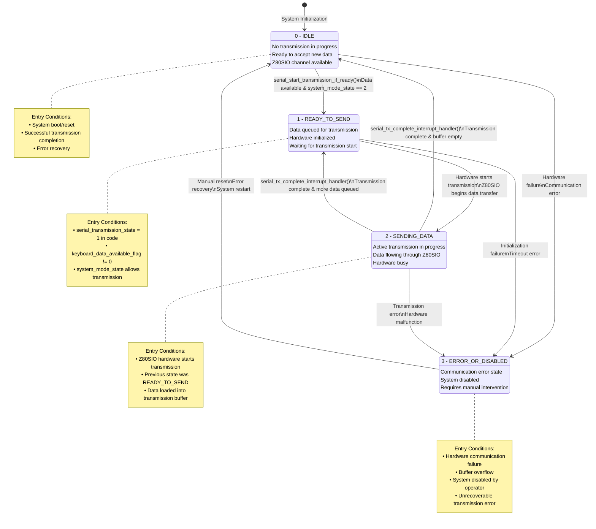

# Serial Communication System Documentation
## TDV 2215 Terminal - Z80SIO Serial Transmission Analysis

### Introduction

The TDV 2215 terminal implements a sophisticated serial communication system using the Z80SIO (Serial Input/Output) controller. The system employs a state-machine driven approach to manage data transmission between the terminal and host computer, ensuring reliable character-by-character communication with proper flow control and error handling.

### Send Logic Overview

The transmission logic operates through a coordinated state machine that manages four distinct phases: IDLE (waiting), READY_TO_SEND (prepared), SENDING_DATA (active transmission), and ERROR_OR_DISABLED (fault condition). When a character needs to be transmitted, the system first queues it in a circular buffer, transitions through the appropriate states based on hardware availability and system mode, and uses interrupt-driven completion handling to maintain continuous data flow without blocking the main terminal operations.

---

## Memory Layout & Function Mapping

### Core Functions

| Function Name | Address | Original Name | Purpose |
|---------------|---------|---------------|---------|
| `terminal_character_output` | 0x2557 | *(unchanged)* | Main character output handler |
| `serial_start_transmission_if_ready` | 0x0ed4 | `serial_conditional_transmission_start` | Conditional transmission initiator |
| `serial_tx_complete_interrupt_handler` | 0x0e0c | `serial_transmission_complete_handler` | Transmission completion interrupt handler |
| `enqueue_char_to_keyboard_buffer` | 0x10d9 | `keyboard_buffer_operation_1` | Add character to transmission buffer |
| `dequeue_char_from_keyboard_buffer` | 0x10e5 | `keyboard_buffer_operation_2` | Remove character from transmission buffer |
| `write_to_keyboard_tx_buffer` | 0x1107 | *(unchanged)* | Low-level buffer write operation |

### Supporting Functions

| Function Name | Address | Purpose |
|---------------|---------|---------|
| `escape_sequence_parser` | *(referenced)* | Processes ANSI/VT escape sequences |
| `write_character_with_cursor_wrap` | *(referenced)* | Handles cursor positioning and line wrapping |
| `store_byte_in_circular_buffer` | *(referenced)* | Generic circular buffer storage |
| `read_char_from_circular_buffer` | *(referenced)* | Generic circular buffer retrieval |
| `disableMaskableInterrupts` | *(referenced)* | Z80 interrupt control |
| `enableMaskableInterrupts` | *(referenced)* | Z80 interrupt control |

### Memory Variables

| Variable Name | Address | Original Name | Type | Purpose |
|---------------|---------|---------------|------|---------|
| `serial_transmission_state` | *(global)* | *(unchanged)* | `byte` | State machine controller (0-3) |
| `system_mode_state` | 0x5df8 | `BYTE_ram_5df8` | `byte` | System operation mode |
| `transmission_buffer_empty_flag` | 0x5e24 | `some_variable_5e24` | `byte` | Buffer status indicator |
| `keyboard_data_available_flag` | 0x5f10 | `BYTE_ram_5f10` | `byte` | Data availability flag |
| `current_output_character` | *(global)* | *(unchanged)* | `byte` | Character being processed |
| `serial_transmission_busy_flag` | *(global)* | *(unchanged)* | `byte` | Hardware busy indicator |
| `serial_transmission_config` | *(global)* | *(unchanged)* | `byte` | Configuration register |
| `cursor_wrap_enabled_flag` | *(global)* | *(unchanged)* | `byte` | Cursor wrapping setting |
| `z80sio_channel_a_test_status` | *(global)* | *(unchanged)* | `byte` | Z80SIO status register |
| `keyboard_buffer_counter` | *(global)* | *(unchanged)* | `byte` | Buffer occupancy counter |
| `keyboard_tx_buffer_write_pointer` | *(global)* | *(unchanged)* | `byte` | Buffer write position |
| `keyboard_tx_buffer_start` | *(global)* | *(unchanged)* | `byte[]` | Circular buffer storage |

---

## State Machine Architecture

### Serial Transmission States

```csharp
/// <summary>
/// Serial transmission state machine for Z80SIO communication
/// Controls the flow of data between terminal and host system
/// </summary>
public enum SerialTransmissionState : byte
{
    /// <summary>
    /// IDLE - No transmission in progress, ready to accept new data
    /// System is waiting for data to transmit
    /// Z80SIO channel is available and ready
    /// </summary>
    IDLE = 0,
    
    /// <summary>
    /// READY_TO_SEND - Data is queued and ready for transmission
    /// Transmission hardware is available and initialized
    /// Waiting for hardware to begin transmission
    /// </summary>
    READY_TO_SEND = 1,
    
    /// <summary>
    /// SENDING_DATA - Transmission is actively in progress
    /// Data is being sent through the Z80SIO channel
    /// Hardware transmission interrupt will signal completion
    /// System should not queue additional data during this state
    /// </summary>
    SENDING_DATA = 2,
    
    /// <summary>
    /// ERROR_OR_DISABLED - Transmission error or system disabled
    /// Used when communication fails or system is in error state
    /// Requires manual intervention or reset to recover
    /// No transmission attempts should be made in this state
    /// </summary>
    ERROR_OR_DISABLED = 3
}
```

### System Operation Modes

```csharp
/// <summary>
/// System operation mode for terminal functionality
/// Controls how characters are processed and transmitted
/// </summary>
public enum SystemModeState : byte
{
    /// <summary>
    /// NORMAL_OPERATION - Standard terminal operation mode
    /// Normal character processing and transmission
    /// Full escape sequence processing enabled
    /// </summary>
    NORMAL_OPERATION = 0,
    
    /// <summary>
    /// DIRECT_MODE - Direct transmission mode
    /// Bypasses some processing steps
    /// Immediate transmission when possible
    /// </summary>
    DIRECT_MODE = 1,
    
    /// <summary>
    /// BUFFERED_MODE - Buffered transmission mode
    /// Uses keyboard buffer for data management
    /// Enables flow control and batching
    /// </summary>
    BUFFERED_MODE = 2
}
```

### State Machine Diagram



---

## Detailed Function Analysis

### `terminal_character_output` (0x2557)

**Purpose**: Main entry point for character output processing

**Parameters**:
- `character_to_output` (byte): Character to be transmitted

**Return**: `byte` - The processed character

**Local Variables**:
- `processed_character` (byte): Character after processing
- `should_continue_processing` (undefined1): Loop control flag

**Flow**:
1. Store character in global `current_output_character`
2. Handle cursor wrapping if enabled
3. Wait for serial transmission to be available
4. Process escape sequences
5. Attempt to start transmission
6. Set transmission busy flag

**Key Logic**:
```c
do {
    should_continue_processing = 0;
    processed_character = current_output_character;
} while (serial_transmission_busy_flag != 0);

do {
    escape_sequence_parser(processed_character);
    processed_character = serial_start_transmission_if_ready();
} while ((bool)should_continue_processing);
```

### `serial_start_transmission_if_ready` (0x0ed4)

**Purpose**: Conditionally initiates serial transmission based on system state

**Return**: `undefined1` - Status/character value

**Local Variables**:
- `in_AF` (undefined2): Z80 AF register pair
- `uVar1` (undefined1): Accumulator value
- `uVar2` (undefined1): Working variable
- `bVar3` (bool): Condition flag

**State Logic**:
```c
if (system_mode_state != 1) {
    if ((system_mode_state != 2) || (serial_transmission_state == 3)) 
        goto LAB_ram_0f11;
    
    if (serial_transmission_state == 0) {
        serial_transmission_state = 1;  // IDLE → READY_TO_SEND
    } else {
        enqueue_char_to_keyboard_buffer();
    }
    
    if (keyboard_data_available_flag == 0) 
        goto LAB_ram_0f11;
}
```

**Critical Sections**: 
- Interrupts disabled during state transitions
- Atomic read-modify-write operations

### `serial_tx_complete_interrupt_handler` (0x0e0c)

**Purpose**: Handles transmission completion interrupts from Z80SIO

**Return**: `undefined1` - Interrupt acknowledgment

**Local Variables**:
- `in_AF` (undefined2): Z80 AF register pair  
- `cVar1` (char): Buffer status

**State Transitions**:
```c
if ((serial_transmission_state != 3) && (serial_transmission_state != 0)) {
    if (serial_transmission_state == 1) {
        z80sio_channel_a_test_status = 0;  // READY_TO_SEND handling
    } else {
        // SENDING_DATA → IDLE or READY_TO_SEND
        if ((transmission_buffer_empty_flag == 0) && 
            (dequeue_char_from_keyboard_buffer(), cVar1 != '\0')) {
            serial_transmission_state = 0;  // → IDLE
        } else {
            transmission_buffer_empty_flag = 0;
            serial_transmission_state = 1;  // → READY_TO_SEND
        }
    }
}
```

### `write_to_keyboard_tx_buffer` (0x1107)

**Purpose**: Adds character to circular transmission buffer

**Parameters**:
- Implicit: Character value from Z80 accumulator

**Return**: `undefined1` - Character value

**Buffer Management**:
```c
if (keyboard_buffer_counter != 0xff) {
    keyboard_buffer_counter = keyboard_buffer_counter + 1;
    uVar1 = (ushort)keyboard_tx_buffer_write_pointer;
    
    if (keyboard_tx_buffer_write_pointer == 0xff) {
        keyboard_tx_buffer_write_pointer = 0xff;  // Overflow protection
    }
    keyboard_tx_buffer_write_pointer = keyboard_tx_buffer_write_pointer + 1;
    (&keyboard_tx_buffer_start)[uVar1] = character_value;
}
```

**Features**:
- Circular buffer with overflow protection
- Maximum capacity: 255 characters
- Write pointer wraparound handling
- Counter-based occupancy tracking

---

## Buffer Architecture

### Circular Buffer Implementation

The system uses a circular buffer design for managing transmission data:

- **Buffer Size**: 256 bytes (0x00-0xFF)
- **Overflow Handling**: Counter saturation at 0xFF
- **Thread Safety**: Interrupt-protected operations
- **Flow Control**: Buffer full detection prevents data loss

### Memory Management

1. **Write Operations**: Protected by interrupt disable/enable
2. **Read Operations**: Atomic character extraction
3. **Pointer Management**: Automatic wraparound with overflow detection
4. **Status Tracking**: Real-time buffer occupancy monitoring

---

## Hardware Integration

### Z80SIO Interface

The system interfaces directly with the Z80SIO controller:

- **Channel A**: Primary host communication channel
- **Status Registers**: Real-time transmission state monitoring  
- **Interrupt-Driven**: Completion signaling through hardware interrupts
- **Flow Control**: Hardware handshaking support

### Timing Considerations

- **Interrupt Latency**: Critical sections minimized for responsiveness
- **State Synchronization**: Atomic transitions prevent race conditions
- **Buffer Management**: Non-blocking operations maintain real-time performance

---

## Error Handling & Recovery

### Error Detection

1. **State Validation**: Illegal state transitions prevented
2. **Buffer Overflow**: Saturation prevents memory corruption  
3. **Hardware Monitoring**: Z80SIO status register checking
4. **Timeout Protection**: Transmission failure detection

### Recovery Mechanisms

1. **Soft Reset**: State machine reset to IDLE
2. **Buffer Flush**: Clear pending transmission data
3. **Hardware Reset**: Z80SIO controller reinitialization  
4. **System Restart**: Complete communication subsystem restart

---

## Performance Characteristics

- **Throughput**: Limited by Z80SIO baud rate configuration
- **Latency**: Single-character processing with minimal buffering
- **Memory Usage**: 256-byte circular buffer + state variables
- **CPU Overhead**: Interrupt-driven design minimizes polling overhead

This documentation provides a comprehensive view of the TDV 2215 terminal's serial communication system, enabling maintenance, debugging, and potential enhancements to the transmission logic.